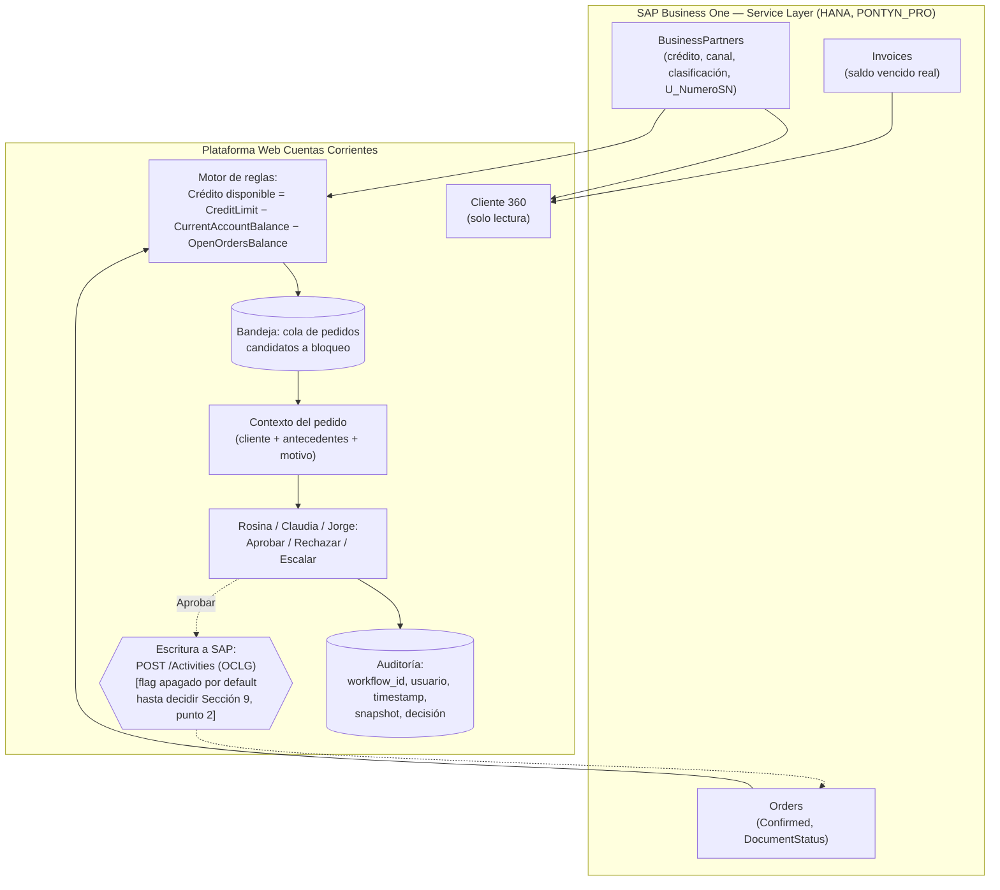

# Architecture.md — Cuentas Corrientes y Cobranzas (Pontyn)

**Aviso de madurez (I.4, dado como paso explícito antes de este documento, no dentro del mismo pedido):** el descubrimiento técnico de SAP Service Layer está en un punto sólido — contrato de sesión, esquema real de `BusinessPartners`/`Orders`/`Invoices`, y una hipótesis de diseño para el bloqueo de crédito ya validada contra un caso real (ver Sección 4). Con eso alcanza para pasar a construcción de **Cliente 360** y para arrancar **Bandeja de Autorización** en modo lectura. **No alcanza todavía** para el paso de escritura de la Bandeja (aprobar/liberar un pedido) — nunca se probó ni se confirmó cómo escribe SAP eso, y eso es crítico. Se marca explícitamente en Sección 9 (Puntos abiertos) como bloqueante, no se asume una solución.

**Alcance de este documento:** cubre **Cliente 360** (listo para construcción) y **Bandeja de Autorización de Pedidos** (lista para construcción en modo lectura; el paso de escritura queda bloqueado, ver Sección 9). **Hub Omnicanal** se incluye solo como esqueleto preliminar — el checklist de Twilio/M365 (Módulo 4) sigue completamente abierto, se amplía esta sección cuando se resuelva, sin reescribir lo ya cerrado (mismo criterio que usa el `Architecture.md` de Costos/Precios).

**Basado en:** `Discovery.md` (estado 16/09/2026, incluye Sección 15 — hallazgos técnicos de SAP Service Layer), `Plan.md` (orden de construcción del MVP, 09/09/2026) y `Decisions.md` (historial completo de decisiones hasta 16/09/2026).

**Convención de certeza usada en este documento** (consistente con el resto del portafolio de Pontyn — `Architecture.md` de Contaduría y de Costos/Precios): `KNOWN` (confirmado por prueba real contra Service Layer o por Líber), `ASSUMED` (supuesto razonable, no verificado), `PROPOSED` (propuesta de diseño, a validar), `TO VERIFY` (pregunta abierta, no asumir). Distinto de la taxonomía HECHO/INFERENCIA/PROPUESTA/RECOMENDACIÓN de `Discovery.md` — esa sigue rigiendo el relevamiento de negocio; esta rige el diseño técnico.

---

## 1. Resumen del flujo de negocio

Reemplazar: SAP como única interfaz + Excel de Karen/Rosina + WhatsApp/Email manual, sin vista consolidada del cliente, sin cola de trabajo para pedidos bloqueados, sin registro de por qué se aprobó o rechazó cada uno.

Por: una plataforma web complementaria a SAP (nunca lo reemplaza) que consolida la ficha del cliente (`Cliente 360`), gobierna la liberación de pedidos bloqueados con un flujo de aprobación auditable (`Bandeja de Autorización`), y centraliza la comunicación con el cliente (`Hub Omnicanal`). SAP sigue siendo el sistema transaccional autoritativo — la plataforma lee, decide dentro de una política, y ejecuta acciones controladas sobre SAP, nunca le duplica el rol de fuente de verdad.

## 2. Componentes (línea base Pontyn + capa de plataforma)

- **Azure Function v2 (Python 3.12)** — backend de la plataforma. `PROPOSED`, mismo criterio que Contaduría y Costos/Precios: repo separado del resto del portafolio (ver Sección 8, "blast radius").
- **Azure Static Web App, tier Standard** — frontend. `PROPOSED`, mismo motivo que los dos proyectos hermanos ("Bring your own API"): el backend necesita VNet Integration hacia SAP on-premise, que la API gestionada gratuita de SWA no soporta bien.
- **Entra ID / MSAL** — autenticación de usuarios finales (Rosina, Claudia, Lorena, Sabrina, Monserrat, Jorge). **`CORREGIDO 16/09/2026`** — no repetir Easy Auth clásico (v1) atado directo a una SPA cross-origin (SWA en un dominio, Function App en otro): es el patrón que le generó a Contaduría el problema documentado de `401` en el preflight `OPTIONS` sin ningún toggle para eximirlo, y terminó necesitando un proxy same-origin con sus propios problemas (cold start propio, corrupción de binarios al reenviar `multipart/form-data` como texto). Acá aplica el mismo riesgo — misma topología (SWA + Function App separada). Ver diseño recomendado en Sección 3.
- **Azure SQL DB** — `PROPOSED`, mismo criterio que los dos hermanos (elegido sobre Table Storage por necesidad real de listar/filtrar/editar): estado de la Bandeja de Autorización, historial de gestiones/comunicaciones del Hub Omnicanal, y cualquier dato propio de la plataforma que no viva en SAP. **`RESUELTO 17/09/2026` (confirmado por Líber):** se crea una base nueva (`PROPUESTO: cc-platform-db`) dentro del server de propósito general `sql-pontyn-prod` (ya existente en `rg-pontyn-sql-prod`, usado hoy por `cfe-review-db`), en vez de un server nuevo — mismo patrón que los dos proyectos hermanos. No se crea todavía: no hace falta para Cliente 360 (sin persistencia propia), se crea cuando arranque el trabajo de la Bandeja.
- **Table Storage** — `PROPOSED`, reservado para un mecanismo simple de idempotencia/claim si hace falta (mismo rol que cumple en Contaduría para su Entrega 1), no para el estado principal de la Bandeja.
- **MS Graph** — email vía `email_sender.py` ya existente. `TO VERIFY` si se reutiliza tal cual o si hace falta una nueva app registration (checklist Módulo 4, sin resolver).
- **Twilio** — WhatsApp Business. Todo el checklist Módulo 4 sigue abierto (Account SID, número aprobado, plantillas de Meta) — ver Sección 9.
- **Key Vault** — credenciales de SAP Service Layer, Twilio Auth Token, client secret de M365. Nunca en el repo ni en variables de entorno planas — mismo estándar que el resto del portafolio.
- **Blob Storage (cuenta simple) vs. ADLS Gen2** — para adjuntos/cartas de pedidos (Discovery.md 9.2). `A EVALUAR`, mismo dilema que ya resolvieron los dos proyectos hermanos a favor de Blob Storage simple (documento discreto referenciado por ID, no dataset analítico) — no se decide acá sin confirmarlo explícitamente, ver Sección 9.

### 2.1 `NUEVO 17/09/2026` Convención de nombres del tenant Azure (inspeccionada en vivo con `az cli`, KNOWN) y plan propuesto para este proyecto

Inspección directa del tenant (`Azure subscription 1`, `rg-*` existentes) confirma la convención ya usada por Contaduría y Costos/Precios:

| Recurso | Convención | Ejemplo existente (`cfe-review`) | Propuesto para Cuentas Corrientes |
|---|---|---|---|
| Resource Group | `rg-pontyn-<proyecto>-prod` | `rg-pontyn-cfe-review-prod` | `rg-pontyn-cc-platform-prod` |
| Key Vault | `kv-pontyn-<proyecto>` | `kv-pontyn-cfe-review` | `kv-pontyn-cc-platform` |
| Function App | `<proyecto>-api` | `cfe-review-api` | `cc-platform-api` |
| App Registration (Entra ID) | `<proyecto>-api-app-registration` | `cfe-review-api-app-registration` | `cc-platform-api-app-registration` |
| Service Principal CI/CD | `sp-<proyecto>-api-cicd` | `sp-cfe-review-api-cicd` | `sp-cc-platform-api-cicd` |
| Azure SQL | base nueva en el server compartido `sql-pontyn-prod` (`rg-pontyn-sql-prod`) | `cfe-review-db` | `cc-platform-db` (recién cuando arranque la Bandeja, ver Sección 2) |
| App Service Plan | `cfe-review-api` corre hoy sobre `ASP-PontynHttpFunctionApp` (Basic B2, capacity 3, RG legacy `pontynhttpfunctionapp`) | `cfe-review-api` | **`DECIDIDO 17/09/2026` (Líber):** reusar el mismo `ASP-PontynHttpFunctionApp` — no `asp-pontyn-functions-prod` (que existe pero queda descartado para este proyecto). **`RE-ABIERTO 17/09/2026` con evidencia nueva:** una guía de arquitectura de Contaduría (aportada por Líber) documenta un incidente real medido en este mismo plan — CPU compartido en 40-50% promedio con picos a 100%, correlacionado con ventanas de latencia de hasta ~36 minutos en Timers/endpoints, atribuido a "vecino ruidoso" (otra app en el mismo plan, no código propio). Verificado en vivo (`az functionapp list`/`az webapp list`): el plan ya hospeda **4 apps** (`cfe-review-api`, `PontynApi`, `PontynSyncImages`, `PontynExtractToDatalake`) — `cc-platform-api` sería la quinta. La guía recomienda un plan dedicado salvo que el costo lo justifique, y monitorear CPU del plan (no solo el de la app propia) si se comparte igual. **`RE-CONFIRMADO 17/09/2026` (Líber, con la evidencia ya conocida):** se mantiene `ASP-PontynHttpFunctionApp` — motivo puntual y más importante que el de costo: es el plan que ya tiene la VNet Integration hacia la VPN de Pontyn donde vive SAP (Sección 4.1/9), no solo una decisión de ahorro. Migrar a un plan dedicado implicaría re-armar esa integración de red. Queda como riesgo aceptado y documentado (no ignorado) — si en el futuro se ve latencia intermitente no explicada, este plan compartido es el primer sospechoso a chequear (monitorear su CPU, no solo el de `cc-platform-api`). |
| Red hacia SAP on-prem | VNet existente `VNet2` (`10.2.0.0/16`, RG `pontynhttpfunctionapp`) con Gateway VPN `VNet2GW` ya conectado al on-prem de Pontyn | `cfe-review-api` usa la subnet `FrontEnd` | **`DECIDIDO 17/09/2026` (Líber):** usar la misma subnet `FrontEnd` que `cfe-review-api` (no `FunctionsProd`, que existe pero nunca se ejercitó con una VNet Integration real). Verificado: `FrontEnd` es `/24` (256 IPs, delegada a `Microsoft.Web/serverfarms`), con lugar de sobra para las dos apps. Coherente con ya compartir el mismo App Service Plan — reusa la única ruta de red ya probada en vez de validar una nueva. |

**Corrección de diseño importante detectada al inspeccionar `cfe-review-api` en vivo:** su `authsettingsV2` tiene Easy Auth **clásico (v1)** realmente activo (`platform.runtimeVersion: "~1"`, proveedor `azureActiveDirectory` habilitado junto con varios proveedores sociales sin usar, de default de scaffold) — confirma en la práctica, no solo en el handoff, el problema que la Sección 3 ya advierte no repetir. `cc-platform-api` nace **sin Easy Auth habilitado** (`az webapp auth show` debe dar `requireAuthentication: false` o el recurso simplemente no tiene `authsettingsV2` configurado) — el gate de auth vive en el código (JWT manual), nunca en la plataforma.

**Estado 17/09/2026:**
- **`CREADO` — App Registration:** `cc-platform-api-app-registration`, `KNOWN`. `appId` (client ID): `2095b6bc-db66-4b95-97ad-7c569800a4c9`. `sign-in-audience`: `AzureADMyOrg` (mono-tenant Pontyn). Identifier URI: `api://2095b6bc-db66-4b95-97ad-7c569800a4c9`. Scope delegado expuesto: `access_as_user`. App Role creado: `CC.Usuario` (allowed member type `User` — no `Application`; pensado para Rosina/Claudia/Lorena/Sabrina/Monserrat en esta etapa de Cliente 360; un rol de aprobador se agrega después, sin tocar este, cuando arranque la Bandeja). Enterprise App (Service Principal) creado con `appRoleAssignmentRequired=true` — **nadie obtiene token para esta API sin que se le asigne explícitamente el rol** (Entra ID → Enterprise Applications → `cc-platform-api-app-registration` → Users and groups). Sin client secret (no hace falta: la validación es JWT contra JWKS público, nunca requiere secreto de este lado). **`RESUELTO 17/09/2026`:** plataforma "Single Page application" agregada con redirect URI `http://localhost:5173` (desarrollo local). Es una lista aditiva (guía §10.9) — la URL real de la Static Web App se agrega después, sin sacar la de localhost.
- **`CREADO 18/09/2026` — Resource Group, Key Vault, Storage, Function App:** creados para el spike de autenticación de punta a punta (§9.5). `rg-pontyn-cc-platform-prod` (brazilsouth); `kv-pontyn-cc-platform` (RBAC, no access policies — mismo patrón que `kv-pontyn-cfe-review`); `stpontynccplatform` en el RG compartido `rg-pontyn-storage-prod`; Function App `cc-platform-api` (Linux, Python 3.12, Functions v4) sobre `ASP-PontynHttpFunctionApp`, con VNet Integration a la subnet `FrontEnd` de `VNet2` (misma que `cfe-review-api`, ver tabla arriba). Managed Identity (System-Assigned) habilitada, con rol `Key Vault Secrets User` sobre el Key Vault propio. `SAP_PASSWORD`/`HANA_PASSWORD` viven en el Key Vault, referenciados desde App Settings vía `@Microsoft.KeyVault(SecretUri=...)` — nunca en texto plano. CORS de plataforma configurado para `http://localhost:5173`. Confirmado sin Easy Auth (`az webapp auth show` no devuelve `authsettingsV2`). App Registration (`cc-platform-api-app-registration`) ya tenía el rol `CC.Usuario` asignado a Líber para poder probar.
- **`RESUELTO 18/09/2026` — Deploy hecho (Líber, `func azure functionapp publish`) y spike de autenticación de punta a punta EXITOSO.** Las 7 funciones cargaron correctamente (confirmado en Application Insights). Tres pruebas reales, en orden:
  1. **Preflight `OPTIONS`** contra `/api/clientes` con `Origin: http://localhost:5173` → `200`, headers CORS correctos, sin ningún gate de auth en el medio — el problema histórico de Easy Auth v1 de Contaduría (Sección 2.1 de la guía de Líber) **no se repite acá**.
  2. **Sin token** → `401` con el JSON propio del código (`"Falta el header Authorization Bearer"`) — confirma que el gate de auth vive en el código, nunca en la plataforma.
  3. **Con un token real** (login de Líber vía MSAL contra el App Registration, página de prueba temporal): `roles: ["CC.Usuario"]`, `aud`/`iss` correctos — y **`GET /api/clientes?q=C1-90020` devolvió `200 {"clientes": []}`**, la cadena completa funcionando: JWT validado (firma/JWKS/audience/issuer/rol) → `ServiceLayerSapGateway` conectó de verdad contra `10.10.10.240` vía la VNet Integration → login a Service Layer con `PontynSL` exitoso → query `substringof` ejecutada sin error → lista vacía porque `C1-90020` es un código ficticio de los fixtures, no un cliente real (esperado).
  
  **Esto resuelve de una sola vez:** el spike de autenticación en sí (bloqueante desde el día 1, Sección 3); la conectividad real Azure→SAP Service Layer para *este* Function App específico (antes solo inferida de `cfe-review-api`); la sintaxis OData `substringof` del punto 20 (ya no es `TO VERIFY`, es `KNOWN`); y el riesgo v1/v2 del emisor del token (`shared/auth.py` TODO) — el token real que emitió Entra ID para este App Registration usa el formato v1 (`https://sts.windows.net/{tenant}/`), exactamente el que el código ya esperaba.

**`NUEVO 17/09/2026` — Puntos aplicados de `guia-arquitectura-backend-frontend.md` (aportada por Líber, extraída de `cfe-review-api`/`frontend-cfe-review` reales en producción):**
- **10.1 (choque de nombres App Registration vs. Managed Identity):** ya cumplido sin saberlo — `cc-platform-api-app-registration` ya tiene el sufijo recomendado, nunca vamos a chocar con el nombre limpio `cc-platform-api` que va a reclamar la Managed Identity System-Assigned de la Function App el día que se cree.
- **10.2 (Storage Account — negocio vs. `AzureWebJobsStorage`):** decisión explícita (no por default): Cliente 360 es de solo lectura y la Bandeja usa Azure SQL, no blobs — no hay dato de negocio real que guardar en Storage en esta etapa. Una sola cuenta (`stpontynccplatform`, Sección 9.20) alcanza para `AzureWebJobsStorage` + lo que haga falta más adelante (ej. adjuntos/cartas, Sección 9.13, todavía sin decidir). Revisar esta decisión si esa necesidad se vuelve real.
- **10.6 (credenciales on-premise a Key Vault desde el día 1, "ni en el primer prototipo"):** ya cumplido para el repo (`local.settings.json` real nunca versionado, confirmado gitignored) — pendiente crear el Key Vault del proyecto (`kv-pontyn-cc-platform`, todavía no creado) antes del primer deploy real, no siga viviendo solo en `local.settings.json` locales una vez que haya más de una persona/máquina involucrada.
- **10.8 (`DEPLOY_VERSION` como App Setting):** **`IMPLEMENTADO`** — el job `deploy_production` de GitLab CI (`Decisions.md` 21/09/2026) lo setea con el SHA corto del commit deployado en cada corrida exitosa.
- **10.9 (redirect URIs son aditivos):** relevante para cuando se agregue la plataforma SPA al App Registration (punto pendiente arriba) — agregar `http://localhost:5173` para desarrollo no reemplaza nada, y la URL real de la Static Web App se agrega después sin sacar la de localhost.

## 3. Best practices adoptadas de Contaduría (`cfe-review-api` / `frontend-cfe-review`) y de Costos/Precios

Cuentas Corrientes es el tercer sector de Pontyn en pasar por este ciclo (discovery → arquitectura → producción), y el que más se parece estructuralmente a Contaduría: bandeja de revisión humana + integración de escritura controlada contra un sistema de registro (SAP, en los dos casos). Mismo criterio que ya usó Costos/Precios: cada patrón se evalúa contra la necesidad real de este sector, no se copia por default.

**Adoptados ya, sin depender de nada más:**

- **"Bring your own API"** (SWA Standard + Function propia) — necesario acá por el mismo motivo que en Contaduría: VNet hacia SAP on-premise.
- **Autenticación — `CORREGIDO 16/09/2026`, no adoptar tal cual de Contaduría:** en vez de Easy Auth clásico + `authLevel=ANONYMOUS`, validación manual del JWT en el backend (firma contra JWKS del tenant, `aud`/`iss`/expiración, roles extraídos del claim del token — librería chica, `PyJWT`+`cryptography` con cache de JWKS) y CORS configurado de forma estándar a nivel de la Function App, sin que el preflight `OPTIONS` pase por ninguna lógica de auth. El frontend llama directo al backend con MSAL pidiendo el scope de la API (`api://<app-id>/access_as_user`) en el header estándar `Authorization: Bearer <token>` — **sin proxy intermedio**. Roles como App Roles del propio App Registration (no una tabla de permisos aparte); un rol nuevo se agrega sin tocar el acceso de los roles existentes (test explícito de no-regresión). El gate de autorización vive siempre en el backend — el frontend puede ocultar UI por rol, pero cada endpoint revalida server-side sin excepciones. **`TO VERIFY` antes de comprometerse a este diseño:** spike de 1-2 días contra un recurso real de Azure Functions Python confirmando que el CORS responde el preflight sin gate de auth en el medio, y que la validación manual de JWT funciona con roles reales — no asumir que esto "debería" funcionar sin medirlo contra el recurso real (misma disciplina que el resto de este documento). Evaluar también, en el mismo spike, si Azure App Service Authentication **v2** (más nuevo que el "clásico v1" que generó el problema en Contaduría) resuelve esto sin necesidad de la validación manual — no confirmado, no asumir.
- **Secretos:** Key Vault, nunca en el repo. Azure SQL DB con auth AAD-only (Managed Identity), sin login/password SQL — mismo patrón que ya está en producción en `sql-pontyn-prod`.
- **Application Insights propio** de esta Function App, no un recurso compartido (ya se corrigió en Contaduría que `ai-pontyn-prod` compartido no existe como tal).
- **CI/CD:** frontend en GitHub Actions (integración nativa de SWA), backend en GitLab — consistente con el resto del portafolio.
- **Coexistencia Azure SQL DB + Table Storage, cada una donde corresponde** — SQL para lo que la plataforma necesita listar/filtrar/editar (Bandeja, Hub Omnicanal), Table Storage reservado para idempotencia simple si hace falta.
- **Máquina de estados simple sobre una tabla, con reapertura** para la Bandeja de Autorización — mismo patrón de Contaduría (`PENDIENTE_CONTADURIA` → `PENDIENTE_COMPRADOR` → ...), adaptado acá a un flujo de un solo paso salvo que el sector confirme que hoy hay más de un nivel de aprobación (`TO VERIFY`, ver checklist Módulo 3: "lista de quién puede aprobar qué tipo/monto de pedido hoy").
- **Nunca escribir en el mismo paso que la aprobación humana** — separar la escritura real a SAP en un proceso aparte (Timer o función dedicada), con claim atómico, igual que `post_to_sap` en Contaduría. Esto aplica incluso más fuerte acá porque, a diferencia de Contaduría, **todavía no sabemos cuál es el mecanismo de escritura real** (ver Sección 9) — separarlo de entrada evita tener que rediseñar el flujo humano el día que se confirme.
- **No construir función de exportar/imprimir sin definición de formato clara primero** — aplica directo al "reporte imprimible de facturas autorizadas" que Contaduría dejó como aspiracional; acá no hay un equivalente definido todavía, mismo criterio si aparece.
- **`NUEVO 16/09/2026` Estructura de triggers del backend:** un Timer por responsabilidad (nunca uno que hace de todo), HTTP triggers finos (el trigger solo valida payload + rol + llama a la lógica real en `shared/`, testeable sin levantar el runtime), Queue triggers para todo lo que no necesita responder en el mismo request (ej. notificación por WhatsApp/email disparada por una aprobación — nunca bloquear la respuesta al frontend esperando ese side-effect).
- **`NUEVO 16/09/2026` Identidad persistida en cada escritura** — quién aprobó/rechazó/marcó, como columna desde el diseño de la tabla, no reconstruible de logs después. Ya implícito en la auditoría mínima del marco de gobernanza, se refuerza acá como decisión de esquema desde el día 1.
- **`NUEVO 16/09/2026` Health check "shallow"** (responde OK sin tocar la base de datos) para el probe de la plataforma — un health check que sí toca la DB cada 20-30 segundos las 24 horas puede impedir que el auto-pause de Azure SQL Serverless llegue a activarse nunca.
- **`NUEVO 16/09/2026` Nunca reintentar automáticamente una escritura no idempotente** (aprobar/rechazar un pedido) — un reintento silencioso ante un timeout puede duplicar la acción si la escritura sí llegó a ocurrir del lado de SAP. Reintentos automáticos solo en GET.
- **`NUEVO 16/09/2026` Sin UI optimista para la transición de aprobar/rechazar** — a diferencia de un toggle simple, es una transición de máquina de estados real; esperar la confirmación del backend antes de reflejar el cambio, aceptando la latencia a cambio de nunca mostrar un estado que no ocurrió de verdad.
- **`NUEVO 16/09/2026` Testing:** cada bug real encontrado se convierte en test de regresión con comentario de causa raíz; fixtures con datos reales anonimizados (ej. una respuesta real de `Orders`/`BusinessPartners`, no armada a mano) para que reproduzcan la variedad real de formatos; tests de camino negativo (rol sin permiso → 403) además del camino feliz.
- **`NUEVO 16/09/2026` Git:** nunca trabajar directo sobre `main` — rama de desarrollo, tests locales, y confirmación explícita y separada antes de mergear/pushear a `main` (son dos decisiones distintas: ¿el código está bien? / ¿es el momento de que salga a producción?).

**A evaluar antes de la primera corrida real:**

- **ADLS Gen2 vs. Blob Storage simple** para adjuntos/cartas — ver Sección 2 y Sección 9.
- **Horario laboral + timezone explícita** para cualquier Timer que se agregue (ej. sincronización de canal/preferencias, o un futuro polling de WhatsApp) — Contaduría acota sus Timers a 7-20hs `America/Montevideo`, con `warmup` si el Azure SQL Serverless tiene auto-pause. Evaluar una vez que se defina el tier real de la base.

**Patrones reservados para cuando algún módulo lo necesite (no aplican al alcance de hoy):**

- **Sincronización de un maestro desde SharePoint/Excel hacia una copia local en Azure SQL** — candidato pensado originalmente para digitalizar la categorización manual de Karen. **Premisa ya descartada** (punto 10, Sección 9): `U_ClasifClienteCC` ya reemplazó esa categorización manual, vive dentro de SAP — este patrón queda sin caso de uso concreto por ahora.
- **No todo necesita pantalla** — si en el futuro algún chequeo de Cuentas Corrientes resulta puramente automático y de solo lectura (riesgo Bajo, A4), no hace falta forzarlo a ser un módulo visible.

## 4. Contrato técnico de SAP Business One Service Layer

Consolidado de la Sección 15 de `Discovery.md` (cuatro rondas de prueba real, 16/09/2026) — esto es lo que Claude Code puede dar por confirmado sin volver a probarlo.

### 4.1 Conexión y sesión

- **Motor:** SAP HANA. **Company DB:** `PONTYN_PRO`. `KNOWN`.
- **Service Layer:** `https://<host>:50000/b1s/v1`. **`RESUELTO 17/09/2026` (Líber, acceso directo vía VPN LAN de Pontyn):** `10.10.10.240` = **test/desarrollo**; `192.168.1.240` = **producción**. `KNOWN`. Las pruebas de la Sección 15 de `Discovery.md` corrieron contra la IP de producción (sin impacto, todo de solo lectura) — de acá en más, desarrollo apunta siempre a `10.10.10.240`; el código nunca hardcodea ninguna de las dos (`base_url` configurable, Sección 2 del handoff).
- **`CORREGIDO 21/09/2026`, importante — test y prod NO son la misma base, aunque el `CompanyDB` se llame `PONTYN_PRO` en los dos.** Contradice lo que decía este documento hasta ahora (que ambas IPs apuntaban a los mismos datos reales). Confirmado comparando `GET /Users` en vivo contra los dos hosts: usuarios creados hace tiempo tienen el mismo `InternalKey`/`USERID` en ambos (`cflores`→92, `rlopez`→20, `schiarle`→55 — coinciden), pero tres usuarios más nuevos (`sdiaz`, `mruiz`, `kbonifacio`, Sección 9 punto 37) **solo existen en el host de producción** — el de test es una copia que dejó de sincronizarse en algún momento. **Implicación a tener en cuenta:** cualquier "confirmado contra SAP real" de este documento que haya corrido contra `10.10.10.240` (la mayoría, incluida la escritura de prueba del punto 36 de la Sección 9) puede no reflejar el estado más reciente de producción para entidades que cambian con el tiempo (como `Users`) — sigue siendo válido para el *mecanismo* (la Actividad se creó bien, el payload es correcto), pero no asumir que los *datos* de ambos hosts están sincronizados sin volver a verificarlo puntualmente. `TO VERIFY` con Germán: hace cuánto se clonó/dejó de sincronizar el host de test, y si Claudia/el sector ven ese host en algún momento o solo el de producción.
- **Login:** `POST /Login` con `CompanyDB`/`UserName`/`Password` → cookies `B1SESSION` + `ROUTEID`. Sesión expira a los ~25 minutos. `KNOWN`.
- **Patrón de sesión:** un solo login por corrida de batch/Timer, reutilizando las cookies para todo el lote; `Logout` explícito al final. `PROPOSED`, heredado del patrón ya validado en producción por `cfe-review-api`.
- **Usuario de servicio (Service Layer):** `PontynSL`, dedicado (no personal), válido en ambos ambientes (test y prod). `KNOWN` que existe; `TO VERIFY` el detalle exacto de permisos otorgados (¿alcanza con lectura + los writes específicos que se necesiten, o tiene de más?).
- **Usuario de servicio (HANA directo, `hdbsql`, para `PedidosParaAutorizar`/Sección 4.6):** `ZBONE` — **distinto** de `PontynSL`, confirmado 17/09/2026. `KNOWN` que existe el usuario; `TO VERIFY` password/permisos exactos otorgados y si alcanza con esto o hace falta gestionarlo aparte con Germán (Sección 9, punto 4).
- **SAP no rechaza duplicados en escritura** — la idempotencia es responsabilidad exclusiva del backend propio, nunca asumir que SAP la resuelve. `KNOWN` (heredado del handoff de Contaduría, mismo SAP).
- **Paginación:** `Prefer: odata.maxpagesize=N` + seguir `odata.nextLink` para listados grandes. **Conteo total:** `$inlinecount=allpages` funciona (probado, devolvió `odata.count` correctamente). `KNOWN`.
- **`/SQLQueries`:** habilitado (`GET` devuelve 200, lista vacía — sin queries guardadas todavía). `KNOWN`. No es necesario para nada de lo confirmado hasta ahora — todo lo que se necesitó salió por OData estándar.
- **SQL directo (`hdbsql`):** no usado ni necesario hasta ahora. Si en algún momento hace falta, tratar con la misma disciplina que cualquier acceso a datos (Sección 7 del marco de gobernanza): nunca SQL libre generado por un agente, siempre un set fijo de consultas pre-aprobadas; nunca para escritura.
- **Técnica de descubrimiento de campos, reutilizable:** el cliente de SAP B1 con "System Information" activado muestra en la barra de estado el nombre técnico exacto de cualquier campo al hacer clic sobre él (`[Form=... Item=U_XXX ... OCRD,U_XXX]`). Más confiable que un `$metadata` exportado (puede estar desactualizado) y no depende de Germán. `PROPOSED` como método estándar del proyecto para resolver dudas de nombre de campo.

### 4.2 `BusinessPartners` — campos confirmados

| Campo | Confirmado | Nota |
|---|---|---|
| `CreditLimit` | `KNOWN` | Puede venir con un valor centinela enorme (`~1e14`) para "sin límite" — la UI debe detectarlo y mostrar "sin límite", no el número crudo. |
| `CurrentAccountBalance` | `KNOWN` | |
| `OpenOrdersBalance` | `KNOWN` | |
| `OpenDeliveryNotesBalance` | `KNOWN` | |
| `Valid` / `ValidFrom` / `ValidTo` | `KNOWN` | Booleano confiable (`tYES`/`tNO`). |
| `Frozen` / `FrozenFrom` / `FrozenTo` / `FrozenRemarks` | `KNOWN` | Booleano confiable. |
| `BlockDunning`, `DunningLevel`, `DunningDate` | `KNOWN` | Booleano confiable. |
| `PaymentBlock` | `KNOWN` | Booleano confiable. |
| `Block` | `KNOWN` — **no usar como flag de crédito** | Devolvió un string de zona/sucursal en un caso real (`"SAN LUIS"`), no `tYES`/`tNO`. Semántica real sin confirmar. |
| `U_NumeroSN` | `KNOWN` | Campo de la regla de consolidación (Sección 5). |
| `U_EmailCC`, `U_WhatsappCC` | `KNOWN` | Preferencia de canal por cliente — validar en código antes de cualquier envío (regla ya vigente, ver `Discovery.md` regresión de WhatsApp). |
| `U_ClasifClienteCC` | `KNOWN` — ver punto 8 (Sección 9) | A/B/C/D, A = mejor cliente. **`A CONFIRMAR` residual:** un caso real (`C3-12788`) con `CreditLimit=0` y deuda enorme tiene `"A"`, contradice esta lectura para ese cliente puntual — no usar como única señal de riesgo sin entender esa discrepancia. |
| `U_DiasToleranciaCC` | `KNOWN` — ver punto 9 (Sección 9) | Sí está conectado a una lógica que se actualiza diariamente (confirmado por Líber); el detalle exacto de esa lógica sigue sin confirmar. |

### 4.3 `Orders` — mecanismo de bloqueo por crédito

- **`AuthorizationStatus`** (Procedimientos de Aprobación estándar de SAP): **DESCARTADO**. Sobre pedidos reales, 100% de la muestra dio `dasWithout`; filtrar por `dasPending` da vacío. Pontyn no usa este mecanismo para esto.
- **`Confirmed` / `U_ConfirmUser` / `U_ConfirmDate`**: **debilitado, no descartado del todo**. Sin acotar por `DocumentStatus`, trae pedidos viejos cerrados/cancelados (ruido). Acotado a `DocumentStatus eq 'bost_Open'`, mejora, pero sigue sin un caso real confirmado por el sector que lo valide como causal de crédito específicamente.
- **Hipótesis vigente (`PROPOSED`, validada contra un caso real extremo, no contra un caso confirmado por el sector):**
  ```
  Crédito disponible = CreditLimit − CurrentAccountBalance − OpenOrdersBalance
  Pedido en riesgo/candidato a bloqueo si: Crédito disponible < 0
  ```
  Evidencia a favor: un cliente (`C3-12788`) con `CreditLimit=0` y `CurrentAccountBalance + OpenOrdersBalance ≈ $732.414` no tiene ninguno de los flags booleanos (`Frozen`/`BlockDunning`/`PaymentBlock`) activo — sugiere que el bloqueo no vive en esos campos, sino en una comparación en vivo. **`TO VERIFY` — antes de construir nada sobre esta fórmula:** validarla contra 2-3 casos que Rosina/Claudia identifiquen explícitamente como "esto está bloqueado hoy" / "esto no lo está".
- **Volumen:** `Orders` con `Confirmed='tNO' AND DocumentStatus='bost_Open'` da **84** en un momento dado (`$inlinecount=allpages`, `KNOWN`). Compatible como orden de magnitud con ~52.500/año como flujo (no como stock) — no es prueba, tampoco contradicción.
- **`DocumentStatus` de `Orders` ≠ `DocumentStatus` de `Invoices`.** `Orders.DocumentStatus=bost_Open` significa "no facturado/entregado todavía" — nada que ver con deuda. `Invoices.DocumentStatus=bost_Open` significa "impago" — **este es el campo correcto para saldo vencido, nunca `Orders`.** `KNOWN`, confirmado con un caso real (cliente con pedidos `Open` de septiembre e facturas `Close` de agosto, ambos ciertos a la vez, sin contradicción).

**`ACTUALIZADO 16/09/2026` — la fórmula de arriba queda relegada frente al mecanismo real, confirmado por Germán (ver 4.6).** La detección real de "pedido con problema de crédito" vive en un stored procedure de SAP (`SP_TransactionNotification`), no en una comparación simple de `BusinessPartners`. La fórmula de crédito disponible sigue siendo útil como chequeo rápido/complementario en Cliente 360, pero **no es la base de la Bandeja de Autorización** — eso pasa a depender de replicar la lógica real (Sección 4.6), no de seguir refinando esta fórmula.

### 4.4 Prefijos de cliente y monedas

`C1-` = pesos, `C2-` = dólares, `C3-` = **Euros** (`KNOWN`, confirmado por Líber). Los tres consolidan por `U_NumeroSN` (Sección 5) — corrige la regla original del proyecto, que solo mencionaba C1-/C2-. **`KNOWN`** — no existen más prefijos además de estos tres, por ahora (punto 15, Sección 9).

### 4.5 `NUEVO 16/09/2026` Patrones de resiliencia para la integración con SAP

Heredados de la guía de arquitectura Azure serverless (misma fuente que el contrato técnico de Sección 4: `cfe-review-api`, mismo SAP). Todos son de la misma familia de riesgo: un sistema externo que falla en silencio, no con una excepción.

- **Paginación completa siempre, nunca asumir que la primera página alcanza.** Ya identificado como necesidad propia en `Discovery.md` 15.4 — se refuerza acá como principio general, no solo para `Orders`/`Invoices` sino para cualquier listado nuevo.
- **Mapear campos de SAP por nombre, nunca por posición.** Natural con OData/JSON (siempre se accede por clave), pero aplica con fuerza extra si en algún momento se lee algo posicional (ej. un Excel de Karen, si la categorización sigue viviendo ahí en paralelo — Sección 9, punto 7).
- **Un `200 OK` de Service Layer no prueba que el dato quedó guardado como se esperaba.** Cuando se implemente el mecanismo de escritura de la Bandeja (confirmado en Sección 4.6), releer con un `GET` fresco después de cada escritura real para confirmar el valor persistido — al menos las primeras veces, y dejarlo como test de regresión.
- **No inferir cómo se calcula un campo — medir contra datos reales.** Ya es la disciplina que se vino aplicando con la fórmula de crédito disponible (Sección 4.3): validada contra un caso real extremo, pendiente de validar contra casos que el sector confirme explícitamente.
- **Normalizar identificadores en un solo lugar, con test de regresión:** prefijos de `CardCode` (`C1-`/`C2-`/`C3-`), `U_NumeroSN`. Un bug de normalización tiende a repetirse en cada punto nuevo de cruce si no se generaliza desde el principio.
- **Cuidado con IDs que no son únicos entre distintas entidades del mismo SAP** — `DocEntry` de `Orders` y de `Invoices` son numeraciones independientes; nunca asumir que un `DocEntry` identifica un documento sin confirmar también de qué entidad viene.
- **Escrituras nuevas arrancan deshabilitadas por flag hasta validar de punta a punta el circuito de solo lectura primero.** Aplica con más fuerza todavía acá porque no hay ambiente de prueba confirmado contra este SAP (Sección 4.1, IP de test sin confirmar) — la escritura de "Aprobar" (mecanismo confirmado en Sección 4.6) debe nacer detrás de un flag apagado por default, no habilitarse "porque ya se probó una vez".


### 4.6 `CONFIRMADO 16/09/2026 (Germán, vía Líber)` Mecanismo real de detección y liberación de pedidos

`sap_data_access` es un **desarrollo separado/piloto** — no es la pantalla que usa hoy el sector. Pero Germán lo pasó explícitamente como **la referencia a copiar**, porque representa el mecanismo real que SAP usa en la práctica para esto. Con esa aclaración, lo siguiente pasa de hipótesis a diseño confirmado:

- **Detección:** la lógica real de "pedido con problema de crédito" vive en un stored procedure de SAP (`SP_TransactionNotification`), replicado como consulta HANA directa en `GET /PedidosParaAutorizar` (devuelve, entre otros, `Status Aprobación Ctas. Ctes.` ya calculado). **`CONFIRMADO 18/09/2026`, ya no `TO VERIFY`:** Claudia Flores (Cuentas Corrientes, quien ejecuta este proceso a diario) aportó una captura de pantalla real de Query Manager corriendo esta consulta en producción hoy, más el `.sql` exportado. Comparado carácter a carácter contra `sql/pedidos_para_autorizar_deuda_vencida.sql` de este repo: **idéntico**, salvo la columna `DocEntry` que Líber ya había autorizado agregar (punto 16 más abajo) y dos diferencias cosméticas de texto en comentarios SQL (sin efecto en la lógica). La traducción de `sap_data_access` **es una réplica fiel** de lo que el sector usa realmente — no una aproximación. Esto también confirma en el mismo archivo detalles que antes eran solo inferidos: la deuda vencida se calcula contra `JDT1` (subledger de cuentas por cobrar) filtrando `DueDate < hoy`, separado por moneda (local/USD/EUR), cruzando por `U_NumeroSN` del cliente **o de su `FatherCard`** (jerarquía padre/hijo); excluye un `GroupCode` de ~24 códigos fijos (grandes cadenas: DISCO, TATA, DEVOTO, GEANT, TIENDA INGLESA, HOMECENTER SODIMAC, FARMASHOP, empleados, etc. — lista completa en el `.sql`); solo aplica si el vendedor tiene `OSLP.U_ControlCC='1'`; y un pedido con una Actividad de rechazo (`OCLG.CntctSbjct='5'`) más reciente que cualquier otra se marca `Rechazado` en vez de recalcular la deuda. Ya implementado tal cual — no requiere cambios de código.
- **Liberación:** se registra como una **Actividad** de SAP (`POST /Activities`, tabla `OCLG`), vinculada al pedido por `DocType`/`DocNum`/`DocEntry`, **nunca modificando `ORDR` directamente** (`DocType=17`, `Activity=cn_Note`, `ActivityType=1`, `Subject=4` aprobado / `Subject=5` rechazado). `KNOWN` — este es el mecanismo real, confirmado por el referente técnico de SAP del proyecto. **`CONFIRMADO 18/09/2026` con captura real de la pantalla de Actividad:** el `Asunto` que ve Claudia es literalmente **"Pedido Autorizado"** — consistente con lo que ya asumíamos para `Subject=4`. El `Tipo` de Actividad que ve en la UI es **"Cuentas Corrientes"** (un valor de dropdown, no confirmado todavía cuál código exacto de `ActivityType` corresponde a esa etiqueta en Service Layer — `ActivityType=1` es lo que ya usa el código, heredado de `sap_data_access`, pero nunca se cruzó explícitamente contra esta etiqueta de UI; `TO VERIFY` con Germán si hace falta, no bloqueante porque el mecanismo ya está confirmado funcionando en general).
- **`GAP DE CÓDIGO ENCONTRADO 18/09/2026` — el campo `Comentarios` de la Actividad NO es texto libre, es un conjunto cerrado, y `build_activity_payload`/`procesar_decision` (`shared/activity_payload.py`, `shared/bandeja.py`) hoy aceptan cualquier string en `notes`/`motivo` sin validar nada.** Confirmado con captura real: al aprobar, el valor es uno de **"Emitir estado de cuenta"** / **"Estado de cuenta"** / **"Carta"** (indica qué documentación mandarle al cliente); al rechazar, **"No autorizar"**. Esto es una regla de negocio real, no un detalle de UI — el resto del proceso (Facturación, quién decide mandar carta) probablemente depende de que el texto sea exactamente uno de estos valores. **Antes de construir el frontend de la Bandeja o de habilitar `SAP_WRITE_ENABLED=true`:** (a) el backend debe validar `motivo` contra este conjunto cerrado (rechazar con un error claro cualquier otro valor, igual que ya se hace con `decision`), y (b) el frontend de la Bandeja debe ofrecer estas opciones como radio/checkbox, nunca un textarea libre. **`CONFIRMADO 18/09/2026` (Líber): sí hay que considerarlo.** Queda como trabajo pendiente concreto para cuando arranque el plan de la Bandeja frontend (backend: agregar la validación; frontend: las opciones fijas) — no implementado todavía en este pase, documentado para no perderlo.

**Esto resuelve el punto bloqueante único de la Sección 9** — ya no es "no sabemos cómo se escribe", es "sabemos cómo, hay que implementarlo acá".

**Decisión de arquitectura, con recomendación (`RECOMENDACIÓN`, decisión final pendiente de Stefano/Germán):**
1. **Reimplementar el patrón en un repo nuevo de esta plataforma — opción recomendada.** Motivos: blast radius (`sap_data_access` ya es infraestructura crítica de Contaduría en producción — CC en desarrollo activo no debería poder afectarla), incompatibilidad de modelo de auth (`FUNCTION` key vs. Entra ID nominal por usuario, que el marco de gobernanza exige para riesgo Alto), y ownership (evita que un repo termine sin dueño claro entre dos sectores).
2. **Extender `sap_data_access` mismo** — descartada como opción por defecto por los mismos tres motivos, aunque cumple mejor "reutilizar lo existente" en abstracto.

**Qué replicar y qué no, si se sigue la opción recomendada:**
- **Replicar el patrón de diseño completo** (gateway + dry-run, clasificación de errores, gate de escritura por flag, idempotencia por búsqueda) — es diseño, no lógica de negocio, tiene sentido que cada repo lo tenga propio.
- **No reimplementar de cero la consulta de `PedidosParaAutorizar`.** Pedir el `.sql` real (o el texto de `SP_TransactionNotification`) a Germán y copiarlo literal, con una nota de origen y fecha — si el SP cambia el día de mañana, es una regla de negocio, no un patrón de diseño, y mantener dos versiones que puedan divergir en silencio es justo el tipo de riesgo que la Sección 4.5 ya advierte evitar.

**Requisito técnico nuevo que esto agrega:** conectar a HANA directo (para replicar `PedidosParaAutorizar`) es una superficie distinta a todo lo probado hasta ahora (que fue siempre Service Layer, puerto 50000). Hace falta credencial de HANA propia (usuario de base, no `PontynSL`) y confirmar con Germán la conectividad de red — no asumir que la VNet Integration ya pedida para Service Layer alcanza para esto. **`YA RESUELTO 18/09/2026`** — confirmado que la misma VNet Integration alcanza (Sección 9, punto 4), y `tests/test_hana_reader_integration.py` corre realmente contra HANA TEST con éxito.

**`RESUELTO 18/09/2026` (Líber) — se evaluó la simplificación de invocar el `SqlCode` vía Service Layer en vez de HANA directo.** Sí existe un `SqlCode` guardado en Query Manager para esta consulta, pero está guardado bajo el usuario `manager`, no bajo `PontynSL` (el usuario de servicio que ya usa este backend para Service Layer) — usarlo implicaría gestionar una credencial nueva aparte, perdiendo la simplificación que se buscaba. **Decisión: seguir usando la conexión HANA directa (`hdbcli`) tal como está construida**, no migrar a `POST /SQLQueries(...)` por ahora. Mecanismo HANA directo ya confirmado funcionando contra datos reales (Sección 9, punto 23) — sin cambios de código a partir de esta decisión.

No se decide acá — se deja como recomendación explícita para que Stefano/Germán la confirmen antes de que Claude Code arranque el backend (ver Sección 9).

**Otros patrones de esta misma guía, reutilizables en el repo nuevo (clasificados igual que en Sección 3):**

**Adoptar:**
- **Gateway con interfaz abstracta + implementación real + implementación dry-run/fake** — permite testear toda la orquestación sin pegarle a SAP. Aplica tanto si se reimplementa un cliente propio como si se llama a `sap_data_access`.
- **Clasificación de errores en categorías de negocio** (`auth`/`server`/`validation`/`unknown_write_status`), nunca status codes crudos propagados hacia arriba.
- **Timeout en una escritura = estado desconocido, no error genérico** — antes de reintentar o reportar error, verificar si la escritura ya ocurrió.
- **Idempotencia por búsqueda antes de crear**, con "más de un resultado" tratado como error explícito (`409`), no como ambigüedad silenciosa.
- **Gate de escritura por variable de entorno, uno por tipo de operación** (no un único "modo producción" global) — ya estaba en `Architecture.md` 4.5 como principio, esto lo concreta con el patrón exacto (`FORCE_X_WRITES=true`).
- **Whitelist de URLs de Service Layer permitidas + `CompanyDB` esperado verificado en código, fallando explícito si no matchea.** Resuelve en código, no solo en documentación, la ambigüedad de la Sección 4.1 (qué IP es cuál) — si se apunta por error a la IP equivocada, el sistema no arranca, en vez de escribir silenciosamente donde no corresponde.

**A evaluar:**
- `SessionTimeout` dinámico (de la respuesta de `/Login`) en vez de la constante de 25 min ya usada — mejora menor, no bloqueante.
- TLS con `verify=False` (certificado autofirmado on-premise) — mismo compromiso ya aceptado en el resto del portafolio; si se puede pasar a un bundle de CA propio, mejor, pero no es requisito de esta etapa.

## 5. Reglas de negocio heredadas (no reinterpretar sin validación del dueño del proceso)

Ver el detalle completo en `Discovery.md` — no se duplica acá, solo se listan por nombre las que tienen superficie directa en esta arquitectura:

- Consolidación por `U_NumeroSN` (C1-/C2-/C3-, corregida en esta versión).
- Validación de preferencias de canal (`U_WhatsappCC`/`U_EmailCC`) en código antes de cualquier envío — nunca decidida por un LLM.
- Categorización de clientes (`U_ClasifClienteCC`) y tolerancia (`U_DiasToleranciaCC`) — no usar como base de decisiones operativas hasta confirmar significado y corregir el bug de notas de crédito ya documentado en `Discovery.md` 4.4.
- SAP Business One es siempre el sistema transaccional autoritativo — esta plataforma es una capa operativa, nunca lo reemplaza ni duplica su rol de fuente de verdad.

## 6. Diagrama de flujo — Cliente 360 + Bandeja de Autorización



**Notas sobre el diagrama:**
- El motor de reglas nunca escribe directo — solo arma la cola de candidatos. La escritura real (liberar el pedido en SAP, vía `POST /Activities`) queda deliberadamente separada del paso de aprobación humana, mismo patrón que `post_to_sap` en Contaduría — y detrás de un flag apagado por default hasta resolver la decisión de alcance de la Sección 9, punto 2.
- Cliente 360 es 100% lectura — no tiene ninguna dependencia de los puntos abiertos de la Bandeja.

## 7. Separación determinístico / agéntico / humano

Ya definida a nivel de proceso en `Discovery.md` Sección 11 — no se repite acá. Lo que agrega esta arquitectura: la fórmula de crédito disponible (Sección 4.3) es el candidato concreto para la parte "determinístico" de la detección de pedido bloqueado, en `PROPOSED` hasta validarse.

## 8. Separación en repo aparte

Mismo criterio que ya se aplicó en Contaduría y Costos/Precios (Sección 15 del marco de gobernanza):

- **Autenticación distinta:** usuarios nominales de Entra ID (Rosina, Claudia, Jorge...) vs. machine-to-machine del resto del portafolio — necesario para auditar quién aprobó cada pedido.
- **Blast radius:** un bug en la lógica de liberación de pedidos (escritura, riesgo Alto) no debe poder afectar sistemas ya en producción sin relación directa.
- **Sesión propia contra SAP** (cookies `B1SESSION`/`ROUTEID`), igual que `cfe-review-api`.

**`ACTUALIZADO 16/09/2026`**: recomendación — repo nuevo, no extender `Sap_data_access`. Motivos y detalle completo en Sección 4.6. Decisión final pendiente de confirmar con Stefano/Germán (Sección 9, punto 2).

## 9. Puntos abiertos y hallazgos (histórico — nació como checklist previo a construir con datos reales, hoy es un log corrido de la mayoría ya resuelta)

**Bloqueantes — resolver antes de continuar con la construcción del backend:**

1. **`RESUELTO 16/09/2026` Mecanismo de escritura para "Aprobar" un pedido.** Confirmado por Germán (vía Líber): registrar la decisión como Actividad de SAP (`POST /Activities`, `OCLG`), nunca modificar `ORDR` — ver Sección 4.6. Deja de ser un bloqueo de "no sabemos cómo", pasa a ser trabajo de implementación normal, detrás de un flag apagado por default (Sección 4.5).
2. **`RESUELTO 17/09/2026` Decisión de alcance: repo nuevo, confirmado por Líber.** No era una decisión de Germán/Stefano como se pensaba — es del propio Líber: copiar el patrón de `sap_data_access` (gateway + dry-run + idempotencia + payload de Actividad) pero desarrollarlo en este repo (`cc-platform-api`), nunca extender `sap_data_access`. Motivos y detalle en Sección 4.6/8. Ya implementado así en el backend de la Bandeja (fundamentos).
3. **`RESUELTO 17/09/2026`** Se obtuvo el `.sql` literal (`sql/pedidos_para_autorizar_deuda_vencida.sql`, ya en este repo) y se comparó byte a byte contra el mismo archivo en `sap_data_access` — **idéntico**, `KNOWN`. Además, inspeccionando `sap_data_access` en vivo (con acceso directo al repo en disco) se confirma el patrón completo de referencia a replicar, no solo la consulta: `hana_reader.py` (conexión vía `hdbcli`/`dbapi`, variables `HANA_HOST`/`HANA_PORT`/`HANA_USER`/`HANA_SCHEMA`/`HANA_PASSWORD`|`HANA_USERKEY`), `activity_payload.py` (payload exacto de `POST /Activities`: `DocType="17"` **como string**, `Activity="cn_Note"`, `ActivityType=1`, `Subject=4`/`5`, `DocNum`/`DocEntry` como string), y `function_app.py` (gate de escritura en dos niveles: uno para el modo del gateway — real vs. dry-run — y **uno aparte y explícito** solo para escrituras de Actividad, `FORCE_ACTIVITY_WRITES`, más whitelist de `ALLOWED_SAP_SERVICE_LAYER_URLS` y verificación de `CompanyDB` esperado). **Diferencia importante a NO copiar:** `sap_data_access` autentica sus endpoints con `auth_level=func.AuthLevel.FUNCTION` (function key compartida) — confirma en código, no solo en el handoff, el motivo de la Sección 4.6/8 para no extender este repo (modelo de auth incompatible con Entra ID nominal por usuario).
4. **`RESUELTO 17/09/2026` Conectividad y credenciales de HANA directo.** Usuario `ZBONE` (permisos completos, ver punto 12 más abajo), puerto `30015` (confirmado por Líber, mismo para test y producción), driver `hdbcli`/`dbapi` (no `hdbsql` de línea de comandos). Password real solo en `local.settings.json` local (gitignored), nunca en este documento. `HANA_SCHEMA` se asume `PONTYN_PRO` por convención estándar de SAP B1 sobre HANA (la Company DB es su propio schema) — `ASSUMED`, no confirmado explícitamente por Germán, pero no bloquea desarrollo local (VPN LAN de Pontyn desde la máquina de Líber). Confirmado también que la VNet `VNet2`/`VNet2GW` ya usada para Service Layer alcanza para el puerto de HANA (punto 5, resuelto).
5. **`RESUELTO 18/09/2026`** — Spike de autenticación exitoso contra la Function App real (`cc-platform-api`, ver Sección 2.1): preflight `OPTIONS` sin interferencia de ningún gate, `401` propio sin token, `200` con un token real de Entra ID con el rol `CC.Usuario`. El diseño de JWT manual + CORS estándar (Sección 3) queda confirmado, no solo propuesto.

**No bloqueantes, pero a resolver pronto:**

6. **`RESUELTO 17/09/2026`** — IP de test/desarrollo (`10.10.10.240`) vs. producción (`192.168.1.240`) confirmada, ver Sección 4.1.
7. La fórmula de crédito disponible (Sección 4.3) queda como chequeo complementario en Cliente 360, no como base de la Bandeja — ya no es prioritario validarla contra casos reales para ese fin.
8. **`RESUELTO 17/09/2026`, corregido 18/09/2026** — `U_ClasifClienteCC` es línea de crédito: A = mejor cliente (confirmado). **`CORREGIDO 18/09/2026`: son 4 valores posibles, A/B/C/D, no A/B/C** — criterios de B, C y D sin definir todavía (ver punto 24 más abajo). **`A CONFIRMAR` residual:** el caso real `C3-12788` (Sección 4.3) tiene `CreditLimit=0` y deuda enorme pero `U_ClasifClienteCC="A"` — contradice esta lectura para ese cliente puntual. No usar el campo como única señal de riesgo sin entender esa discrepancia (¿campo no actualizado automáticamente? ¿caso excepcional?). El frontend de Cliente 360 ya trata este campo con la misma cautela: nunca lo colorea como bueno/malo, solo lo muestra en neutro (`docs/superpowers/specs/2026-09-18-cliente-360-frontend-design.md`, `frontend-cc-platform`).
9. **`RESUELTO 17/09/2026`** — `U_DiasToleranciaCC` sí está conectado a una lógica que se actualiza diariamente (confirmado por Líber). Sigue pendiente el detalle de cuál es esa lógica exactamente.
10. **`RESUELTO 17/09/2026`** — `U_ClasifClienteCC` es la categorización vigente, ya reemplazó cualquier categorización manual anterior de Karen (confirmado por Líber).
11. Resolver todo el checklist del Módulo 4 (Twilio/M365) — Account SID, número WhatsApp aprobado, plantillas Meta, reutilización de `email_sender.py`, buzón compartido vs. individual.
12. **`RESUELTO 17/09/2026`** — `PontynSL` tiene los mismos permisos que el usuario de test `manager`: superusuario, permisos completos (confirmado por Líber).
13. **`RESUELTO E IMPLEMENTADO 21/09/2026`** — ADLS Gen2 vs. Blob Storage simple para adjuntos/cartas (Sección 2): **Blob Storage simple**, sobre la cuenta ya existente `stpontynccplatform`, contenedor nuevo dedicado `bandeja-adjuntos` (nunca mezclado con los contenedores internos de `AzureWebJobsStorage`) — no hace falta namespace jerárquico (ADLS Gen2) para documentos sueltos adjuntados a una decisión de la Bandeja. Se volvió real con el pedido de adjuntar archivos al aprobar con motivo "Estado de cuenta/carta" — ver `docs/superpowers/specs/2026-09-21-bandeja-adjuntos-y-suspendido-design.md`. Contenedor, rol `Storage Blob Data Contributor` (Managed Identity) y política de lifecycle (tier Cool a los 90 días) ya creados en vivo; `shared/blob_storage.py::subir_adjunto` implementado (validación de tamaño/tipo por magic bytes, sanitización de nombre) y wireado en `shared/bandeja.py::procesar_decision`/`function_app.py::post_decision`.
14. Alcance de "POC" (herramienta de Nicolás) — **`PARCIALMENTE RESUELTO 17/09/2026`**: POC es el sistema de preventa y cobranzas electrónicas de Nicolás; hay superposición real con Cuentas Corrientes, por eso el CRM de Cobranza sigue pausado (`Decisions.md` 09/09/2026) — pero Líber confirmó que superposición de **solo lectura**, como la vista de Cliente 360, se puede permitir sin problema. No bloquea Cliente 360.
15. **`RESUELTO 17/09/2026`** — no existen más prefijos de cliente además de C1-/C2-/C3- por ahora (confirmado por Líber).

Ninguno de estos puntos, salvo los cinco primeros, bloquea seguir construyendo Cliente 360. El punto 2 sigue siendo el que bloquea arrancar el backend de la Bandeja — ya con dirección recomendada, no en el aire.

**`NUEVO 17/09/2026` — Puntos abiertos encontrados en la revisión final del backend de la Bandeja (fundamentos), pendientes de resolver antes de la próxima etapa (no bloquean lo ya construido, que queda detrás de `SAP_WRITE_ENABLED=false`):**

16. **`RESUELTO 17/09/2026`** — Líber autorizó agregar `T0."DocEntry" "DocEntry"` al `SELECT` de `sql/pedidos_para_autorizar_deuda_vencida.sql` (única línea agregada, comparada byte a byte contra el resto del archivo — sigue idéntico a `sap_data_access` salvo esa línea). `GET /api/bandeja/candidatos` ya puede encadenarse con `POST /api/bandeja/pedidos/{doc_entry}/decision`. **Nota importante:** a partir de ahora este repo y `sap_data_access` **ya no tienen el mismo `.sql` byte a byte** — si `sap_data_access` necesita la misma mejora en algún momento, es una decisión aparte de sus propios dueños, no algo que se propague solo.
17. **`RESUELTO 17/09/2026`** — `shared/normalization.py` ahora tiene `normalize_candidato_bandeja()`, que mapea cada columna del `.sql` (español, con tildes) a snake_case; `GET /api/bandeja/candidatos` ya nunca expone un alias crudo de SAP.
18. **`RESUELTO E IMPLEMENTADO 21/09/2026`** — Precondición explícita antes de poner `SAP_WRITE_ENABLED=true` alguna vez: (a) reemplazar `InMemoryBandejaRepository` por una implementación real contra Azure SQL; (b) invertir el orden de `procesar_decision`; (c) cruzar `cardCode`/`docNum`/`doc_entry` del body contra un dato de SAP antes de escribir. Las tres, resueltas:
    - **(a) Azure SQL real.** Nueva base `cc-platform-db` en el server compartido `sql-pontyn-prod` (`rg-pontyn-sql-prod`), mismo tier que la base hermana `cfe-review-db` (`GP_S_Gen5_2`, serverless, auto-pause 60min, backup local). Auth AAD-only (ya era política del server) — la Managed Identity del Function App (ya existía, System-Assigned) se agregó como *contained user* con `WITH OBJECT_ID='<principal-id>'` directo (evita de raíz el error real de "duplicate display name" que documentó el proyecto hermano cuando el nombre del recurso coincide con un App Registration), permisos `db_datareader`/`db_datawriter` — mínimos necesarios, nunca `ALTER`. Esquema canónico en `sql/ddl/bandeja_decisiones.sql`, sin herramienta de migraciones (mismo patrón sin ceremonial que `cfe-review-db`, aplicado a mano contra la base real, decisión consciente para un proyecto de este tamaño). `shared/db.py` (`pyodbc`, ya viene con ODBC Driver 18 preinstalado en este entorno de desarrollo — confirmado, no asumido) resuelve el modo de auth por la presencia de `AZURE_SQL_UID`: producción usa `Authentication=ActiveDirectoryMsi` (Managed Identity, sin token manual); desarrollo local interactivo usa `Authentication=ActiveDirectoryInteractive;UID=<upn>` (abre browser una vez). Reintento con backoff (5/10/20/40s) ante los códigos de resume de Serverless (`40613`/`40197`/`64`) — sin Timer de warmup todavía (bajo volumen de uso, se evalúa si hace falta con datos reales). **Verificado en vivo contra la base real** (insert/find/update vía `MERGE`/delete) usando el patrón de token AAD manual (`az account get-access-token` + `attrs_before`) que documentó el proyecto hermano para autenticación no interactiva — `Authentication=ActiveDirectoryAzCli` en la connection string falla con este ODBC Driver 18, confirmado también acá. **Sin verificar todavía:** `Authentication=ActiveDirectoryMsi` contra la Function App real desplegada (Linux, Basic B2) — no hay forma de probarlo fuera de Azure; queda pendiente del primer despliegue + prueba controlada real.
    - **(b) Orden invertido.** `procesar_decision` ahora guarda el registro con `sap_status='pendiente'` **antes** de tocar SAP (nuevo tercer valor de `sap_status`, junto a `no_ejecutado`/`ejecutado`); recién después llama a `create_activity` y actualiza a `'ejecutado'`. Un reintento sobre una decisión `'pendiente'` reintenta la escritura real en vez de devolverla como si ya estuviera resuelta — nunca duplica la Actividad. El motivo se valida (`build_activity_payload`) *antes* de guardar nada, para que un motivo inválido falle rápido sin dejar un registro `'pendiente'` fantasma.
    - **(c) Cruce de verificación.** Nuevo `SapGateway.get_order(doc_entry)` (ambos gateways) — antes de escribir la Actividad, se compara `CardCode`/`DocNum` reales de SAP contra lo guardado en el registro (nunca contra los argumentos crudos de la llamada, para que un reintento verifique lo mismo que se guardó la primera vez); una discrepancia tira `SapValidationError` sin tocar `create_activity`.
    - `DecisionRegistrada` perdió el campo `snapshot: dict` (era `{"card_code","doc_num","doc_entry"}`) — ahora `card_code`/`doc_num` son campos explícitos de primer nivel, columnas reales de la tabla.
    - 126/126 unit tests + 6/6 integration tests (SAP TEST) pasando, más una verificación manual end-to-end contra la Azure SQL real.
19. El spec original (`docs/superpowers/specs/2026-09-17-bandeja-autorizacion-fundamentos-design.md`) pedía `sql/ddl/` (DDL de las tablas de estado/auditoría) y `GET /api/bandeja/pedidos/{doc_entry}` (contexto de un pedido puntual, cruzado con Cliente 360) — el plan de implementación no los incluyó y quedaron sin construir. Alcance que pasa a la próxima etapa de la Bandeja, no perdido, pero hay que recordarlo explícitamente al planificar esa etapa.

**`NUEVO 17/09/2026` — Huecos encontrados al diseñar el frontend de Cliente 360, ya resueltos en el backend:**

20. **`RESUELTO`** — `GET /api/clientes?q=<texto>` (nuevo): busca por nombre o código contra `BusinessPartners`. Implementación real usa `substringof('...',CardName) or substringof('...',CardCode)` (sintaxis OData v2). **`CONFIRMADO 18/09/2026` contra el Service Layer real** (ver Sección 2.1) — la query ejecutó sin error (`200`, lista vacía porque el código de prueba era ficticio). **`CONFIRMADO de nuevo 18/09/2026`, esta vez con coincidencia no vacía** — `tests/test_sap_gateway_integration.py::test_search_business_partners_against_real_sap_test` (opt-in, `pytest -m integration`) busca por un término derivado del nombre real de `C1-11391` (cliente de test provisto por Líber) y confirma que el cliente aparece en los resultados. Ya no es `TO VERIFY`, es `KNOWN` en ambos sentidos (sintaxis y coincidencia real).
21. **`RESUELTO`** — Consolidación por `U_NumeroSN` (Discovery.md §4.5): `get_ficha_cliente` ahora devuelve `cuentas_relacionadas` (las otras cuentas C1-/C2-/C3- del mismo cliente, cada una normalizada con su propia `moneda`). Deliberadamente **no se suman saldos entre monedas** — no hay tipo de cambio confirmado, y no se inventa uno.
22. **`RESUELTO`** — `moneda` (UYU/USD/EUR, derivada del prefijo C1-/C2-/C3-, Architecture.md §4.4) agregada a `normalize_business_partner`. Un prefijo no confirmado devuelve `None`, nunca una moneda adivinada.
23. **`CONFIRMADO 18/09/2026` — pruebas de integración opt-in contra SAP TEST (`10.10.10.240`) y HANA TEST, corridas realmente (no solo escritas).** `tests/test_sap_gateway_integration.py` (marcador `pytest.mark.integration`, excluido por default vía `addopts = -m "not integration"` en `pytest.ini`) confirma contra infraestructura real, con el cliente de test `C1-11391`: `get_business_partner`, `list_orders`, `list_open_invoices` y `search_business_partners` — los cuatro de solo lectura. `tests/test_hana_reader_integration.py` confirma que `get_pedidos_para_autorizar` (mecanismo de conexión `hdbcli` + ejecución de `sql/pedidos_para_autorizar_deuda_vencida.sql`) funciona contra HANA real. **`ACTUALIZADO 18/09/2026`:** la distinción que quedaba pendiente (fidelidad de la traducción SQL frente al SP real) también quedó `CONFIRMADO` el mismo día — ver Sección 4.6, captura real de Claudia Flores.

**`NUEVO 18/09/2026` — Segundo relevamiento (Claudia Flores, Cuentas Corrientes): confirma el mecanismo real de punta a punta, agrega reglas de negocio nuevas sin definición cerrada, y un hallazgo de código pendiente:**

24. **`RESUELTO 18/09/2026`** — Clasificación crediticia es **A/B/C/D, no A/B/C** (el modelo de datos de este repo ya trata `clasificacion_cc` como string libre, sin asumir un conjunto cerrado de 3 valores — no requiere cambio de código, solo corregir la documentación/expectativa). Criterios de B, C y D siguen **sin definir** — no inferirlos a partir de A. Se detectó además un problema real en el cálculo de antigüedad usado para la categorización (un cliente con una compra puntual en 2021 y 5 años sin operar cuenta antigüedad desde 2021, inflando artificialmente su categoría) — dato para quien defina los criterios, no algo que este backend deba corregir.
25. **`RESUELTO E IMPLEMENTADO 18/09/2026`** — `build_activity_payload` valida `notes` contra el conjunto cerrado (`shared/activity_payload.py`, `SapValidationError` si no coincide); al rechazar, el comentario ("No autorizar") lo fija el backend, no requiere que el llamador lo mande. 112/112 tests pasando. Ver detalle completo en Sección 4.6.
26. **`ABIERTO, sin bloquear nada`** — significado exacto de `QryGroup8` (columna de `OCRD` usada en el `WHERE T1."QryGroup8" = 'N'` de la consulta de detección) sin confirmar con Germán. La consulta ya funciona correctamente sin saber el significado exacto (es una condición de filtro que ya viene dada), pero vale la pena preguntarlo para documentarlo bien.
27. **`ABIERTO, sin bloquear nada`** — sigue sin confirmarse si el campo `Confirmed` de `Orders` se actualiza por algún mecanismo aparte (logística/entrega) sin relación con la Bandeja. El proceso real relevado no lo menciona en ningún paso — no asumir que el backend de la Bandeja tiene que setearlo.
28. **`A DEFINIR, no implementar sin definición cerrada del sector`** — dos reglas de negocio nuevas, propuestas pero no confirmadas: (a) tolerancia de días de atraso como % de la condición de pago (ejemplo dado en la reunión: 60 días de crédito → 10% de tolerancia — no confirmado si el 10% es definitivo o solo un ejemplo); (b) importe mínimo por debajo del cual no se bloquea un pedido, sin valor definido. La SQL real hoy **no aplica ningún margen** de ninguno de los dos tipos — no inventar un valor default.
29. **`DENTRO DE ALCANCE, confirmado por Stefano 18/09/2026`** — control de cheques (pantalla nativa de SAP "Saldo de cheque"). Karen B. lo pidió como agregado a Cliente 360, dentro de "comportamiento de pago": **deuda de cliente en cheques, importe total de cheques, cantidad de cheques, promedio de plazo en cheques.** Distinto del punto 1 de esta guía (cheques diferidos entregados y todavía no cobrados, `vencimiento > hoy` — confirmado por Líber) — **no** se pide todavía automatizar la detección de cheques rechazados (eso sigue como iniciativa separada, sin fecha, mencionada en la minuta de Claudia; no confundir alcance).
    - **`RESUELTO E IMPLEMENTADO 18/09/2026`** (importe total/deuda en cheques) — no requiere HANA directo. Líber usó la revelación nativa de SAP GUI (`Ctrl+Alt+doble-click` sobre el campo) sobre el campo "Cheques" del maestro de socio de negocios y confirmó `OCRD, ChecksBal`. Confirmado en vivo contra Service Layer real (`get_business_partner`, cliente de test `C1-11391`): el campo se expone como `OpenChecksBalance` en `BusinessPartners` — ya viene en cada llamada a `get_business_partner` que ya hacemos hoy. **Ya agregado** a `normalize_business_partner` como `cheques_pendientes` (`shared/normalization.py`), sin cambios de infraestructura. (De paso aparecieron dos campos relacionados, no pedidos por Karen: `EndorsableChecksFromBP`/`AcceptsEndorsedChecks`.) Esto resuelve "deuda de cliente en cheques" e "importe total de cheques" — son el mismo número.
    - **`RESUELTO 18/09/2026`, tabla y columnas confirmadas** — "cantidad de cheques" y "promedio de plazo en cheques" necesitan el **detalle** por cheque (pantalla "Saldo de cheque"), no solo el agregado de `OpenChecksBalance`. Tabla real: `OCHH`, filtrada por `CardCode` (no por `U_NumeroSN` — igual que `OpenChecksBalance`, es por cuenta individual, no consolidado). Mapeo columna↔UI confirmado comparando una consulta real (`SELECT * FROM OCHH WHERE "CardCode" = 'C1-08875'`) contra la captura de la pantalla nativa:
        - `CheckKey` = "ID interno", `CheckNum` = "Verificar", `RcptNum` = "Pago recibido", `CheckSum` = "Importe del cheque", `Currency` = "Moneda" (mismo `'$'`→`UYU` que en `estado_cuenta_cliente.sql`).
        - `RcptDate` = "Fecha" (fecha de recepción del cheque). **`CheckDate` = "Fecha de vencimiento"** (no fecha de emisión) — confirmado dos veces: por Líber directamente, y de forma independiente comparando fechas reales (los 5 cheques de ejemplo dan plazos de 31/30/35/6/21 días entre `RcptDate` y `CheckDate`, consistente con cheques diferidos reales). **"Promedio de plazo en cheques" = promedio de `CheckDate − RcptDate`.**
        - **`RESUELTO E IMPLEMENTADO 18/09/2026`** — Claudia confirmó que `Deposited` **no se mantiene actualizado hoy** (no es confiable como filtro, a pesar de la evidencia numérica que sugería `!= 'C'`). Regla real, confirmada por Líber: un cheque se considera pendiente si su vencimiento (`CheckDate`) es **posterior a hoy** — sin filtrar por `Deposited` en absoluto. **`GET /api/clientes/{card_code}/cheques`** (nuevo endpoint) → `{cantidad_cheques, promedio_plazo_dias}`, corriendo `sql/cheques_pendientes_cliente.sql` (`WHERE "CardCode" = :CustomerCode AND "CheckDate" > CURRENT_DATE`) vía HANA directo — `shared/cheques.py`, `shared/hana_reader.py::get_cheques_pendientes`. Filtra por `CardCode` (cuenta individual), igual que `OpenChecksBalance`, no por `U_NumeroSN`. 106/106 tests pasando.
30. **`DENTRO DE ALCANCE, confirmado por Líber 18/09/2026`, ya implementado** — consulta de "estado de cuenta" de un cliente en Cliente 360. **`GET /api/clientes/{card_code}/estado-cuenta`** (nuevo endpoint) resuelve `U_NumeroSN` del `card_code` y corre `sql/estado_cuenta_cliente.sql` (copiada literal de Líber, sin modificar) vía HANA directo — `shared/estado_cuenta.py`, `shared/hana_reader.py::get_estado_cuenta`. Hallazgos concretos de leer esta SQL con cuidado:
    - **Requiere HANA directo**, mismo motivo que `PedidosParaAutorizar`: usa `JDT1` (subledger de cuentas por cobrar) con joins a `OJDT`/`OINV`/`ORIN`/`ORCT`/`OSLP` — ninguna de estas combinaciones es un endpoint de Service Layer.
    - **Filtra por `U_NumeroSN`, no por `CardCode`** (parámetro `:CustomerCode`, a pesar del nombre, se compara contra `U_NumeroSN`). Esto significa que el estado de cuenta es **inherentemente consolidado entre las cuentas C1-/C2-/C3- relacionadas** de un mismo cliente — no es por cuenta individual, como sí lo es el resto de Cliente 360 hoy (ficha/facturas/pedidos, por `CardCode`). Usa el mismo patrón `FatherCard`→`U_NumeroSN` que la consulta de la Bandeja (`COALESCE(t_parent."U_NumeroSN", t1."U_NumeroSN")`) — mismo mecanismo de jerarquía padre/hijo confirmado dos veces ahora.
    - **La columna `Saldo` que devuelve es el pendiente de ESE documento puntual, no un acumulado.** El reporte impreso (Crystal Report) muestra una columna "Saldo" que sí se ve acumulada fila a fila (ej. -1.676,66 → 4.877,78 → 6.615,47...) — pero esa acumulación la calcula Crystal Reports al momento de imprimir, no esta consulta. Si queremos replicar ese "saldo corrido" en la pantalla, hay que calcularlo nosotros (suma acumulada ordenada por `RefDate`) — no viene ya calculado.
    - **`RESUELTO 18/09/2026` (Líber): no hace falta un "Importe" separado.** El "Importe" que se ve en el reporte impreso es el mismo valor que ya devuelve la columna `"Saldo"` de esta SQL — no se necesita ningún join adicional a `OINV.DocTotal`/`ORIN.DocTotal`. Se muestra una sola columna de importe/pendiente, no dos.
    - **`RESUELTO 18/09/2026` (Líber): el saldo corrido se calcula por moneda, nunca mezclando.** Confirma el principio ya vigente en el resto de la plataforma (Sección 5) — nunca sumar pesos y dólares en una sola acumulación. **Sin ejemplo real todavía de un cliente con actividad mixta entre monedas** — implementar el cálculo por moneda de todos modos (es la única opción consistente con el resto del proyecto) y verificar contra un caso real mixto en cuanto aparezca uno.
    - `RefDate"`/`"DueDate"` llegan como fechas HANA nativas — misma disciplina de normalización de fechas que ya se aplica al resto del proyecto.
31. **`NUEVO, requisito de UX para la próxima etapa de la Bandeja (frontend, todavía sin construir)`** — en el proceso real, "Rechazado" no significa "resuelto": es el estado por defecto de un pedido bloqueado que Claudia ya miró una vez pero todavía no puede liberar (sigue activo, pendiente de una nueva revisión). El backend ya lo maneja bien (`shared/bandeja.py::listar_candidatos` incluye tanto `"Pendiente"` como `"Rechazado"` — no hay que tocar nada ahí). **Cuando se diseñe la UI de la Bandeja: no ocultar ni despriorizar los pedidos en estado `Rechazado`** asumiendo que ya están resueltos — son justamente los que necesitan seguimiento activo.

**`NUEVO 18/09/2026` — Primer login real de punta a punta (Líber, contra el backend ya desplegado): dos bugs reales encontrados, ambos ya corregidos.** Hasta este momento todo lo verificado había sido automatizado (tests, typecheck, `npm run dev` sin login) — esta fue la primera vez que alguien navegó Cliente 360 y la Bandeja de verdad, con datos reales.

32. **`RESUELTO 18/09/2026`** — `GET /api/clientes/{card_code}/estado-cuenta` tiraba `500` en cada llamada real. Causa: HANA devuelve `Decimal` para columnas numéricas calculadas (la `"Saldo"` de `estado_cuenta_cliente.sql`), y `_json_safe` (`shared/hana_reader.py`) las convertía a `str()` en vez de un número — la suma acumulada de `_con_saldo_corrido` (`shared/estado_cuenta.py`) explotaba con `TypeError: int + str`. Corregido convirtiendo `Decimal` a `float` en `_json_safe` — mismo criterio que el resto de la plataforma ya usa para montos de Service Layer (`CreditLimit`, etc., ya son `float` nativo, sin tratamiento especial). **Efecto colateral que también corrige:** el `"Importe"` de los candidatos de la Bandeja pasaba por el mismo `_json_safe`, así que llegaba al frontend como string — el `sortValue` de esa columna (`Table.tsx`) ordenaba lexicográficamente, no numéricamente, sin que nadie lo notara hasta ahora.
33. **`RESUELTO 18/09/2026`** — `GET /api/clientes/{card_code}/pedidos` tardaba **50 a 70 segundos** contra un cliente real con historial largo (confirmado con Application Insights, no solo sospechado). Causa: `list_orders` (`shared/sap_gateway.py`) no filtraba por `DocumentStatus`, así que traía **todo** el histórico de pedidos del cliente (abiertos, cerrados, cancelados, de años) paginando de a 20 registros — para un cliente con miles de pedidos históricos, eso son cientos de idas y vueltas secuenciales a SAP. Corregido con el mismo filtro que ya usa `list_open_invoices` (`DocumentStatus eq 'bost_Open'`) — coincide además con lo que Líber ya había sugerido por intuición de UX ("convendría filtrar los abiertos por default"), confirmando que no era solo una preferencia de diseño sino la causa raíz de la lentitud. También se subió el `odata.maxpagesize` de 20 a 100 para toda consulta paginada (Facturas, Pedidos, búsqueda), reduciendo la cantidad de idas y vueltas 5x de forma general. **Nota:** los fixtures de test (`orders_sample_recent`/`orders_sample_noise`) ya documentaban esta distinción desde antes (comentario `_readme` explícito) pero el filtro real nunca se había implementado — quedó como un TODO perdido hasta esta prueba real.
34. **`RESUELTO E IMPLEMENTADO 18/09/2026`** — segunda ronda de feedback real (Líber, contra SAP TEST) sobre Cliente 360 y la Bandeja tras el rediseño visual:
    - **Condición de pago del cliente, campo nuevo.** Confirmado en vivo contra Service Layer real (`GET BusinessPartners('C1-12526')`): el campo es `PayTermsGrpCode` (código numérico, ej. `1`), **no** un texto legible. **`CORREGIDO 18/09/2026` — primer intento fallido en producción real:** la primera versión asumió que `PayTermsGrpCode` era también el nombre de columna en HANA (`OCRD."PayTermsGrpCode"`) y agregó una consulta HANA nueva (`sql/condicion_pago_cliente.sql`) sin probarla contra HANA real antes de commitear — HANA la rechazó (`invalid column name`) en el primer uso real de Líber. La columna real en `OCRD` es `GroupNum` (mismo nombre que usa `ORDR` para el campo equivalente en `pedidos_para_autorizar_deuda_vencida.sql`) — confirmado contra HANA real (`C1-12526` → `GroupNum=1`). **Al investigar la corrección se encontró una alternativa mejor: el Service Layer ya resuelve esto directamente**, sin HANA — `GET /PaymentTermsTypes({group_number})` devuelve `PaymentTermsGroupName` (confirmado en vivo: grupo `1` → `"30 días"`, grupo `2` → `"60 Días"`, coincide con la pantalla de SAP GUI que mostró Líber). Se descartó el archivo SQL y `hana_reader.get_condicion_pago` por completo — nuevo método `SapGateway.get_payment_terms_group_name(group_number)` (ambos gateways), integrado en `shared/cliente_360.py::get_ficha_cliente` (una llamada Service Layer adicional por ficha, sin nuevo endpoint ni nuevo round-trip del frontend) como `condicion_pago`. **Es por `CardCode` (cuenta individual), no por `U_NumeroSN`** — cada cuenta C1-/C2-/C3- puede tener su propia condición configurada en SAP. **Lección: toda consulta HANA nueva debe probarse contra HANA real antes de commitear, no solo con fixtures mockeadas — la suite de unit tests no detecta un nombre de columna incorrecto.**
    - **Clasificación (A/B/C/D) ahora siempre visible en Cliente 360**, incluso cuando `clasificacion_cc` es `null` (se muestra "—") — antes solo aparecía como pill condicional dentro de `construirResumenRiesgo`, y para un cliente real sin el campo seteado (`C1-12526` en la prueba) directamente desaparecía, dando la falsa impresión de que no se había implementado. `construirResumenRiesgo` no cambió (sigue testeado igual); `Cliente360Page.tsx` ahora filtra su tag de clasificación para no duplicarlo con el nuevo badge fijo.
    - **Bandeja: el filtro por estado (`Todos`/`Pendiente`/`Rechazado`) era decorativo** (solo mostraba conteos, no filtraba). Ahora son botones funcionales y el filtro por defecto es **`Pendiente`** — con datos reales (204 candidatos totales: 164 pendientes + 40 rechazados) la lista sin filtrar era inmanejable. El usuario puede volver a "Todos" para ver los `Rechazado` (punto 31 — siguen sin ser "resueltos", necesitan seguimiento activo).
35. **`RESUELTO 19/09/2026`** — Cliente 360 empezó a devolver `{"error": "Error de SAP (401) en BusinessPartners"}` (y en un caso un `502` de la plataforma) contra producción real, sin haber cambiado nada — "antes funcionaba". Causa: `get_gateway()` (`function_app.py`) es un singleton reusado entre invocaciones de un mismo worker "caliente" de Azure Functions; `ServiceLayerSapGateway._login()` seteaba `self._logged_in = True` para siempre tras el primer login y nunca volvía a autenticar. La sesión de SAP Service Layer expira sola del lado del servidor tras un rato de inactividad (típico ~30 min) — la request real (no el Login) recibía el 401, y el código nunca lo reintentaba. La Bandeja **no** se ve afectada por este bug: `get_candidatos` corre contra HANA directo (`shared/hana_reader.py`), nunca pasa por este gateway — confirmado en producción real por Líber ("la bandeja funciona bien pero clientes 360 no"), consistente con el diagnóstico antes de mirar el código. Corregido con `ServiceLayerSapGateway._request()`: ante un `401`, invalida `self._logged_in` y reintenta login + la request original una sola vez — aplica a las cinco llamadas autenticadas (`get_business_partner`, `_get_paginated`, `create_activity`, `get_payment_terms_group_name`). De paso se encontró que un `SapError` nunca quedaba logueado (`function_app.py::_handle_errors` lo convertía directo a JSON sin loguear) — invisible en Application Insights al investigar el incidente real; ahora se loguea como warning. 117/117 unit tests + 6/6 integration tests pasando.
36. **`RESUELTO 21/09/2026`** — Primera escritura real controlada en SAP TEST (Líber, `SAP_WRITE_ENABLED=true` temporal contra el backend ya desplegado): la Actividad se creó perfecto en SAP (confirmado consultando `GET /Activities` en vivo: `DocNum=812296`, `DocEntry=1016501`, `Notes="Estado de cuenta"`, `CardCode=C1-11391` — todo coincide con lo aprobado), pero `activity_code` quedó `None` en `bandeja_decisiones`. Causa: `shared/bandeja.py` leía `resultado.get("ClgCode")` de la respuesta de `POST /Activities` — `ClgCode` es el nombre de la columna interna de `OCLG` en HANA, **no** el nombre de la propiedad OData que devuelve el Service Layer. Confirmado en vivo (`GET /Activities` real): el campo correcto es **`ActivityCode`**. La escritura en sí nunca falló — solo se perdía el código devuelto. Corregido en `shared/bandeja.py` y `FixtureSapGateway.create_activity` (antes devolvía `{"ClgCode": ...}` en los tests, ahora `{"ActivityCode": ...}`, consistente con el Service Layer real). La fila ya escrita (`doc_entry=1016501`) se corrigió a mano con el `ActivityCode` real (`62367`) — no se reintenta sola porque `sap_status` ya estaba en `'ejecutado'` (comportamiento correcto: nunca reintentar una Actividad ya confirmada). Un hallazgo intermedio (`doc_entry=1016499`, aprobado apenas después de prender el flag) quedó como `'no_ejecutado'` por una carrera real con la propagación del cambio de `SAP_WRITE_ENABLED` en el Function App (no es instantáneo) — comportamiento esperado por diseño, no reintenta. 126/126 unit tests + 6/6 integration tests pasando. **`SAP_WRITE_ENABLED` vuelve a `false`** hasta el próximo despliegue con este fix.
20-bis. **`NUEVO 17/09/2026` Cuenta de Storage para la Function App (`AzureWebJobsStorage`), pendiente de confirmación de Líber antes de crearla:** inspeccionando el tenant (`az storage account list`) se confirma que `stpontyncfereview` (la cuenta de Contaduría) vive en el resource group compartido `rg-pontyn-storage-prod`, no dentro del RG propio de `cfe-review`. Mismo patrón que `sql-pontyn-prod` (server SQL compartido, DB propia por proyecto): un RG de storage compartido, pero **una cuenta de Storage dedicada por proyecto** — nunca una cuenta de Storage compartida entre Function Apps de proyectos distintos (mismo motivo de blast radius que ya rige toda la Sección 8). `RECOMENDACIÓN`: crear `stpontynccplatform` dentro de `rg-pontyn-storage-prod`, siguiendo la misma convención — no reusar `stpontyncfereview`. Para desarrollo local, `AzureWebJobsStorage=UseDevelopmentStorage=true` (emulador Azurite) alcanza, sin necesidad de ninguna cuenta real todavía.

**`NUEVO 21/09/2026` — Propuesto por Líber, sin implementar todavía: asignar el usuario SAP real que autoriza a la Actividad (hoy siempre queda como `PontynSL`):**

37. **`PROPUESTO, no implementado`** — Hoy `build_activity_payload`/`shared/bandeja.py` crean la Actividad de `POST /Activities` siempre con el usuario técnico de servicio (`PontynSL`) como `AttendUser`/"Asignado a" (visto en la pantalla nativa de SAP, `Form=651 Item=33 ... OCLG,AttendUser`). La idea es que quede el usuario real que autorizó (ej. Claudia Flores) como "Asignado a", sin tocar "Asignado por" (sigue `PontynSL`).
    - **`sap_data_access` ya tiene este patrón resuelto** — commit `1e617b1` ("feat: asignar usuario SAP en actividades de autorización", Germán Alvite, 18/09/2026), validado contra `PONTYN_TEST` real. Agrega un campo `handledBy` (int, el `USERID` numérico de SAP) al body de `POST /AutorizarPedido`, lo valida (`> 0`, no bool) y lo pasa como `handled_by` a `build_activity_payload`, que lo manda al Service Layer como **`HandledBy`** en el payload de `POST /Activities` (no `AttendUser` — ese es el nombre de columna interno de `OCLG`, igual que `ActivityCode`/`ClgCode` en el punto 36; `HandledBy` es la propiedad OData real). Confirma la misma correspondencia que muestra la pantalla nativa de la captura de Líber (`OCLG,AttendUser`).
    - **Diferencia importante a resolver acá, que `sap_data_access` no resuelve:** ese repo recibe `handledBy` como valor crudo del llamador, sin cruzarlo contra ninguna identidad — aceptable ahí porque sus endpoints están detrás de `auth_level=FUNCTION` (una function key compartida, sin usuario nominal, Sección 9 punto 3). Este repo autentica con Entra ID nominal por usuario (`shared/auth.py`, claims con `preferred_username`/`upn`/`oid`, ya usado para `usuario` en `DecisionRegistrada` vía `_usuario_from_claims`) — pero el JWT de Entra ID **no trae el `USERID` numérico de SAP** en ningún claim; son dos sistemas de identidad separados sin vínculo hoy. Si el backend aceptara `handledBy` directo del body (como hace `sap_data_access`), cualquier usuario autenticado podría mandar el `USERID` de otra persona y la Actividad en SAP quedaría atribuida a quien no la autorizó — un hueco de integridad del audit trail que no existe en `sap_data_access` porque ahí no hay múltiples usuarios humanos nominales detrás del mismo endpoint.
    - **`RESUELTO 21/09/2026` (Líber) — el mapeo Entra↔SAP USERID vive en una tabla nueva de `cc-platform-db`, no en variable de entorno.** Motivo: la plomería de Azure SQL ya existe y está probada en este repo (Managed Identity, `shared/db.py`, retry con backoff contra Serverless — punto 18a), así que es reusar infraestructura ya validada, no abrir una superficie nueva; y a diferencia de un env var, se puede editar (alta/baja/cambio de un integrante del equipo) sin redeploy del Function App. Tabla separada de `bandeja_decisiones` (mismo criterio de responsabilidad por tabla de la Sección 8), ej. `usuarios_sap(entra_upn, sap_userid, activo)` — sin UI de administración por ahora, se edita a mano por SQL.
    - **`RESUELTO E CONFIRMADO 21/09/2026` contra SAP real (`GET /Users`, solo lectura, `$select` explícito sin `UserPassword`), primero contra el host de test (`10.10.10.240`), completado y verificado contra el host de producción (`192.168.1.240`, autorizado puntualmente por Líber) al confirmarse que no son la misma base (ver Sección 4.1 arriba). Tabla final de mapeo (valores de producción — los que importan para este proyecto, ver hallazgo siguiente):**

      | Persona | `UserCode` | `USERID` (`InternalKey`, prod) |
      |---|---|---|
      | Claudia Flores | `cflores` | 92 |
      | Rosina López | `rlopez` | 20 |
      | Stefano Chiarle | `schiarle` | 55 |
      | Sabrina Diaz | `sdiaz` | 237 |
      | Montserrat Ruiz Diaz | `mruiz` | 243 |
      | Karen Bonifacio | `kbonifacio` | 246 |
      | Lorena Nilo | `snilo` — nombre en SAP: "Stephanie Nilo", confirmado por Líber que es la misma persona | 160 |
      | *default* (Líber Almeida y cualquier usuario Entra sin fila en el mapeo) | `PontynSL` | **263** |

      Los valores de Claudia/Rosina coinciden con los que ya usaba `sap_data_access` como ejemplo (`handledBy: 92`/`20`), confirmando que Germán ya había resuelto esto mismo para esas dos personas.
    - **`IMPLEMENTADO 21/09/2026`** — `shared/usuarios_sap.py::resolver_sap_userid` (nunca acepta `handledBy` del body, siempre resuelve contra `usuarios_sap.entra_upn` a partir del JWT ya validado), `shared/activity_payload.py::build_activity_payload` acepta `handled_by` opcional (omite `HandledBy` del payload si es `None`), `shared/bandeja.py::procesar_decision` lo pasa a través, `function_app.py::post_decision` lo resuelve **solo cuando `SAP_WRITE_ENABLED=true`** (resolverlo con el flag apagado pegaría a Azure SQL sin necesidad — bug real encontrado en el primer pase de tests, ver más abajo). Tabla `usuarios_sap` + seed de las 7 personas ya aplicados en vivo contra `cc-platform-db` (`sql/ddl/usuarios_sap.sql`).
    - **`HALLAZGO CRÍTICO` — `PontynSL` (el usuario de servicio, default/fallback) tiene `USERID` distinto en cada host: `235` en test, `263` en producción.** Refuerza el punto anterior (no son la misma base) con el peor caso posible: si el default se hubiera tomado del host de test, la Actividad en producción real habría quedado con un `HandledBy` de un usuario que no es el esperado en esa base. **Regla que se desprende de esto para toda esta feature: el `USERID` que se use en código productivo tiene que resolverse siempre contra el host de producción (`192.168.1.240`), nunca asumir que el de test sirve** — ni para los usuarios del mapeo ni para el default.
    - **Decisión de diseño confirmada:** el mapeo no necesita una fila por cada usuario de Entra posible — solo las personas de Cuentas Corrientes de la tabla de arriba. Cualquier usuario autenticado sin fila en el mapeo (incluido Líber, hoy) cae al default `PontynSL` (`263`) — mismo comportamiento que el sistema tiene *hoy* para todos los casos (Sección 4.6), así que no hay regresión posible: en el peor caso, un usuario nuevo sin mapear se comporta exactamente como ahora.
    - **`RESUELTO 21/09/2026` (Líber)** — no se hardcodea ningún `sap_userid` de `PontynSL` como "default" a enviar explícito (justo por el hallazgo de arriba: cambia según el host). Si no hay fila en `usuarios_sap` para el usuario de Entra autenticado, se **omite `HandledBy` del payload por completo** — SAP atribuye la Actividad a quien hizo el login técnico (`PontynSL`), igual que el comportamiento de hoy. `entra_upn` confirmados y verificados contra el tenant real (`az ad user show`, uno por uno): `cflores@pontyn.com.uy`, `rlopez@pontyn.com.uy`, `schiarle@pontyn.com.uy`, `sdiaz@pontyn.com.uy`, `mruiz@pontyn.com.uy`, `kbonifacio@pontyn.com.uy`, `snilo@pontyn.com.uy` — **las 7 personas del mapeo, completo.** Detalle completo, DDL y archivos a tocar en `docs/superpowers/specs/2026-09-21-bandeja-adjuntos-y-suspendido-design.md` §4 — **sigue sin implementar en código**, solo documentado.

38. **`HALLAZGO CRÍTICO 21/09/2026`, bug real ya corregido en los datos históricos — el comentario de la Actividad se estaba escribiendo en el campo equivocado.** Al confirmar contra una Actividad real (captura de Líber, `ClgCode 162571`, "NO AUTORIZAR") el texto exacto que debía viajar como comentario de rechazo, se encontró que **SAP GUI muestra como "Comentarios" la columna `Details` de `OCLG`, no `Notes`** — y `shared/activity_payload.py`/`shared/bandeja.py` (código ya en producción, con dos escrituras reales, Sección 9 punto 36) mandan el motivo/comentario como `Notes`. Confirmado en tres frentes independientes, no un caso aislado: (1) la Actividad real de la captura (`Details='NO AUTORIZAR'`, `Notes=None`); (2) las últimas 15 Actividades reales de Cuentas Corrientes en producción, mismo patrón (`Details` con el texto real tipeado — `'EMITIR'`, `'emiitr'` con error de tipeo, `'etiqueta y ec'` —, `Notes` siempre vacío) sobre un total de 136.159 Actividades reales con `CntctSbjct=4` (confirma de paso que `Subject=4`/`5` para aprobado/rechazado, que ya usa el código actual, es correcto); (3) verificado escribiendo en vivo contra SAP TEST (`PATCH /Activities(62367)` con `{"Details": "..."}`) — el Service Layer acepta y persiste `Details` como propiedad real. **Efecto:** las dos escrituras reales de prueba (`ActivityCode 62367`/`62368`) quedaron con el "Comentarios" vacío del lado de SAP GUI — la escritura técnica funcionó bien, pero el equipo de Cuentas Corrientes habría visto el campo vacío. **Ya corregido a mano** en ambas filas de SAP TEST (mismo criterio que la corrección de `activity_code` del punto 36). **`IMPLEMENTADO 21/09/2026`** — `build_activity_payload` manda el comentario como `Details`, nunca `Notes`; `COMENTARIO_RECHAZADO = "NO AUTORIZAR"` (mayúsculas, corregido). **`VERIFICADO 21/09/2026` contra una muestra amplia** (las 20 Actividades aprobadas y las 20 rechazadas más recientes, sin excepción) — confirma el patrón sin sorpresas. De paso aparecieron 203 Actividades viejas (18 aprobadas + 185 rechazadas, de ~157.000 totales, `ClgCode` mucho más bajo que el rango actual) donde `Notes` sí tenía contenido — una explicación libre adicional ("DEUDA DE JULIO", "CLIENTE CON CI"), práctica vieja y abandonada (ninguna de las 40 más recientes la usa), no se replica. También se confirmó que el texto real tipeado a mano en `Details` para rechazo es inconsistente (`"no"`, `"NO"`, `"no aut"`, no siempre `"NO AUTORIZAR"` completo) — refuerza escribir siempre el texto completo desde este sistema.

39. **`IMPLEMENTADO Y VALIDADO CONTRA SAP TEST 21/09/2026`** — Cliente 360: ver y editar el UDF `U_Suspendido` (spec `2026-09-21-bandeja-adjuntos-y-suspendido-design.md` §3). Lectura: `normalize_business_partner` agrega `"suspendido"` (siempre bool, nunca `None`). Escritura: `SapGateway.update_suspendido(card_code, suspendido)` en ambos gateways (`FixtureSapGateway` muta el fixture; `ServiceLayerSapGateway` hace `PATCH /BusinessPartners('{card_code}')`) + `shared/suspendido.py::actualizar_suspendido` (escribe a SAP primero, audita después — a diferencia de la Bandeja, es idempotente, no hay estado "pendiente") + nuevo endpoint `PATCH /api/clientes/{card_code}/suspendido`, gateado por `SAP_WRITE_ENABLED` (rechaza con 400 si está apagado, nunca simula éxito) + tabla `cliente_suspendido_historial` ya aplicada en `cc-platform-db`. Frontend: badge "Suspendido"/"Activo" en la franja de balance de Cliente 360, con confirmación inline antes de escribir.

    **`HALLAZGO CRÍTICO`, encontrado y corregido durante la validación contra SAP TEST real:** `GET /BusinessPartners` devuelve `U_Suspendido` como **`int`** (`0`/`1`), no como el string `"0"`/`"1"` que se manda al escribirlo vía `PATCH` (asimetría real del Service Layer, mismo tipo de gotcha que `ActivityCode`/`Details` de los puntos 36/38 — nunca asumir que lectura y escritura usan la misma representación). Con la comparación original (`== "1"`), `normalize_business_partner` marcaba `suspendido: false` siempre, sin importar el valor real, y `shared/suspendido.py` registraba `suspendido_anterior` siempre en `False` en la auditoría. **Corregido:** comparar contra `("1", 1)` en ambos lugares. Confirmado en vivo: escritura `PATCH {"U_Suspendido": "1"}` → relectura `U_Suspendido == 1` (int) → con el fix, `suspendido == True` correctamente.

    **Los 4 puntos del spec del 21/09/2026 (motivos/`Details`, adjuntos, `Suspendido`, `HandledBy`) quedaron completamente implementados, testeados (161/161 unitarios backend, 65/65 frontend, build y `tsc --noEmit` limpios) y validados con una prueba controlada real contra SAP TEST** (`SAP_WRITE_ENABLED=true` temporal, script ad-hoc no commiteado): aprobó 3 pedidos reales con motivo "Estado de cuenta/carta" + adjunto real subido a `bandeja-adjuntos` (confirmado `Details`/`HandledBy`/adjunto correctos leyendo de vuelta desde SAP/Blob/Azure SQL), rechazó 3 pedidos reales (`Details == "NO AUTORIZAR"` confirmado), y probó `PATCH /clientes/.../suspendido` de punta a punta (escritura, relectura, fila de auditoría, restauración del valor original) — mismo criterio que ya se siguió para el fix de `ActivityCode`/punto 36. **El Function App real queda apuntando a SAP TEST (`10.10.10.240`) con `SAP_WRITE_ENABLED=true`, a pedido explícito de Líber, para seguir probando el flujo nuevo antes de decidir el pase a `main`/producción** — no es el estado de reposo documentado en la Sección 4.1, es una decisión temporal y consciente.

40. **`IMPLEMENTADO 22/09/2026`** — Cliente 360 gana una pestaña nueva **"Autorizaciones"** (entre "Pedidos" y "Estado de cuenta"): historial completo de decisiones de la Bandeja para un cliente (pedido, aprobado/rechazado, motivo, usuario, cuándo, si llegó a escribirse en SAP, si tiene adjunto), independiente de si el pedido sigue abierto en SAP o ya se cerró/facturó. Se agregó tras un pedido real de Líber al no encontrar dónde ver pedidos ya decididos en la prueba de SAP TEST (la Bandeja es una cola de trabajo, no un historial; "Pedidos" de Cliente 360 solo trae pedidos `bost_Open`). Nuevo `BandejaRepository.find_decisions_by_card_code(card_code)` (ambas implementaciones) + `GET /api/clientes/{card_code}/autorizaciones`. La Bandeja en sí no cambió — sigue siendo exclusivamente la cola de pendientes/rechazados, a propósito (pedido explícito de Líber de no perder ese foco).

41. **`HALLAZGO CRÍTICO 22/09/2026` — incidente real en producción, pedido 1144724 (C2-15033): `PontynSL` no tiene autorización en SAP producción para crear Actividades de "Cuentas Corrientes", aunque sí la tiene en TEST.** Al pasar el Function App a producción con `SAP_WRITE_ENABLED=true` (prueba real de Líber), un rechazo falló con `Error de SAP (400) creando Actividad` — mensaje inútil para diagnosticar porque el código descartaba el body de la respuesta de SAP. Se reprodujo el mismo payload a mano contra el Service Layer real y se capturó el error completo: `{"error":{"code":-1116,"message":{"value":"(-119) Usuario no autorizado para crear este tipo de actividad."}}}`. Confirmado con un segundo experimento controlado: el mismo payload exacto, autenticado como `manager` (superusuario SAP, mismo usuario/password en TEST y en producción, confirmado por Líber) devolvió `201` sin cambios — descarta cualquier problema de payload/código, es 100% autorización de SAP a nivel de usuario, distinta entre TEST y producción. El pedido 1144724 ya quedó rechazado de verdad (`ActivityCode 163359`, vía `manager`) y `bandeja_decisiones` se corrigió a mano (`sap_status='ejecutado'`, `activity_code=163359`) para que no quede desalineada con SAP real.

    **Fix real, ya implementado:** `shared/sap_gateway.py` agrega `_mensaje_error_sap(response)` — extrae `error.message.value` del body de SAP (con fallback al texto crudo si no es JSON o no tiene esa forma) y lo suma a todos los `SapServerError` de `ServiceLayerSapGateway` (login, paginación, `BusinessPartners`, `Activities`, `PaymentTermsTypes`, `Orders`, `U_Suspendido`). El mensaje real de SAP ya llega hasta la UI (`_handle_errors` en `function_app.py` ya serializaba `str(exc)` sin cambios). 170/170 tests backend.

    **Mitigación temporal, hasta que se resuelva el permiso de `PontynSL`:** el Function App real (`SAP_USERNAME`/`SAP_PASSWORD`) quedó apuntando a `manager` en vez de `PontynSL` — decisión explícita de Líber, confirmando que `manager` es el mismo usuario/password tanto en TEST como en producción. **`TO DO` (pendiente, no de código): pedirle a Germán que le dé a `PontynSL` el permiso de crear Actividades tipo "Cuentas Corrientes" en producción, y una vez confirmado, volver `SAP_USERNAME`/`SAP_PASSWORD` a `PontynSL`** — `manager` es el superusuario de SAP, tiene mucho más alcance del necesario para este caso de uso puntual, no es una configuración para dejar de forma permanente.

42. **`BUENA PRÁCTICA 23/09/2026` — "una conexión a Azure SQL por request, no una por operación".** Nació acotado a la aprobación/rechazo múltiple (punto de la spec del 22/09/2026: `SqlBandejaRepository.conexion_compartida()` reutilizaba una sola conexión para todo un lote de pedidos, en vez de 3 por pedido). A pedido de Líber, se generalizó y se auditó el resto del proyecto para no dejar el mismo problema sin resolver en otro lado — un pedido **individual** ya hacía 3-4 conexiones nuevas por sí solo (`resolver_sap_userid` + `find_decision` + `save_decision` ×1-2), suficiente para que aprobar un solo pedido tardara ~10s antes de sumarle las llamadas a SAP.

    **El mecanismo se movió de `bandeja_repository.py` a `shared/db.py`** (para que lo comparta cualquier módulo que use `conectar()`, no solo la Bandeja): `db.conexion_compartida()` (context manager) abre una conexión y la deja disponible vía un `contextvar` — cualquier `db.conectar()` anidado adentro del bloque, venga de donde venga, devuelve esa misma conexión en vez de abrir una nueva. El complemento obligatorio es `db.cerrar_conexion(conn)` en vez de `conn.close()` directo — solo cierra de verdad si la conexión no es la compartida activa. **Anidar bloques es seguro a propósito**: `procesar_decisiones_multiples()` ya abre su propio `conexion_compartida()` para poder llamarse sola; cuando `function_app.py` envuelve `resolver_sap_userid` + esa llamada en un bloque de afuera, el de adentro detecta que ya hay uno activo y no toca el ciclo de vida (nunca cierra una conexión que no abrió él).

    **Aplicado a:** `post_decision` y `post_decision_multiple` (ambos: `handled_by` + `procesar_decision(es)` comparten una sola conexión). **Auditado y descartado por ahora:** `patch_suspendido` (`suspendido.py::_guardar_historial`) y `get_autorizaciones` solo hacen **una** operación a Azure SQL cada uno — no hay nada que compartir todavía, pero ya usan `cerrar_conexion()` en vez de `conn.close()` para no romperse el día que sumen una segunda operación.

    **Regla para código nuevo:** si un endpoint o función va a tocar Azure SQL más de una vez dentro de la misma operación lógica, envolver el tramo relevante en `db.conexion_compartida()` (no la request entera si hay validación que puede fallar antes de tocar la base — abrir la conexión recién cuando se sabe que se va a usar) y usar `db.cerrar_conexion(conn)` en cualquier `finally` que hoy tenga `conn.close()`.

43. **`HALLAZGO Y CORREGIDO 23/09/2026` — la búsqueda de clientes por nombre (Cliente 360) distinguía mayúsculas de minúsculas contra SAP real**, aunque los tests con fixtures (case-insensitive por diseño) daban una falsa sensación de que funcionaba bien. Confirmado en vivo contra SAP TEST: `GET /BusinessPartners?$filter=substringof('congelados',CardName)...` devolvía 0 resultados para un cliente real cuyo `CardName` es `"-18° CONGELADOS"` (34 resultados con `"CONGELADOS"` en mayúsculas). Se probaron variantes con `tolower()` — todas rechazadas por el Service Layer con `"Property 'tolower' of 'BusinessPartner' is invalid"` / `"invalid function parameter"`: **el Service Layer no soporta `tolower()` en filtros OData contra esta entidad.** Tampoco alcanza con mandar siempre la consulta en mayúsculas: hay `CardName` reales que no están en mayúsculas (ej. `"German"`, confirmado consultando los 30 clientes más recientes directo en HANA). Se investigó si `sap_data_access`/`poc-azure-functions` (proyectos hermanos, sin tocar) ya resolvían esto — ninguno hace búsqueda de texto contra SAP, solo lookup por código exacto, no había precedente para reusar.

    **Fix implementado:** la búsqueda pasa de Service Layer a **HANA directo**, mismo patrón que estado de cuenta/cheques pendientes (`sql/buscar_clientes.sql` + `shared/hana_reader.py::buscar_clientes_hana`) — `UPPER("CardName") LIKE UPPER(:query) OR UPPER("CardCode") LIKE UPPER(:query)`, con `TOP 50` (antes no había tope: el Service Layer paginaba hasta traer todo). El único consumidor era `shared/cliente_360.py::buscar_clientes`, que ahora ya no recibe el `gateway` (no lo necesita más). Como consecuencia, `SapGateway.search_business_partners` quedó sin ningún caso de uso real — se sacó de la interfaz y de ambas implementaciones (`FixtureSapGateway`/`ServiceLayerSapGateway`) junto con sus tests dedicados, en vez de dejarlo como código muerto que además daba una falsa sensación de "ya está probado" (la fixture era case-insensitive, el Service Layer real no).

    De paso, mismo día, se agregó a Cliente 360 el campo **`U_ZONA`** ("Zona Ctas Ctes" en la pantalla nativa de SAP) — este sí vía Service Layer normal (es un UDF de `BusinessPartners`, igual que `U_NumeroSN`/`U_EmailCC`, no necesita HANA): `normalize_business_partner` agrega `"zona_ctas_ctes"`, mostrado en la grilla de estadísticas de Cliente 360 junto a "Condición de pago".

44. **`IMPLEMENTADO 23/09/2026`** — se puede ver/descargar el adjunto de una autorización desde el frontend (antes la pestaña "Autorizaciones" de Cliente 360 solo mostraba "Sí"/"—", sin forma de abrirlo). Nuevo endpoint `GET /api/bandeja/pedidos/{doc_entry}/adjunto`: busca la decisión con `BandejaRepository.find_decision(doc_entry)`, 404 si no existe o no tiene adjunto, y devuelve `{"url": ...}` con una **User Delegation SAS** de solo lectura (15 min) generada por `shared/blob_storage.py::generar_url_descarga` — sin usar account key en ningún momento, misma identidad RBAC (`DefaultAzureCredential`) que ya usa `subir_adjunto`. Requiere que la identidad (managed identity de la Function App en producción, o el usuario logueado via `az login` en local) tenga el rol `Storage Blob Data Contributor` sobre `stpontynccplatform` — mismo rol que ya hacía falta para subir adjuntos, no es un permiso nuevo distinto.

45. **`HALLAZGO REAL EN PRODUCCIÓN 24/09/2026` — un pedido "Rechazado" no se podía reconsiderar/aprobar más adelante.** Reportado por Rosina Lopez (usuaria real) desde el celular: al intentar aprobar un pedido ya rechazado (1146083/1400895, cliente VELA RESTO), la API devolvía `"El pedido 1400895 ya tiene una decision registrada distinta: rejected"`. Causa: `procesar_decision` (`shared/bandeja.py`) bloqueaba **cualquier** decisión distinta de la ya registrada, sin distinguir entre un conflicto real (la decisión anterior seguía `sap_status="pendiente"`, escritura a SAP todavía en curso) y una reconsideración legítima de un pedido ya resuelto — contradiciendo lo ya documentado en el punto 31 de esta misma sección ("Rechazado" no es "resuelto", sigue necesitando seguimiento activo).

    **Corregido:** el guard ahora solo bloquea cuando la decisión anterior sigue `"pendiente"` (conflicto real, nunca pisar una escritura en curso). Cuando la anterior ya está `"ejecutado"`/`"no_ejecutado"` (resuelta) y llega una decisión distinta, se trata igual que una decisión nueva — crea su propia Actividad en SAP (la anterior queda intacta como historial, nunca se pisa ni se borra) y sobreescribe la fila `bandeja_decisiones` (una fila por `doc_entry`, siempre el estado más reciente). **Efecto conocido y aceptado:** la pestaña "Autorizaciones" de Cliente 360 va a mostrar solo la decisión más reciente por pedido (como ya hacía antes) — el historial completo de reconsideraciones (ej. rechazado → aprobado) queda en SAP (Actividades), no en esa tabla. Aplica igual a la decisión individual y a la múltiple (`procesar_decisiones_multiples` llama a `procesar_decision` por pedido, se beneficia del mismo fix sin cambios propios). 211/211 tests backend.

46. **`IMPLEMENTADO 24/09/2026` — "pagador central" (`OCRD.FatherCard`) agregado a Cliente 360 - Resumen.** Algunas cadenas de clientes usan el mecanismo nativo de consolidación de SAP (pestaña "Finanzas" del maestro de socio de negocio, "Socio comercial de consolidación") para que varios locales compartan un único pagador — mecanismo distinto de `U_NumeroSN` (la consolidación propia de Pontyn entre C1-/C2-/C3-, Sección 5), no reemplaza esa lógica, es una relación aparte. **Confirmado contra SAP real (producción, `C1-06904`→`C1-06905`, mismo caso de la captura de Líber) antes de tocar código:** `BusinessPartners.FatherCard` ya viene en el mismo `get_business_partner` que Cliente 360 llama siempre — sin request nueva a SAP ni HANA. Devuelve `""` (no `null`) cuando el cliente no tiene pagador central — nunca asumir `None`. `shared/cliente_360.py::get_ficha_cliente`: si `FatherCard` es no vacío, un segundo `get_business_partner(father_card)` resuelve el nombre (mismo patrón que `cuentas_relacionadas`); expone `ficha["pagador_central"] = {"card_code", "card_name"} | None`. Alcance confirmado con Líber (no se agregó sin preguntar): solo código + nombre como referencia (no saldo, no link navegable, no se distingue "consolidación de pagos" vs. "de entregas" — `FatherType`, sin caso real de "entregas" visto todavía). Frontend: nueva fila en la grilla de estadísticas del Resumen, junto a "Condición de pago"/"Zona ctas. ctes.". Al armar el diseño se encontraron dos problemas de UX que el proyecto ya tenía y que este campo agravaba: (a) la grilla estaba hardcodeada a `repeat(7, 1fr)`, forzando a recordar bumpear el número cada vez que se agrega un campo — se cambió a `repeat(auto-fit, minmax(130px, 1fr))`, se acomoda solo sin importar cuántas estadísticas haya; (b) un valor largo (`card_code` + nombre completo del pagador) no entraba en una celda angosta con el estilo mono de 21px pensado para montos/plazos cortos — se extendió el componente `Estadistica` local (`Cliente360Page.tsx`) con una segunda línea opcional (`sub`, más chica y en gris), mostrando el código como valor principal y el nombre como referencia secundaria, con `text-overflow: ellipsis` + `title` como red de seguridad si igual no entra. `tests/test_cliente_360.py` 12/12 (2 nuevos), 84/84 frontend, `tsc --noEmit` y build limpios. **Nota de verificación:** la corrida completa de la suite backend en esta sesión se hizo con un intérprete de Anaconda prestado (sin las dependencias de Azure completas) — `tests/test_function_app.py` no pudo ni importarse ahí (falta el paquete `azure`, no relacionado a este cambio) y `tests/test_blob_storage.py` (5 tests, tampoco relacionado) falló por el mismo motivo; el resto de la suite (159 tests) pasó igual. Confirmar el conteo total real con el entorno de `func start` en la próxima sesión que lo tenga a mano. **Seguimiento en la misma sesión, feedback real de Líber probándolo local:** con 8 estadísticas en la grilla, los montos con dos decimales (`formatMoney`) se veían recortados con `…` en pantallas angostas (ej. "Saldo vencido"). Se agregó `formatMoneyCompact` (`src/design/format.ts`) — sin decimales, abrevia con K/M — usada **solo** en las 3 estadísticas monetarias de esta grilla ("Saldo cta. cte.", "Saldo pedidos abiertos", "Saldo vencido"); `formatMoney` completo sigue sin cambios en el resto de la app (Bandeja, tablas de Facturas/Pedidos, cheques) — ahí sí importa el centavo exacto para decidir. El monto completo queda como `title` (tooltip) sobre la celda, mismo patrón de red de seguridad que "Pagador central". 18/18 tests de `format.test.ts` (7 nuevos), 91/91 frontend, `tsc --noEmit` y build limpios. **`ACTUALIZADO 25/09/2026` (feedback de Líber, rama `development_crm`):**
    - "Pagador central" salió de la grilla, porque ocupaba una celda entera (con "—" la mayoría de las veces) y hacía que la Zona se cortara. Ahora es una línea chica bajo el nombre del cliente ("Lo paga C1-17454 · nombre"), solo si tiene.
    - Los montos de la grilla pasaron de K/M a **completos sin decimales** (`formatMoneyEntero`, reemplaza a `formatMoneyCompact`), con el monto con centavos como tooltip.
    - Los cheques pendientes se muestran sin decimales y **en positivo**: SAP devuelve `OpenChecksBalance` con signo negativo.

47. **`BUENA PRÁCTICA 25/09/2026` — liberación por etapas de funcionalidades grandes (rol `CC.Supervisor` + flag por funcionalidad).** Pedido de Líber para el CRM liviano, adoptado como práctica general para toda funcionalidad nueva **grande** (no para fixes ni cambios chicos; qué es "grande" se define caso por caso). Separa dos cosas: **quién es cada usuario** (roles de Entra ID: `CC.Usuario`, más el nuevo `CC.Supervisor` para Claudia Flores y Rosina Lopez) y **en qué etapa está cada funcionalidad** (App Setting `FEATURE_<NOMBRE>` = `off` | `piloto` | `todos`, en `shared/features.py`). `piloto` = visible solo para `CC.Supervisor`. **Sin la variable, o con un valor inválido, la etapa es `piloto`**: lo nuevo nunca llega liberado a todos por accidente. `_authorize` acepta cualquiera de los dos roles; `GET /api/config` devuelve las funcionalidades ya resueltas para el usuario que pregunta (el frontend nunca decide solo); cada endpoint nuevo empieza con `_requiere_feature(nombre, claims)` → 404 si no está habilitada para ese usuario. Los procesos sin usuario (timer) corren salvo en `off`, para que los datos existan cuando las supervisoras los miran. `riesgo_bloqueo` suma `FEATURE_RIESGO_BLOQUEO_MODO` = `sombra` (se calcula, no se muestra a nadie) | `activo`. Liberar o apagar es un `az functionapp config appsettings set`, sin redeploy ni rebuild. En `local.settings.json` los flags van en `todos` para probar sin el rol; `tests/conftest.py` no los hereda. **`HECHO 25/09/2026`:** App Role `CC.Supervisor` creado en `cc-platform-api-app-registration` (id `50d20078-499d-4329-a869-9319a4966c91`, junto a `CC.Usuario`) y asignado a Claudia Flores, Rosina Lopez y Líber Almeida, que conservan también `CC.Usuario`. El rol aparece en el token recién después de cerrar sesión y volver a entrar. Tablas `crm_*` (`sql/ddl/crm_liviano.sql`) aplicadas a `cc-platform-db` el mismo día, con autorización de Líber.

48. **`HALLAZGOS 25/09/2026` — investigación de la Fase 0 del CRM liviano (solo lectura, SAP TEST + producción; `docs/Gap_ClaudeCode_CRM_Liviano.md` Sección 0).**
    - **Cómo se cobran las facturas de clientes:** de ~164.000 facturas cerradas en los últimos 12 meses, **solo el 5% (8.768) tiene el pago aplicado directo** (`RCT2`→`ORCT`); **el 95% (155.538) se cierra por reconciliación interna** (`OITR`/`ITR1`). La vía que proponía el documento (`IncomingPayments`/`PaymentInvoices` del Service Layer) se perdería casi todo. Los indicadores de pago tienen que salir de las reconciliaciones, mismo patrón `OITR`/`ITR1` que ya usa `cfe-review-api` (del lado proveedor). Contrapartidas de una factura dentro de una reconciliación: otras facturas (13), notas de crédito (14), pagos (24), objeto 321 y asientos (30). `OINV.PaidToDate` existe, pero no dice *cuándo*.
    - **La fecha de reconciliación va atrasada respecto del pago real:** en promedio 8 días (63% entre 1 y 3 días, 10% más de 10). Usarla inflaría los "días para cobrar"; se usa la fecha del pago real (`ORCT.DocDate` de los pagos de la reconciliación).
    - **Cobros en partes:** el 22% de las facturas cerradas (≈36.900) se cerró en 2 o más reconciliaciones. **Decisión de Líber:** fecha de cobro = promedio ponderado por monto de las fechas reales de pago; lo que se canceló con **nota de crédito se excluye** del cálculo (no es un cobro).
    - **`U_ZONA` (día fijo de "Mi día"):** en producción cada día aparece como `DÍA`, `DÍA-M`, `DÍA-W`, `DÍA PC`, más `MENSUAL-M`, con variantes de escritura (minúsculas, `MARTES- M`, `MIERCOLES-PC`). **Significado confirmado por Líber (25/09/2026):** el prefijo es el día de seguimiento; el sufijo es el canal: **sin sufijo = Mail/correo**, **`-W` = WhatsApp**, **`-M` = Manual** (gestión manual obligatoria, lo que también dice el instructivo de la planilla; ej. `JUEVES-M` = manual los jueves). **`PC` = pagador central** (la cuenta la paga otra cuenta: `OCRD.FatherCard`, ver punto 46). **`DANIEL` = lo gestiona Daniel Rama (director general)** y **`VENDEDOR` = lo gestiona el vendedor**, no el equipo de Cuentas Corrientes (corrección de Líber del 25/09/2026: una versión anterior de este punto decía que `PC` era contado). **El resto ("ETIQUETA", "CONTADOS", "CONTRA PEDIDO"...) = contado o contra entrega**, fuera del seguimiento de cuenta corriente. `MENSUAL-M` (45 clientes) = **gestión manual una vez al mes** (confirmado por Líber, 25/09/2026), sin día de la semana fijo; en "Mi día" no entra por día de la semana sino por "no gestionado en el mes". Además `U_ZONA` tiene muchos valores no ligados a un día (geográficos, "NO USAR", "INACTIVO", nombres de cadenas). **HANA TEST es una copia de junio 2025 y no tiene los sufijos**: cualquier cosa que dependa de ellos se valida contra producción.
    - **Planilla semanal de seguimiento** (referencia, fuera de git; solo se documenta estructura, nunca datos): una hoja por día hábil, copiada de la del mismo día de la semana anterior. Columnas: código, número SN, nombre, razón social, pendiente en cuenta corriente, condición de pago, zona, moneda, saldo vencido, observaciones de la semana anterior (traídas por búsqueda), observaciones de hoy (lista desplegable) y fecha de pago. ~200 filas por día, que coincide con las cuentas del día con saldo ≠ 0 (≈34% con vencido). **Usan 21 valores de "observación"**, más finos que los 6 motivos que propone el documento (ej. "Consultamos por pago", "Envío estado de cuenta", "Enviar ec semana que viene", "Pago coordinado", "Cobra vendedor", "Diferencia/Reclamo/NC", "Se cobra fijo en la semana", "Transfiere", "Pagó", "Calendario de pago"...). La columna "Fecha de pago" está **vacía en las 611 filas**: hoy las promesas no se registran con fecha. Orden de trabajo: por zona (primero los `-M` manuales), después por número; se filtran los que tienen vencido.
    - **Planilla de antigüedad de saldos** (referencia, fuera de git, revisada el 25/09/2026; solo estructura): un **corte semanal de toda la cartera**, una hoja por viernes (~3.100 cuentas), con fecha de corte y tipo de cambio de la semana en el encabezado.
      - **Columnas:** código, nombre, saldo, "abono futuro" (lo que todavía no venció), tramos de atraso `0-30`, `31-60`, `61-90`, `91-120`, `121+`, cadena, vendedor, "Mayor a 61" (= 61-90 + 91-120 + 121+), moneda (prefijo del código: `C1` pesos, `C2` dólares, `C3` euros, que nunca se suman), "Estado" y "Var Sem Ant".
      - **La columna "Saldo vencido" en realidad es el saldo total:** saldo = abono futuro + tramos, verificado en todas las filas. ~15% de las cuentas tiene saldo negativo (a favor).
      - **La métrica que siguen es la deuda de más de 61 días** y su **variación contra la semana anterior**, con formato verde/rojo. La semana anterior se trae por búsqueda contra la hoja previa: no hay historia fuera de las copias de la planilla.
      - **"Estado"** es una clasificación manual de la deuda antigua, que se arrastra de semana en semana. Se usa casi solo en cuentas con más de 61 días. Valores: Gestión Vendedor, Clearing, Incobrable, Gestión CC, Saldo pendiente descontar, Abogados, Acuerdo CC, Canje, Gestión Directorio, RR.HH, Negocio exterior. **No son motivos de una gestión** (lo que registra la Bitácora): son la *situación* en la que está la cuenta y quién la tiene.
      - "Cadena" sale de un rango aparte (27 cuentas) y se superpone con el pagador central (`FatherCard`, punto 46).
    - **Detección de bloqueo:** la SQL real no usa `U_DiasToleranciaCC` (bloquea ante cualquier saldo vencido). La alerta preventiva no depende de la semántica de tolerancia; alcanza con una copia con `:FechaRef`.

49. **`IMPLEMENTADO 25/09/2026 (piloto)` — CRM liviano, Fase 1: indicadores de comportamiento de pago.** `GET /api/clientes/{card_code}/indicadores?ventana=6|12`, detrás de `FEATURE_INDICADORES_PAGO`. Primera fase construida con el esquema de agentes (Investigador, backend y frontend en paralelo sobre un contrato de API fijado por el orquestador, más un Validador que revisa antes de integrar).
    - **SQL** (`sql/indicadores_pago_cliente.sql`, solo lectura, diseñada y validada contra producción por el Investigador): una fila por "parte" de cada factura saldada.
      - Sale de las **reconciliaciones** (`OITR`/`ITR1`), no del pago aplicado directo (punto 48).
      - Reparto FIFO por fecha contable dentro de cada reconciliación. El reparto proporcional generaba 900 mil filas y fechas imposibles.
      - Los asientos de cambio de moneda (Deudores $ ↔ USD) se siguen un nivel hasta el pago real. Se excluye el ajuste automático 321.
      - `ImporteFactura = DocTotal + WTSum`, porque lo conciliado incluye la retención.
      - Consolidación con la cuenta padre dentro de la SQL.
      - Tiempo: 0,1–2,3 s por cliente; el cliente más grande (~10.000 facturas/año) tarda 4,3 s con ventana de 12 meses. La primera ejecución compila el plan.
    - **Decisiones de Líber:**
      - fecha de cobro = promedio ponderado por monto de las fechas reales de pago;
      - **cheques diferidos a su vencimiento** (`RCT1.DueDate`), ponderados con el resto del pago. En clientes que pagan con cheque diferido esto sube los indicadores 30–60 días; en los que pagan por transferencia, unos 2;
      - **resguardos cuentan como cobro**;
      - notas de crédito y `otro` (redondeos, 0,01% del monto) no cuentan;
      - los pagos anteriores a la emisión cuentan en la fecha de emisión.
    - **Cálculo** (`shared/indicadores.py`, puro):
      - ponderación **en pesos** (`ImporteParteUYU`), para poder mezclar facturas UYU y USD de un mismo cliente;
      - ventanas `(hoy−v, hoy]` y `(hoy−2v, hoy−v]`;
      - "sin historial suficiente" por debajo de `INDICADORES_MINIMO_FACTURAS` (default 5);
      - tendencia sobre el atraso, con umbral `INDICADORES_UMBRAL_TENDENCIA_DIAS` (default 3), calculada sobre los valores redondeados. Un bug de punto flotante justo en el umbral lo encontró el Validador y está corregido;
      - "hoy" en hora de Uruguay (UTC−3 fijo), no UTC.
    - **Bug de consolidación encontrado al probar de punta a punta:** 2.571 cuentas hijas de un "pagador central" consolidan con el SN del padre en las SQL. Consultar con el SN propio devolvía vacío (un cliente con 165 facturas daba 0). Se agregó `cliente_360.get_numero_sn_consolidado`, que replica `COALESCE(padre.U_NumeroSN, U_NumeroSN)`, y lo usan los indicadores. **El Estado de cuenta tenía el mismo problema** (usaba el SN propio). Medido en producción: una cuenta hija daba 0 filas contra 39 de su pagador. Solo 9 cuentas hijas tienen saldo propio ≠ 0; en el resto la deuda queda en el pagador. **Corregido en `development_crm`** (decisión de Líber: bajo impacto, sale junto con el CRM): `cliente_360.consolidacion_de` devuelve el SN consolidado y, cuando es distinto del propio, el pagador central; `GET /api/clientes/{card_code}/estado-cuenta` suma `"pagador_central": {card_code, card_name} | null`. Cliente 360 muestra el estado de cuenta del pagador con el aviso "Estado de cuenta consolidado del pagador central …". Se borró `get_numero_sn`, que quedó sin uso.
    - **Frontend:** bloque "Comportamiento de pago" en el Resumen de Cliente 360 (días para cobrar, atraso con chip de tendencia, selector 6/12 meses, "sin historial suficiente", badge "Piloto") y una línea de contexto en el detalle de la Bandeja que nunca bloquea la decisión. Sin la funcionalidad habilitada no se monta ni se hace el fetch.
    - **Abierto:** cheques rechazados no detectables de forma simple (257 en 12 meses, sin vínculo directo con el recibo). Las cuentas de resguardo están fijadas por patrón (`1-1-3-00_-900`, `1-1-4-010-%`): confirmar con Alejandro por el rediseño contable. Además, facturas pagadas con cheques que todavía no vencieron quedan fuera de la ventana actual hasta el vencimiento, lo que es consistente con la decisión.
    - Tests: 275 backend, 120 frontend.
50. **`IMPLEMENTADO 25/09/2026 (piloto)` — CRM liviano, Fase 3: Bitácora de gestión.** Pestaña "Actividad" en Cliente 360, detrás de `FEATURE_BITACORA`. Se hizo antes que la Fase 2 (alertas) por pedido de Líber: "la bitácora es más útil".
    - **Endpoints** (todos con 404 si la funcionalidad no está habilitada para el usuario):
      - `GET /api/clientes/{card_code}/bitacora` → `{cliente, motivos, canales, equipo, tareas, eventos}`;
      - `POST .../bitacora/eventos` (gestión manual) y `POST .../bitacora/tareas` (recordatorio) → 201;
      - `PATCH /api/bitacora/tareas/{id}` con `{"estado": "completada"}`.
    - **Clave:** `numero_sn` consolidado (`cliente_360.consolidacion_de`), o `card_code` si no hay SN. Una cuenta hija y su pagador central comparten la Bitácora, y la UI lo avisa. Un `card_code` que no existe en SAP da 404 antes de escribir.
    - **Tablas:** `crm_eventos` (inmutable, sin UPDATE ni DELETE) y `crm_tareas`. Las decisiones de la Bandeja aparecen como eventos automáticos **armados en la lectura** desde `bandeja_decisiones`, sin duplicarse en `crm_eventos`. Aparecen con cualquier `sap_status`, porque la decisión la tomó una persona igual.
    - **Motivos:** los 22 del vocabulario real de la planilla semanal (decisión de Líber), en una constante única en `shared/bitacora.py` que viaja en el GET; la UI nunca la duplica. Canales: Llamada, Email, WhatsApp, Visita, Carta, Otro. `equipo` = usuarios activos de `usuarios_sap` (`usuarios_sap.listar_activos()`), para elegir el responsable.
    - **Completar una tarea:** el UPDATE solo toca la tarea si sigue `pendiente` y mira `rowcount`. Si dos personas completan a la vez, la segunda recibe 400 y no se genera un evento duplicado. Al completarla se genera el evento automático "Recordatorio completado" (con `card_code: null`, porque la tarea es del cliente, no de una cuenta).
    - **Decisiones del orquestador (aceptadas en la revisión):**
      - completar (UPDATE de la tarea + INSERT del evento) no es atómico: si falla el INSERT, la tarea queda completada sin evento. Costo bajo, porque el evento es informativo;
      - el tope de 20 completadas se aplica en Python;
      - cualquier usuario del equipo puede completar cualquier tarea (el trabajo es compartido);
      - `fecha_objetivo` pasada se bloquea solo en el frontend. En el backend se acepta, porque solo se ve como vencida, y validarla haría que los tests dependan del día en que se corren;
      - largos (`nota` 1000, `descripcion` 500) medidos en unidades UTF-16, igual que `NVARCHAR`: con emojis, un texto que Python contaba como válido daba 500 en vez de 400.
    - **Frontend:** `BitacoraActividad.tsx`:
      - tareas vencidas en rojo ("Venció hace N días") y completadas colapsadas;
      - historial agrupado por día, con los automáticos más discretos;
      - panel "Registrar" (Gestión / Recordatorio) fijo en escritorio y antes del historial en celular.
      Tildar una tarea la completa al instante, sin confirmación; queda para evaluar con las supervisoras en el piloto.
    - **Validador:** aprobado con observaciones, todas corregidas:
      - la pestaña podía quedar en "Cargando…" para siempre si se cambiaba de cuenta mientras terminaba una acción (el `recargar` del cliente anterior pisaba la carga del actual), con test de regresión;
      - `card_code` nullable en el tipo;
      - recarga cuando completar da 400;
      - largo UTF-16;
      - test de render de `Cliente360Page` con la flag apagada y encendida.
    - **Fuera de esta etapa:** no se conecta al envío automático de estados de cuenta ni al sistema de recordatorios existente (bloqueante del doc de gap). Las cuentas hijas con SN propio distinto del consolidado no suman sus decisiones de la Bandeja.
    - Tests: 355 backend, 171 frontend.
51. **`IMPLEMENTADO 25/09/2026 (piloto)` — CRM liviano, Fase 2: Centro de alertas.** Campana en el header, detrás de `FEATURE_ALERTAS`. **Primer timer trigger del proyecto.**
    - **Tipos en esta fase:** `pedido_bloqueado` y `pedido_reabierto`. `riesgo_bloqueo` y `promesa_incumplida` quedan en el modelo para las Fases 5 y 4. No se agregan otros sin validarlo con el sector.
    - **Decisiones de Líber:**
      - **arranque en cero:** la primera corrida, cuando no hay ninguna alerta `pedido_bloqueado` en la tabla, registra los pedidos bloqueados de ese momento como `vista` / "sistema (arranque)", sin avisar;
      - **lista compartida:** marcar vista o resuelta vale para todo el equipo y registra quién y cuándo.
    - **`pedido_bloqueado`:**
      - una alerta por pedido para siempre (clave `pedido_bloqueado:<doc_entry>`): si el pedido vuelve a bloquearse, no se avisa de nuevo;
      - solo candidatos en estado `Pendiente`;
      - se resuelve sola (`resuelta_por = "sistema"`) cuando el pedido deja de estar pendiente, o cuando alguien lo decide en la Bandeja (queda registrado ese usuario).
    - **`pedido_reabierto`:** un pedido rechazado que se autoriza (reconsideración, punto 45). La clave lleva el timestamp de la decisión nueva. También se emite si la primera escritura a SAP falla: el hook relee la decisión guardada. El reintento no la duplica.
    - **Hook en la decisión (individual y múltiple):**
      - lee la decisión anterior, y después de `procesar_decision` corre `alertas.al_decidir`;
      - **aislado**: cualquier error se loguea y la respuesta de la decisión no cambia;
      - comparte la conexión de la Bandeja (contextvar de `db`). Es seguro porque `save_decision` ya commiteó antes; hay un test con un error SQL real del hook;
      - con la etapa en `off` no hace nada, ni siquiera la lectura previa;
      - **costo aceptado:** con la flag activa, la múltiple suma un SELECT por pedido antes de escribir a SAP.
    - **Timer `tareas_programadas_crm`:**
      - `0 0 10-23 * * 1-5` UTC, es decir, cada hora de 7 a 20 hs de Montevideo, de lunes a viernes;
      - no corre con la etapa en `off` y no relanza errores;
      - consulta HANA primero y después abre una sola conexión a Azure SQL;
      - en local está deshabilitado (`AzureWebJobs.tareas_programadas_crm.Disabled=true`, para no depender de Azurite). Para probarlo a mano: `POST /api/crm/tareas-programadas/ejecutar` (solo `CC.Supervisor`, 403 si no);
      - **carrera aceptada:** si un pedido se decide justo mientras corre, su alerta puede quedar abierta hasta la hora siguiente.
    - **Endpoints:**
      - `GET /api/alertas` → `{no_vistas, abiertas (≤200), resueltas_recientes (7 días, ≤20), equipo}`;
      - `PATCH /api/alertas/{id}` (`vista`/`resuelta`, UPDATE condicional; `vista` es idempotente incluso en carrera);
      - `POST /api/alertas/marcar-vistas`.
      El alta es idempotente con `INSERT … WHERE NOT EXISTS` más la captura de la violación del UNIQUE (solo 2627/2601).
    - **Frontend:**
      - `CampanaAlertas` en `AppShell`, con un badge "no vistas" en el color de acento (los bloqueos son trabajo diario, no emergencias);
      - panel desplegable en escritorio y hoja a pantalla completa en celular (con `aria-modal` y foco atrapado);
      - las alertas nuevas se destacan, las resueltas quedan colapsadas con "Resuelta por <nombre>" o "El pedido ya no está bloqueado";
      - "Ver pedido" abre la Bandeja con `?pedido=<doc_entry>` (lo selecciona, expande su grupo y hace scroll);
      - polling cada 5 minutos solo con la pestaña visible, y al volver el foco.
    - **Validador:** aprobado con observaciones, corregidas; los dos costos aceptados figuran arriba.
    - Tests: 445 backend, 226 frontend.
    - **Al promover a producción:** el timer corre solo en Azure. Con `FEATURE_ALERTAS` en `piloto`, su primera corrida hace el arranque en cero **siempre que `crm_alertas` no tenga ninguna fila `pedido_bloqueado`**. Ojo en local: HANA apunta a TEST y Azure SQL a la base real, así que correr `tareas-programadas/ejecutar` en local carga alertas de pedidos de TEST en la tabla real y arruina el arranque. Antes de promover hay que verificar que la tabla esté vacía (o limpiarla).

## 10. Gotchas ya pagados

Convención recomendada por la guía de arquitectura Azure serverless: cada bug real se documenta acá con la causa raíz, no solo el síntoma — para que no se reintente en otra parte del sistema.

- **Los booleanos de SAP llegan como string `"tYES"`/`"tNO"`, nunca como boolean real.** `Frozen`, `BlockDunning`, `PaymentBlock`, `Valid`, `Confirmed` — todos así. Convertir explícitamente (`valor === "tYES"`) antes de usar en cualquier patrón tipo `{flag && <Componente/>}` en el frontend — un `"tNO"` es *truthy* en JS y se renderiza literal en pantalla si no se convierte primero. Mismo tipo de bug que la guía documenta para flags 0/1 de SQL.
- **`Block` de `BusinessPartners` no es un flag de crédito** pese al nombre — devolvió un string de zona/sucursal (`"SAN LUIS"`) en un caso real. No usarlo con ese supuesto.
- **`CreditLimit` puede traer un valor centinela enorme** (`~1e14`) para "sin límite" — detectarlo explícitamente en la UI, no mostrar el número crudo.
- **`Orders.DocumentStatus` y `Invoices.DocumentStatus` significan cosas distintas** pese a ser el mismo enum (`bost_Open`/`bost_Close`) — uno mide entrega/facturación, el otro cobro. Saldo vencido siempre contra `Invoices`.
- **`AuthorizationStatus` no es el mecanismo de bloqueo por crédito** en esta instalación de SAP, pese a que el esquema de Procedimientos de Aprobación existe — 100% de una muestra real dio `dasWithout`.
- **`Confirmed`/`U_ConfirmUser` sin acotar por `DocumentStatus` trae pedidos viejos cerrados/cancelados** — ruido histórico, no señal de bloqueo vigente.

## 11. Fuera de alcance de este documento

- Diseño técnico detallado del Hub Omnicanal — se agrega como sección nueva cuando el checklist del Módulo 4 esté resuelto, sin reescribir lo ya cerrado acá (mismo criterio que `Architecture.md` de Costos/Precios).
- CRM de Cobranza (pausado, ver `Plan.md` y `Decisions.md` 09/09/2026).
- Cualquier escritura a SAP hasta resolver la decisión de alcance del repo (Sección 9, punto 2) e implementar el mecanismo confirmado en Sección 4.6 detrás de su flag.
- Automatización de resguardos, reconciliación de cadenas, identificación de depósitos — pendientes de su propio ciclo de discovery técnico → arquitectura, cuando les toque.
