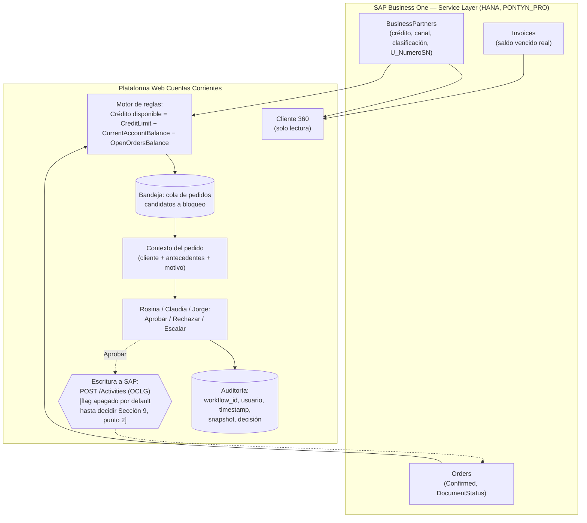

# Architecture.md — Cuentas Corrientes y Cobranzas (Pontyn)

**Aviso de madurez (I.4, dado como paso explícito antes de este documento, no dentro del mismo pedido):** el descubrimiento técnico de SAP Service Layer está en un punto sólido — contrato de sesión, esquema real de `BusinessPartners`/`Orders`/`Invoices`, y una hipótesis de diseño para el bloqueo de crédito ya validada contra un caso real (ver Sección 4). Con eso alcanza para pasar a construcción de **Cliente 360** y para arrancar **Bandeja de Autorización** en modo lectura. **No alcanza todavía** para el paso de escritura de la Bandeja (aprobar/liberar un pedido) — nunca se probó ni se confirmó cómo escribe SAP eso, y eso es crítico. Se marca explícitamente en Sección 9 (Puntos abiertos) como bloqueante, no se asume una solución.

**Alcance de este documento:** cubre **Cliente 360** (listo para construcción) y **Bandeja de Autorización de Pedidos** (lista para construcción en modo lectura; el paso de escritura queda bloqueado, ver Sección 9). **Hub Omnicanal** se incluye solo como esqueleto preliminar — el checklist de Twilio/M365 (Módulo 4) sigue completamente abierto, se amplía esta sección cuando se resuelva, sin reescribir lo ya cerrado (mismo criterio que usa el `Architecture.md` de Costos/Precios).

**Basado en:** `Discovery.md` (estado 16/09/2026, incluye Sección 15 — hallazgos técnicos de SAP Service Layer), `Plan.md` (orden de construcción del MVP, 09/09/2026) y `Decisions.md` (historial completo de decisiones hasta 16/09/2026).

**Convención de certeza usada en este documento** (consistente con el resto del portafolio de Pontyn — `Architecture.md` de Contaduría y de Costos/Precios): `KNOWN` (confirmado por prueba real contra Service Layer o por Líber), `ASSUMED` (supuesto razonable, no verificado), `PROPOSED` (propuesta de diseño, a validar), `TO VERIFY` (pregunta abierta, no asumir). Distinto de la taxonomía HECHO/INFERENCIA/PROPUESTA/RECOMENDACIÓN de `Discovery.md` — esa sigue rigiendo el relevamiento de negocio; esta rige el diseño técnico.

---

## 1. Resumen del flujo de negocio

Reemplazar: SAP como única interfaz + Excel de Karen/Rosina + WhatsApp/Email manual, sin vista consolidada del cliente, sin cola de trabajo para pedidos bloqueados, sin registro de por qué se aprobó o rechazó cada uno.

Por: una plataforma web complementaria a SAP (nunca lo reemplaza) que consolida la ficha del cliente (`Cliente 360`), gobierna la liberación de pedidos bloqueados con un flujo de aprobación auditable (`Bandeja de Autorización`), y centraliza la comunicación con el cliente (`Hub Omnicanal`). SAP sigue siendo el sistema transaccional autoritativo — la plataforma lee, decide dentro de una política, y ejecuta acciones controladas sobre SAP, nunca le duplica el rol de fuente de verdad.

## 2. Componentes (línea base Pontyn + capa de plataforma)

- **Azure Function v2 (Python 3.12)** — backend de la plataforma. `PROPOSED`, mismo criterio que Contaduría y Costos/Precios: repo separado del resto del portafolio (ver Sección 8, "blast radius").
- **Azure Static Web App, tier Standard** — frontend. `PROPOSED`, mismo motivo que los dos proyectos hermanos ("Bring your own API"): el backend necesita VNet Integration hacia SAP on-premise, que la API gestionada gratuita de SWA no soporta bien.
- **Entra ID / MSAL** — autenticación de usuarios finales (Rosina, Claudia, Lorena, Sabrina, Monserrat, Jorge). **`CORREGIDO 16/09/2026`** — no repetir Easy Auth clásico (v1) atado directo a una SPA cross-origin (SWA en un dominio, Function App en otro): es el patrón que le generó a Contaduría el problema documentado de `401` en el preflight `OPTIONS` sin ningún toggle para eximirlo, y terminó necesitando un proxy same-origin con sus propios problemas (cold start propio, corrupción de binarios al reenviar `multipart/form-data` como texto). Acá aplica el mismo riesgo — misma topología (SWA + Function App separada). Ver diseño recomendado en Sección 3.
- **Azure SQL DB** — `PROPOSED`, mismo criterio que los dos hermanos (elegido sobre Table Storage por necesidad real de listar/filtrar/editar): estado de la Bandeja de Autorización, historial de gestiones/comunicaciones del Hub Omnicanal, y cualquier dato propio de la plataforma que no viva en SAP. **`RESUELTO 17/09/2026` (confirmado por Líber):** se crea una base nueva (`PROPUESTO: cc-platform-db`) dentro del server de propósito general `sql-pontyn-prod` (ya existente en `rg-pontyn-sql-prod`, usado hoy por `cfe-review-db`), en vez de un server nuevo — mismo patrón que los dos proyectos hermanos. No se crea todavía: no hace falta para Cliente 360 (sin persistencia propia), se crea cuando arranque el trabajo de la Bandeja.
- **Table Storage** — `PROPOSED`, reservado para un mecanismo simple de idempotencia/claim si hace falta (mismo rol que cumple en Contaduría para su Entrega 1), no para el estado principal de la Bandeja.
- **MS Graph** — email vía `email_sender.py` ya existente. `TO VERIFY` si se reutiliza tal cual o si hace falta una nueva app registration (checklist Módulo 4, sin resolver).
- **Twilio** — WhatsApp Business. Todo el checklist Módulo 4 sigue abierto (Account SID, número aprobado, plantillas de Meta) — ver Sección 9.
- **Key Vault** — credenciales de SAP Service Layer, Twilio Auth Token, client secret de M365. Nunca en el repo ni en variables de entorno planas — mismo estándar que el resto del portafolio.
- **Blob Storage (cuenta simple) vs. ADLS Gen2** — para adjuntos/cartas de pedidos (Discovery.md 9.2). `A EVALUAR`, mismo dilema que ya resolvieron los dos proyectos hermanos a favor de Blob Storage simple (documento discreto referenciado por ID, no dataset analítico) — no se decide acá sin confirmarlo explícitamente, ver Sección 9.

### 2.1 `NUEVO 17/09/2026` Convención de nombres del tenant Azure (inspeccionada en vivo con `az cli`, KNOWN) y plan propuesto para este proyecto

Inspección directa del tenant (`Azure subscription 1`, `rg-*` existentes) confirma la convención ya usada por Contaduría y Costos/Precios:

| Recurso | Convención | Ejemplo existente (`cfe-review`) | Propuesto para Cuentas Corrientes |
|---|---|---|---|
| Resource Group | `rg-pontyn-<proyecto>-prod` | `rg-pontyn-cfe-review-prod` | `rg-pontyn-cc-platform-prod` |
| Key Vault | `kv-pontyn-<proyecto>` | `kv-pontyn-cfe-review` | `kv-pontyn-cc-platform` |
| Function App | `<proyecto>-api` | `cfe-review-api` | `cc-platform-api` |
| App Registration (Entra ID) | `<proyecto>-api-app-registration` | `cfe-review-api-app-registration` | `cc-platform-api-app-registration` |
| Service Principal CI/CD | `sp-<proyecto>-api-cicd` | `sp-cfe-review-api-cicd` | `sp-cc-platform-api-cicd` |
| Azure SQL | base nueva en el server compartido `sql-pontyn-prod` (`rg-pontyn-sql-prod`) | `cfe-review-db` | `cc-platform-db` (recién cuando arranque la Bandeja, ver Sección 2) |
| App Service Plan | `cfe-review-api` corre hoy sobre `ASP-PontynHttpFunctionApp` (Basic B2, capacity 3, RG legacy `pontynhttpfunctionapp`) | `cfe-review-api` | **`DECIDIDO 17/09/2026` (Líber):** reusar el mismo `ASP-PontynHttpFunctionApp` — no `asp-pontyn-functions-prod` (que existe pero queda descartado para este proyecto). **`RE-ABIERTO 17/09/2026` con evidencia nueva:** una guía de arquitectura de Contaduría (aportada por Líber) documenta un incidente real medido en este mismo plan — CPU compartido en 40-50% promedio con picos a 100%, correlacionado con ventanas de latencia de hasta ~36 minutos en Timers/endpoints, atribuido a "vecino ruidoso" (otra app en el mismo plan, no código propio). Verificado en vivo (`az functionapp list`/`az webapp list`): el plan ya hospeda **4 apps** (`cfe-review-api`, `PontynApi`, `PontynSyncImages`, `PontynExtractToDatalake`) — `cc-platform-api` sería la quinta. La guía recomienda un plan dedicado salvo que el costo lo justifique, y monitorear CPU del plan (no solo el de la app propia) si se comparte igual. **`RE-CONFIRMADO 17/09/2026` (Líber, con la evidencia ya conocida):** se mantiene `ASP-PontynHttpFunctionApp` — motivo puntual y más importante que el de costo: es el plan que ya tiene la VNet Integration hacia la VPN de Pontyn donde vive SAP (Sección 4.1/9), no solo una decisión de ahorro. Migrar a un plan dedicado implicaría re-armar esa integración de red. Queda como riesgo aceptado y documentado (no ignorado) — si en el futuro se ve latencia intermitente no explicada, este plan compartido es el primer sospechoso a chequear (monitorear su CPU, no solo el de `cc-platform-api`). |
| Red hacia SAP on-prem | VNet existente `VNet2` (`10.2.0.0/16`, RG `pontynhttpfunctionapp`) con Gateway VPN `VNet2GW` ya conectado al on-prem de Pontyn | `cfe-review-api` usa la subnet `FrontEnd` | **`DECIDIDO 17/09/2026` (Líber):** usar la misma subnet `FrontEnd` que `cfe-review-api` (no `FunctionsProd`, que existe pero nunca se ejercitó con una VNet Integration real). Verificado: `FrontEnd` es `/24` (256 IPs, delegada a `Microsoft.Web/serverfarms`), con lugar de sobra para las dos apps. Coherente con ya compartir el mismo App Service Plan — reusa la única ruta de red ya probada en vez de validar una nueva. |

**Corrección de diseño importante detectada al inspeccionar `cfe-review-api` en vivo:** su `authsettingsV2` tiene Easy Auth **clásico (v1)** realmente activo (`platform.runtimeVersion: "~1"`, proveedor `azureActiveDirectory` habilitado junto con varios proveedores sociales sin usar, de default de scaffold) — confirma en la práctica, no solo en el handoff, el problema que la Sección 3 ya advierte no repetir. `cc-platform-api` nace **sin Easy Auth habilitado** (`az webapp auth show` debe dar `requireAuthentication: false` o el recurso simplemente no tiene `authsettingsV2` configurado) — el gate de auth vive en el código (JWT manual), nunca en la plataforma.

**Estado 17/09/2026:**
- **`CREADO` — App Registration:** `cc-platform-api-app-registration`, `KNOWN`. `appId` (client ID): `2095b6bc-db66-4b95-97ad-7c569800a4c9`. `sign-in-audience`: `AzureADMyOrg` (mono-tenant Pontyn). Identifier URI: `api://2095b6bc-db66-4b95-97ad-7c569800a4c9`. Scope delegado expuesto: `access_as_user`. App Role creado: `CC.Usuario` (allowed member type `User` — no `Application`; pensado para Rosina/Claudia/Lorena/Sabrina/Monserrat en esta etapa de Cliente 360; un rol de aprobador se agrega después, sin tocar este, cuando arranque la Bandeja). Enterprise App (Service Principal) creado con `appRoleAssignmentRequired=true` — **nadie obtiene token para esta API sin que se le asigne explícitamente el rol** (Entra ID → Enterprise Applications → `cc-platform-api-app-registration` → Users and groups). Sin client secret (no hace falta: la validación es JWT contra JWKS público, nunca requiere secreto de este lado). **`RESUELTO 17/09/2026`:** plataforma "Single Page application" agregada con redirect URI `http://localhost:5173` (desarrollo local). Es una lista aditiva (guía §10.9) — la URL real de la Static Web App se agrega después, sin sacar la de localhost.
- **`CREADO 18/09/2026` — Resource Group, Key Vault, Storage, Function App:** creados para el spike de autenticación de punta a punta (§9.5). `rg-pontyn-cc-platform-prod` (brazilsouth); `kv-pontyn-cc-platform` (RBAC, no access policies — mismo patrón que `kv-pontyn-cfe-review`); `stpontynccplatform` en el RG compartido `rg-pontyn-storage-prod`; Function App `cc-platform-api` (Linux, Python 3.12, Functions v4) sobre `ASP-PontynHttpFunctionApp`, con VNet Integration a la subnet `FrontEnd` de `VNet2` (misma que `cfe-review-api`, ver tabla arriba). Managed Identity (System-Assigned) habilitada, con rol `Key Vault Secrets User` sobre el Key Vault propio. `SAP_PASSWORD`/`HANA_PASSWORD` viven en el Key Vault, referenciados desde App Settings vía `@Microsoft.KeyVault(SecretUri=...)` — nunca en texto plano. CORS de plataforma configurado para `http://localhost:5173`. Confirmado sin Easy Auth (`az webapp auth show` no devuelve `authsettingsV2`). App Registration (`cc-platform-api-app-registration`) ya tenía el rol `CC.Usuario` asignado a Líber para poder probar.
- **`RESUELTO 18/09/2026` — Deploy hecho (Líber, `func azure functionapp publish`) y spike de autenticación de punta a punta EXITOSO.** Las 7 funciones cargaron correctamente (confirmado en Application Insights). Tres pruebas reales, en orden:
  1. **Preflight `OPTIONS`** contra `/api/clientes` con `Origin: http://localhost:5173` → `200`, headers CORS correctos, sin ningún gate de auth en el medio — el problema histórico de Easy Auth v1 de Contaduría (Sección 2.1 de la guía de Líber) **no se repite acá**.
  2. **Sin token** → `401` con el JSON propio del código (`"Falta el header Authorization Bearer"`) — confirma que el gate de auth vive en el código, nunca en la plataforma.
  3. **Con un token real** (login de Líber vía MSAL contra el App Registration, página de prueba temporal): `roles: ["CC.Usuario"]`, `aud`/`iss` correctos — y **`GET /api/clientes?q=C1-90020` devolvió `200 {"clientes": []}`**, la cadena completa funcionando: JWT validado (firma/JWKS/audience/issuer/rol) → `ServiceLayerSapGateway` conectó de verdad contra `10.10.10.240` vía la VNet Integration → login a Service Layer con `PontynSL` exitoso → query `substringof` ejecutada sin error → lista vacía porque `C1-90020` es un código ficticio de los fixtures, no un cliente real (esperado).
  
  **Esto resuelve de una sola vez:** el spike de autenticación en sí (bloqueante desde el día 1, Sección 3); la conectividad real Azure→SAP Service Layer para *este* Function App específico (antes solo inferida de `cfe-review-api`); la sintaxis OData `substringof` del punto 20 (ya no es `TO VERIFY`, es `KNOWN`); y el riesgo v1/v2 del emisor del token (`shared/auth.py` TODO) — el token real que emitió Entra ID para este App Registration usa el formato v1 (`https://sts.windows.net/{tenant}/`), exactamente el que el código ya esperaba.

**`NUEVO 17/09/2026` — Puntos aplicados de `guia-arquitectura-backend-frontend.md` (aportada por Líber, extraída de `cfe-review-api`/`frontend-cfe-review` reales en producción):**
- **10.1 (choque de nombres App Registration vs. Managed Identity):** ya cumplido sin saberlo — `cc-platform-api-app-registration` ya tiene el sufijo recomendado, nunca vamos a chocar con el nombre limpio `cc-platform-api` que va a reclamar la Managed Identity System-Assigned de la Function App el día que se cree.
- **10.2 (Storage Account — negocio vs. `AzureWebJobsStorage`):** decisión explícita (no por default): Cliente 360 es de solo lectura y la Bandeja usa Azure SQL, no blobs — no hay dato de negocio real que guardar en Storage en esta etapa. Una sola cuenta (`stpontynccplatform`, Sección 9.20) alcanza para `AzureWebJobsStorage` + lo que haga falta más adelante (ej. adjuntos/cartas, Sección 9.13, todavía sin decidir). Revisar esta decisión si esa necesidad se vuelve real.
- **10.6 (credenciales on-premise a Key Vault desde el día 1, "ni en el primer prototipo"):** ya cumplido para el repo (`local.settings.json` real nunca versionado, confirmado gitignored) — pendiente crear el Key Vault del proyecto (`kv-pontyn-cc-platform`, todavía no creado) antes del primer deploy real, no siga viviendo solo en `local.settings.json` locales una vez que haya más de una persona/máquina involucrada.
- **10.8 (`DEPLOY_VERSION` como App Setting):** no implementado todavía — agregar cuando exista el primer pipeline de CI/CD real (bajo costo, alto retorno para verificar deploys).
- **10.9 (redirect URIs son aditivos):** relevante para cuando se agregue la plataforma SPA al App Registration (punto pendiente arriba) — agregar `http://localhost:5173` para desarrollo no reemplaza nada, y la URL real de la Static Web App se agrega después sin sacar la de localhost.

## 3. Best practices adoptadas de Contaduría (`cfe-review-api` / `frontend-cfe-review`) y de Costos/Precios

Cuentas Corrientes es el tercer sector de Pontyn en pasar por este ciclo (discovery → arquitectura → producción), y el que más se parece estructuralmente a Contaduría: bandeja de revisión humana + integración de escritura controlada contra un sistema de registro (SAP, en los dos casos). Mismo criterio que ya usó Costos/Precios: cada patrón se evalúa contra la necesidad real de este sector, no se copia por default.

**Adoptados ya, sin depender de nada más:**

- **"Bring your own API"** (SWA Standard + Function propia) — necesario acá por el mismo motivo que en Contaduría: VNet hacia SAP on-premise.
- **Autenticación — `CORREGIDO 16/09/2026`, no adoptar tal cual de Contaduría:** en vez de Easy Auth clásico + `authLevel=ANONYMOUS`, validación manual del JWT en el backend (firma contra JWKS del tenant, `aud`/`iss`/expiración, roles extraídos del claim del token — librería chica, `PyJWT`+`cryptography` con cache de JWKS) y CORS configurado de forma estándar a nivel de la Function App, sin que el preflight `OPTIONS` pase por ninguna lógica de auth. El frontend llama directo al backend con MSAL pidiendo el scope de la API (`api://<app-id>/access_as_user`) en el header estándar `Authorization: Bearer <token>` — **sin proxy intermedio**. Roles como App Roles del propio App Registration (no una tabla de permisos aparte); un rol nuevo se agrega sin tocar el acceso de los roles existentes (test explícito de no-regresión). El gate de autorización vive siempre en el backend — el frontend puede ocultar UI por rol, pero cada endpoint revalida server-side sin excepciones. **`TO VERIFY` antes de comprometerse a este diseño:** spike de 1-2 días contra un recurso real de Azure Functions Python confirmando que el CORS responde el preflight sin gate de auth en el medio, y que la validación manual de JWT funciona con roles reales — no asumir que esto "debería" funcionar sin medirlo contra el recurso real (misma disciplina que el resto de este documento). Evaluar también, en el mismo spike, si Azure App Service Authentication **v2** (más nuevo que el "clásico v1" que generó el problema en Contaduría) resuelve esto sin necesidad de la validación manual — no confirmado, no asumir.
- **Secretos:** Key Vault, nunca en el repo. Azure SQL DB con auth AAD-only (Managed Identity), sin login/password SQL — mismo patrón que ya está en producción en `sql-pontyn-prod`.
- **Application Insights propio** de esta Function App, no un recurso compartido (ya se corrigió en Contaduría que `ai-pontyn-prod` compartido no existe como tal).
- **CI/CD:** frontend en GitHub Actions (integración nativa de SWA), backend en GitLab — consistente con el resto del portafolio.
- **Coexistencia Azure SQL DB + Table Storage, cada una donde corresponde** — SQL para lo que la plataforma necesita listar/filtrar/editar (Bandeja, Hub Omnicanal), Table Storage reservado para idempotencia simple si hace falta.
- **Máquina de estados simple sobre una tabla, con reapertura** para la Bandeja de Autorización — mismo patrón de Contaduría (`PENDIENTE_CONTADURIA` → `PENDIENTE_COMPRADOR` → ...), adaptado acá a un flujo de un solo paso salvo que el sector confirme que hoy hay más de un nivel de aprobación (`TO VERIFY`, ver checklist Módulo 3: "lista de quién puede aprobar qué tipo/monto de pedido hoy").
- **Nunca escribir en el mismo paso que la aprobación humana** — separar la escritura real a SAP en un proceso aparte (Timer o función dedicada), con claim atómico, igual que `post_to_sap` en Contaduría. Esto aplica incluso más fuerte acá porque, a diferencia de Contaduría, **todavía no sabemos cuál es el mecanismo de escritura real** (ver Sección 9) — separarlo de entrada evita tener que rediseñar el flujo humano el día que se confirme.
- **No construir función de exportar/imprimir sin definición de formato clara primero** — aplica directo al "reporte imprimible de facturas autorizadas" que Contaduría dejó como aspiracional; acá no hay un equivalente definido todavía, mismo criterio si aparece.
- **`NUEVO 16/09/2026` Estructura de triggers del backend:** un Timer por responsabilidad (nunca uno que hace de todo), HTTP triggers finos (el trigger solo valida payload + rol + llama a la lógica real en `shared/`, testeable sin levantar el runtime), Queue triggers para todo lo que no necesita responder en el mismo request (ej. notificación por WhatsApp/email disparada por una aprobación — nunca bloquear la respuesta al frontend esperando ese side-effect).
- **`NUEVO 16/09/2026` Identidad persistida en cada escritura** — quién aprobó/rechazó/marcó, como columna desde el diseño de la tabla, no reconstruible de logs después. Ya implícito en la auditoría mínima del marco de gobernanza, se refuerza acá como decisión de esquema desde el día 1.
- **`NUEVO 16/09/2026` Health check "shallow"** (responde OK sin tocar la base de datos) para el probe de la plataforma — un health check que sí toca la DB cada 20-30 segundos las 24 horas puede impedir que el auto-pause de Azure SQL Serverless llegue a activarse nunca.
- **`NUEVO 16/09/2026` Nunca reintentar automáticamente una escritura no idempotente** (aprobar/rechazar un pedido) — un reintento silencioso ante un timeout puede duplicar la acción si la escritura sí llegó a ocurrir del lado de SAP. Reintentos automáticos solo en GET.
- **`NUEVO 16/09/2026` Sin UI optimista para la transición de aprobar/rechazar** — a diferencia de un toggle simple, es una transición de máquina de estados real; esperar la confirmación del backend antes de reflejar el cambio, aceptando la latencia a cambio de nunca mostrar un estado que no ocurrió de verdad.
- **`NUEVO 16/09/2026` Testing:** cada bug real encontrado se convierte en test de regresión con comentario de causa raíz; fixtures con datos reales anonimizados (ej. una respuesta real de `Orders`/`BusinessPartners`, no armada a mano) para que reproduzcan la variedad real de formatos; tests de camino negativo (rol sin permiso → 403) además del camino feliz.
- **`NUEVO 16/09/2026` Git:** nunca trabajar directo sobre `main` — rama de desarrollo, tests locales, y confirmación explícita y separada antes de mergear/pushear a `main` (son dos decisiones distintas: ¿el código está bien? / ¿es el momento de que salga a producción?).

**A evaluar antes de la primera corrida real:**

- **ADLS Gen2 vs. Blob Storage simple** para adjuntos/cartas — ver Sección 2 y Sección 9.
- **Horario laboral + timezone explícita** para cualquier Timer que se agregue (ej. sincronización de canal/preferencias, o un futuro polling de WhatsApp) — Contaduría acota sus Timers a 7-20hs `America/Montevideo`, con `warmup` si el Azure SQL Serverless tiene auto-pause. Evaluar una vez que se defina el tier real de la base.

**Patrones reservados para cuando algún módulo lo necesite (no aplican al alcance de hoy):**

- **Sincronización de un maestro desde SharePoint/Excel hacia una copia local en Azure SQL** — candidato directo para el día que se digitalice la categorización manual de Karen, si se confirma que hoy vive fuera de SAP (`TO VERIFY`, ver Sección 4).
- **No todo necesita pantalla** — si en el futuro algún chequeo de Cuentas Corrientes resulta puramente automático y de solo lectura (riesgo Bajo, A4), no hace falta forzarlo a ser un módulo visible.

## 4. Contrato técnico de SAP Business One Service Layer

Consolidado de la Sección 15 de `Discovery.md` (cuatro rondas de prueba real, 16/09/2026) — esto es lo que Claude Code puede dar por confirmado sin volver a probarlo.

### 4.1 Conexión y sesión

- **Motor:** SAP HANA. **Company DB:** `PONTYN_PRO`. `KNOWN`.
- **Service Layer:** `https://<host>:50000/b1s/v1`. **`RESUELTO 17/09/2026` (Líber, acceso directo vía VPN LAN de Pontyn):** `10.10.10.240` = **test/desarrollo**; `192.168.1.240` = **producción**. `KNOWN`. Las pruebas de la Sección 15 de `Discovery.md` corrieron contra la IP de producción (sin impacto, todo de solo lectura) — de acá en más, desarrollo apunta siempre a `10.10.10.240`; el código nunca hardcodea ninguna de las dos (`base_url` configurable, Sección 2 del handoff).
- **Login:** `POST /Login` con `CompanyDB`/`UserName`/`Password` → cookies `B1SESSION` + `ROUTEID`. Sesión expira a los ~25 minutos. `KNOWN`.
- **Patrón de sesión:** un solo login por corrida de batch/Timer, reutilizando las cookies para todo el lote; `Logout` explícito al final. `PROPOSED`, heredado del patrón ya validado en producción por `cfe-review-api`.
- **Usuario de servicio (Service Layer):** `PontynSL`, dedicado (no personal), válido en ambos ambientes (test y prod). `KNOWN` que existe; `TO VERIFY` el detalle exacto de permisos otorgados (¿alcanza con lectura + los writes específicos que se necesiten, o tiene de más?).
- **Usuario de servicio (HANA directo, `hdbsql`, para `PedidosParaAutorizar`/Sección 4.6):** `ZBONE` — **distinto** de `PontynSL`, confirmado 17/09/2026. `KNOWN` que existe el usuario; `TO VERIFY` password/permisos exactos otorgados y si alcanza con esto o hace falta gestionarlo aparte con Germán (Sección 9, punto 4).
- **SAP no rechaza duplicados en escritura** — la idempotencia es responsabilidad exclusiva del backend propio, nunca asumir que SAP la resuelve. `KNOWN` (heredado del handoff de Contaduría, mismo SAP).
- **Paginación:** `Prefer: odata.maxpagesize=N` + seguir `odata.nextLink` para listados grandes. **Conteo total:** `$inlinecount=allpages` funciona (probado, devolvió `odata.count` correctamente). `KNOWN`.
- **`/SQLQueries`:** habilitado (`GET` devuelve 200, lista vacía — sin queries guardadas todavía). `KNOWN`. No es necesario para nada de lo confirmado hasta ahora — todo lo que se necesitó salió por OData estándar.
- **SQL directo (`hdbsql`):** no usado ni necesario hasta ahora. Si en algún momento hace falta, tratar con la misma disciplina que cualquier acceso a datos (Sección 7 del marco de gobernanza): nunca SQL libre generado por un agente, siempre un set fijo de consultas pre-aprobadas; nunca para escritura.
- **Técnica de descubrimiento de campos, reutilizable:** el cliente de SAP B1 con "System Information" activado muestra en la barra de estado el nombre técnico exacto de cualquier campo al hacer clic sobre él (`[Form=... Item=U_XXX ... OCRD,U_XXX]`). Más confiable que un `$metadata` exportado (puede estar desactualizado) y no depende de Germán. `PROPOSED` como método estándar del proyecto para resolver dudas de nombre de campo.

### 4.2 `BusinessPartners` — campos confirmados

| Campo | Confirmado | Nota |
|---|---|---|
| `CreditLimit` | `KNOWN` | Puede venir con un valor centinela enorme (`~1e14`) para "sin límite" — la UI debe detectarlo y mostrar "sin límite", no el número crudo. |
| `CurrentAccountBalance` | `KNOWN` | |
| `OpenOrdersBalance` | `KNOWN` | |
| `OpenDeliveryNotesBalance` | `KNOWN` | |
| `Valid` / `ValidFrom` / `ValidTo` | `KNOWN` | Booleano confiable (`tYES`/`tNO`). |
| `Frozen` / `FrozenFrom` / `FrozenTo` / `FrozenRemarks` | `KNOWN` | Booleano confiable. |
| `BlockDunning`, `DunningLevel`, `DunningDate` | `KNOWN` | Booleano confiable. |
| `PaymentBlock` | `KNOWN` | Booleano confiable. |
| `Block` | `KNOWN` — **no usar como flag de crédito** | Devolvió un string de zona/sucursal en un caso real (`"SAN LUIS"`), no `tYES`/`tNO`. Semántica real sin confirmar. |
| `U_NumeroSN` | `KNOWN` | Campo de la regla de consolidación (Sección 5). |
| `U_EmailCC`, `U_WhatsappCC` | `KNOWN` | Preferencia de canal por cliente — validar en código antes de cualquier envío (regla ya vigente, ver `Discovery.md` regresión de WhatsApp). |
| `U_ClasifClienteCC` | `KNOWN` que existe y es consultable | **`TO VERIFY` el significado de cada valor** (A/B/C...) — un caso real con `CreditLimit=0` y deuda enorme tenía valor `"A"`, contradice la lectura intuitiva de "A = mejor cliente". No asumir orden sin confirmar con Karen/Rosina. |
| `U_DiasToleranciaCC` | `KNOWN` que existe y es consultable | `TO VERIFY` si ya está conectado a alguna lógica de bloqueo o es un campo configurado sin usar todavía. |

### 4.3 `Orders` — mecanismo de bloqueo por crédito

- **`AuthorizationStatus`** (Procedimientos de Aprobación estándar de SAP): **DESCARTADO**. Sobre pedidos reales, 100% de la muestra dio `dasWithout`; filtrar por `dasPending` da vacío. Pontyn no usa este mecanismo para esto.
- **`Confirmed` / `U_ConfirmUser` / `U_ConfirmDate`**: **debilitado, no descartado del todo**. Sin acotar por `DocumentStatus`, trae pedidos viejos cerrados/cancelados (ruido). Acotado a `DocumentStatus eq 'bost_Open'`, mejora, pero sigue sin un caso real confirmado por el sector que lo valide como causal de crédito específicamente.
- **Hipótesis vigente (`PROPOSED`, validada contra un caso real extremo, no contra un caso confirmado por el sector):**
  ```
  Crédito disponible = CreditLimit − CurrentAccountBalance − OpenOrdersBalance
  Pedido en riesgo/candidato a bloqueo si: Crédito disponible < 0
  ```
  Evidencia a favor: un cliente (`C3-12788`) con `CreditLimit=0` y `CurrentAccountBalance + OpenOrdersBalance ≈ $732.414` no tiene ninguno de los flags booleanos (`Frozen`/`BlockDunning`/`PaymentBlock`) activo — sugiere que el bloqueo no vive en esos campos, sino en una comparación en vivo. **`TO VERIFY` — antes de construir nada sobre esta fórmula:** validarla contra 2-3 casos que Rosina/Claudia identifiquen explícitamente como "esto está bloqueado hoy" / "esto no lo está".
- **Volumen:** `Orders` con `Confirmed='tNO' AND DocumentStatus='bost_Open'` da **84** en un momento dado (`$inlinecount=allpages`, `KNOWN`). Compatible como orden de magnitud con ~52.500/año como flujo (no como stock) — no es prueba, tampoco contradicción.
- **`DocumentStatus` de `Orders` ≠ `DocumentStatus` de `Invoices`.** `Orders.DocumentStatus=bost_Open` significa "no facturado/entregado todavía" — nada que ver con deuda. `Invoices.DocumentStatus=bost_Open` significa "impago" — **este es el campo correcto para saldo vencido, nunca `Orders`.** `KNOWN`, confirmado con un caso real (cliente con pedidos `Open` de septiembre e facturas `Close` de agosto, ambos ciertos a la vez, sin contradicción).

**`ACTUALIZADO 16/09/2026` — la fórmula de arriba queda relegada frente al mecanismo real, confirmado por Germán (ver 4.6).** La detección real de "pedido con problema de crédito" vive en un stored procedure de SAP (`SP_TransactionNotification`), no en una comparación simple de `BusinessPartners`. La fórmula de crédito disponible sigue siendo útil como chequeo rápido/complementario en Cliente 360, pero **no es la base de la Bandeja de Autorización** — eso pasa a depender de replicar la lógica real (Sección 4.6), no de seguir refinando esta fórmula.

### 4.4 Prefijos de cliente y monedas

`C1-` = pesos, `C2-` = dólares, `C3-` = **Euros** (`KNOWN`, confirmado por Líber). Los tres consolidan por `U_NumeroSN` (Sección 5) — corrige la regla original del proyecto, que solo mencionaba C1-/C2-. `TO VERIFY` si existen más prefijos además de estos tres.

### 4.5 `NUEVO 16/09/2026` Patrones de resiliencia para la integración con SAP

Heredados de la guía de arquitectura Azure serverless (misma fuente que el contrato técnico de Sección 4: `cfe-review-api`, mismo SAP). Todos son de la misma familia de riesgo: un sistema externo que falla en silencio, no con una excepción.

- **Paginación completa siempre, nunca asumir que la primera página alcanza.** Ya identificado como necesidad propia en `Discovery.md` 15.4 — se refuerza acá como principio general, no solo para `Orders`/`Invoices` sino para cualquier listado nuevo.
- **Mapear campos de SAP por nombre, nunca por posición.** Natural con OData/JSON (siempre se accede por clave), pero aplica con fuerza extra si en algún momento se lee algo posicional (ej. un Excel de Karen, si la categorización sigue viviendo ahí en paralelo — Sección 9, punto 7).
- **Un `200 OK` de Service Layer no prueba que el dato quedó guardado como se esperaba.** Cuando se implemente el mecanismo de escritura de la Bandeja (confirmado en Sección 4.6), releer con un `GET` fresco después de cada escritura real para confirmar el valor persistido — al menos las primeras veces, y dejarlo como test de regresión.
- **No inferir cómo se calcula un campo — medir contra datos reales.** Ya es la disciplina que se vino aplicando con la fórmula de crédito disponible (Sección 4.3): validada contra un caso real extremo, pendiente de validar contra casos que el sector confirme explícitamente.
- **Normalizar identificadores en un solo lugar, con test de regresión:** prefijos de `CardCode` (`C1-`/`C2-`/`C3-`), `U_NumeroSN`. Un bug de normalización tiende a repetirse en cada punto nuevo de cruce si no se generaliza desde el principio.
- **Cuidado con IDs que no son únicos entre distintas entidades del mismo SAP** — `DocEntry` de `Orders` y de `Invoices` son numeraciones independientes; nunca asumir que un `DocEntry` identifica un documento sin confirmar también de qué entidad viene.
- **Escrituras nuevas arrancan deshabilitadas por flag hasta validar de punta a punta el circuito de solo lectura primero.** Aplica con más fuerza todavía acá porque no hay ambiente de prueba confirmado contra este SAP (Sección 4.1, IP de test sin confirmar) — la escritura de "Aprobar" (mecanismo confirmado en Sección 4.6) debe nacer detrás de un flag apagado por default, no habilitarse "porque ya se probó una vez".


### 4.6 `CONFIRMADO 16/09/2026 (Germán, vía Líber)` Mecanismo real de detección y liberación de pedidos

`sap_data_access` es un **desarrollo separado/piloto** — no es la pantalla que usa hoy el sector. Pero Germán lo pasó explícitamente como **la referencia a copiar**, porque representa el mecanismo real que SAP usa en la práctica para esto. Con esa aclaración, lo siguiente pasa de hipótesis a diseño confirmado:

- **Detección:** la lógica real de "pedido con problema de crédito" vive en un stored procedure de SAP (`SP_TransactionNotification`), replicado como consulta HANA directa en `GET /PedidosParaAutorizar` (devuelve, entre otros, `Status Aprobación Ctas. Ctes.` ya calculado). **`CONFIRMADO 18/09/2026`, ya no `TO VERIFY`:** Claudia Flores (Cuentas Corrientes, quien ejecuta este proceso a diario) aportó una captura de pantalla real de Query Manager corriendo esta consulta en producción hoy, más el `.sql` exportado. Comparado carácter a carácter contra `sql/pedidos_para_autorizar_deuda_vencida.sql` de este repo: **idéntico**, salvo la columna `DocEntry` que Líber ya había autorizado agregar (punto 16 más abajo) y dos diferencias cosméticas de texto en comentarios SQL (sin efecto en la lógica). La traducción de `sap_data_access` **es una réplica fiel** de lo que el sector usa realmente — no una aproximación. Esto también confirma en el mismo archivo detalles que antes eran solo inferidos: la deuda vencida se calcula contra `JDT1` (subledger de cuentas por cobrar) filtrando `DueDate < hoy`, separado por moneda (local/USD/EUR), cruzando por `U_NumeroSN` del cliente **o de su `FatherCard`** (jerarquía padre/hijo); excluye un `GroupCode` de ~24 códigos fijos (grandes cadenas: DISCO, TATA, DEVOTO, GEANT, TIENDA INGLESA, HOMECENTER SODIMAC, FARMASHOP, empleados, etc. — lista completa en el `.sql`); solo aplica si el vendedor tiene `OSLP.U_ControlCC='1'`; y un pedido con una Actividad de rechazo (`OCLG.CntctSbjct='5'`) más reciente que cualquier otra se marca `Rechazado` en vez de recalcular la deuda. Ya implementado tal cual — no requiere cambios de código.
- **Liberación:** se registra como una **Actividad** de SAP (`POST /Activities`, tabla `OCLG`), vinculada al pedido por `DocType`/`DocNum`/`DocEntry`, **nunca modificando `ORDR` directamente** (`DocType=17`, `Activity=cn_Note`, `ActivityType=1`, `Subject=4` aprobado / `Subject=5` rechazado). `KNOWN` — este es el mecanismo real, confirmado por el referente técnico de SAP del proyecto. **`CONFIRMADO 18/09/2026` con captura real de la pantalla de Actividad:** el `Asunto` que ve Claudia es literalmente **"Pedido Autorizado"** — consistente con lo que ya asumíamos para `Subject=4`. El `Tipo` de Actividad que ve en la UI es **"Cuentas Corrientes"** (un valor de dropdown, no confirmado todavía cuál código exacto de `ActivityType` corresponde a esa etiqueta en Service Layer — `ActivityType=1` es lo que ya usa el código, heredado de `sap_data_access`, pero nunca se cruzó explícitamente contra esta etiqueta de UI; `TO VERIFY` con Germán si hace falta, no bloqueante porque el mecanismo ya está confirmado funcionando en general).
- **`GAP DE CÓDIGO ENCONTRADO 18/09/2026` — el campo `Comentarios` de la Actividad NO es texto libre, es un conjunto cerrado, y `build_activity_payload`/`procesar_decision` (`shared/activity_payload.py`, `shared/bandeja.py`) hoy aceptan cualquier string en `notes`/`motivo` sin validar nada.** Confirmado con captura real: al aprobar, el valor es uno de **"Emitir estado de cuenta"** / **"Estado de cuenta"** / **"Carta"** (indica qué documentación mandarle al cliente); al rechazar, **"No autorizar"**. Esto es una regla de negocio real, no un detalle de UI — el resto del proceso (Facturación, quién decide mandar carta) probablemente depende de que el texto sea exactamente uno de estos valores. **Antes de construir el frontend de la Bandeja o de habilitar `SAP_WRITE_ENABLED=true`:** (a) el backend debe validar `motivo` contra este conjunto cerrado (rechazar con un error claro cualquier otro valor, igual que ya se hace con `decision`), y (b) el frontend de la Bandeja debe ofrecer estas opciones como radio/checkbox, nunca un textarea libre. Ninguno de los dos está implementado todavía — se documenta acá para no perderlo, no se implementa en este momento porque la Bandeja frontend todavía no arrancó.

**Esto resuelve el punto bloqueante único de la Sección 9** — ya no es "no sabemos cómo se escribe", es "sabemos cómo, hay que implementarlo acá".

**Decisión de arquitectura, con recomendación (`RECOMENDACIÓN`, decisión final pendiente de Stefano/Germán):**
1. **Reimplementar el patrón en un repo nuevo de esta plataforma — opción recomendada.** Motivos: blast radius (`sap_data_access` ya es infraestructura crítica de Contaduría en producción — CC en desarrollo activo no debería poder afectarla), incompatibilidad de modelo de auth (`FUNCTION` key vs. Entra ID nominal por usuario, que el marco de gobernanza exige para riesgo Alto), y ownership (evita que un repo termine sin dueño claro entre dos sectores).
2. **Extender `sap_data_access` mismo** — descartada como opción por defecto por los mismos tres motivos, aunque cumple mejor "reutilizar lo existente" en abstracto.

**Qué replicar y qué no, si se sigue la opción recomendada:**
- **Replicar el patrón de diseño completo** (gateway + dry-run, clasificación de errores, gate de escritura por flag, idempotencia por búsqueda) — es diseño, no lógica de negocio, tiene sentido que cada repo lo tenga propio.
- **No reimplementar de cero la consulta de `PedidosParaAutorizar`.** Pedir el `.sql` real (o el texto de `SP_TransactionNotification`) a Germán y copiarlo literal, con una nota de origen y fecha — si el SP cambia el día de mañana, es una regla de negocio, no un patrón de diseño, y mantener dos versiones que puedan divergir en silencio es justo el tipo de riesgo que la Sección 4.5 ya advierte evitar.

**Requisito técnico nuevo que esto agrega:** conectar a HANA directo (para replicar `PedidosParaAutorizar`) es una superficie distinta a todo lo probado hasta ahora (que fue siempre Service Layer, puerto 50000). Hace falta credencial de HANA propia (usuario de base, no `PontynSL`) y confirmar con Germán la conectividad de red — no asumir que la VNet Integration ya pedida para Service Layer alcanza para esto. **`YA RESUELTO 18/09/2026`** — confirmado que la misma VNet Integration alcanza (Sección 9, punto 4), y `tests/test_hana_reader_integration.py` corre realmente contra HANA TEST con éxito.

**`PREGUNTA ABIERTA para Germán, 18/09/2026` — posible simplificación arquitectónica, no descartar sin preguntar:** dado que esta consulta ya corre hoy en Query Manager de SAP (no es solo un stored procedure invisible), preguntarle a Germán si tiene un `SqlCode` guardado — si lo tiene, podría invocarse vía `POST /SQLQueries('<código>')/List` de Service Layer (ya confirmado habilitado, Sección 4.1) en vez de mantener una conexión HANA directa aparte. Sería significativamente más simple (una superficie de conectividad menos, mismas credenciales que ya usa `PontynSL`) — pero **no se cambia nada todavía**, el mecanismo HANA directo ya construido funciona y está confirmado contra datos reales; esto es una pregunta a favor de simplificar más adelante, no un bloqueante ni una corrección de lo ya hecho.

No se decide acá — se deja como recomendación explícita para que Stefano/Germán la confirmen antes de que Claude Code arranque el backend (ver Sección 9).

**Otros patrones de esta misma guía, reutilizables en el repo nuevo (clasificados igual que en Sección 3):**

**Adoptar:**
- **Gateway con interfaz abstracta + implementación real + implementación dry-run/fake** — permite testear toda la orquestación sin pegarle a SAP. Aplica tanto si se reimplementa un cliente propio como si se llama a `sap_data_access`.
- **Clasificación de errores en categorías de negocio** (`auth`/`server`/`validation`/`unknown_write_status`), nunca status codes crudos propagados hacia arriba.
- **Timeout en una escritura = estado desconocido, no error genérico** — antes de reintentar o reportar error, verificar si la escritura ya ocurrió.
- **Idempotencia por búsqueda antes de crear**, con "más de un resultado" tratado como error explícito (`409`), no como ambigüedad silenciosa.
- **Gate de escritura por variable de entorno, uno por tipo de operación** (no un único "modo producción" global) — ya estaba en `Architecture.md` 4.5 como principio, esto lo concreta con el patrón exacto (`FORCE_X_WRITES=true`).
- **Whitelist de URLs de Service Layer permitidas + `CompanyDB` esperado verificado en código, fallando explícito si no matchea.** Resuelve en código, no solo en documentación, la ambigüedad de la Sección 4.1 (qué IP es cuál) — si se apunta por error a la IP equivocada, el sistema no arranca, en vez de escribir silenciosamente donde no corresponde.

**A evaluar:**
- `SessionTimeout` dinámico (de la respuesta de `/Login`) en vez de la constante de 25 min ya usada — mejora menor, no bloqueante.
- TLS con `verify=False` (certificado autofirmado on-premise) — mismo compromiso ya aceptado en el resto del portafolio; si se puede pasar a un bundle de CA propio, mejor, pero no es requisito de esta etapa.

## 5. Reglas de negocio heredadas (no reinterpretar sin validación del dueño del proceso)

Ver el detalle completo en `Discovery.md` — no se duplica acá, solo se listan por nombre las que tienen superficie directa en esta arquitectura:

- Consolidación por `U_NumeroSN` (C1-/C2-/C3-, corregida en esta versión).
- Validación de preferencias de canal (`U_WhatsappCC`/`U_EmailCC`) en código antes de cualquier envío — nunca decidida por un LLM.
- Categorización de clientes (`U_ClasifClienteCC`) y tolerancia (`U_DiasToleranciaCC`) — no usar como base de decisiones operativas hasta confirmar significado y corregir el bug de notas de crédito ya documentado en `Discovery.md` 4.4.
- SAP Business One es siempre el sistema transaccional autoritativo — esta plataforma es una capa operativa, nunca lo reemplaza ni duplica su rol de fuente de verdad.

## 6. Diagrama de flujo — Cliente 360 + Bandeja de Autorización



**Notas sobre el diagrama:**
- El motor de reglas nunca escribe directo — solo arma la cola de candidatos. La escritura real (liberar el pedido en SAP, vía `POST /Activities`) queda deliberadamente separada del paso de aprobación humana, mismo patrón que `post_to_sap` en Contaduría — y detrás de un flag apagado por default hasta resolver la decisión de alcance de la Sección 9, punto 2.
- Cliente 360 es 100% lectura — no tiene ninguna dependencia de los puntos abiertos de la Bandeja.

## 7. Separación determinístico / agéntico / humano

Ya definida a nivel de proceso en `Discovery.md` Sección 11 — no se repite acá. Lo que agrega esta arquitectura: la fórmula de crédito disponible (Sección 4.3) es el candidato concreto para la parte "determinístico" de la detección de pedido bloqueado, en `PROPOSED` hasta validarse.

## 8. Separación en repo aparte

Mismo criterio que ya se aplicó en Contaduría y Costos/Precios (Sección 15 del marco de gobernanza):

- **Autenticación distinta:** usuarios nominales de Entra ID (Rosina, Claudia, Jorge...) vs. machine-to-machine del resto del portafolio — necesario para auditar quién aprobó cada pedido.
- **Blast radius:** un bug en la lógica de liberación de pedidos (escritura, riesgo Alto) no debe poder afectar sistemas ya en producción sin relación directa.
- **Sesión propia contra SAP** (cookies `B1SESSION`/`ROUTEID`), igual que `cfe-review-api`.

**`ACTUALIZADO 16/09/2026`**: recomendación — repo nuevo, no extender `Sap_data_access`. Motivos y detalle completo en Sección 4.6. Decisión final pendiente de confirmar con Stefano/Germán (Sección 9, punto 2).

## 9. Puntos abiertos antes de construir con datos reales

**Bloqueantes — resolver antes de continuar con la construcción del backend:**

1. **`RESUELTO 16/09/2026` Mecanismo de escritura para "Aprobar" un pedido.** Confirmado por Germán (vía Líber): registrar la decisión como Actividad de SAP (`POST /Activities`, `OCLG`), nunca modificar `ORDR` — ver Sección 4.6. Deja de ser un bloqueo de "no sabemos cómo", pasa a ser trabajo de implementación normal, detrás de un flag apagado por default (Sección 4.5).
2. **`RESUELTO 17/09/2026` Decisión de alcance: repo nuevo, confirmado por Líber.** No era una decisión de Germán/Stefano como se pensaba — es del propio Líber: copiar el patrón de `sap_data_access` (gateway + dry-run + idempotencia + payload de Actividad) pero desarrollarlo en este repo (`cc-platform-api`), nunca extender `sap_data_access`. Motivos y detalle en Sección 4.6/8. Ya implementado así en el backend de la Bandeja (fundamentos).
3. **`RESUELTO 17/09/2026`** Se obtuvo el `.sql` literal (`sql/pedidos_para_autorizar_deuda_vencida.sql`, ya en este repo) y se comparó byte a byte contra el mismo archivo en `sap_data_access` — **idéntico**, `KNOWN`. Además, inspeccionando `sap_data_access` en vivo (con acceso directo al repo en disco) se confirma el patrón completo de referencia a replicar, no solo la consulta: `hana_reader.py` (conexión vía `hdbcli`/`dbapi`, variables `HANA_HOST`/`HANA_PORT`/`HANA_USER`/`HANA_SCHEMA`/`HANA_PASSWORD`|`HANA_USERKEY`), `activity_payload.py` (payload exacto de `POST /Activities`: `DocType="17"` **como string**, `Activity="cn_Note"`, `ActivityType=1`, `Subject=4`/`5`, `DocNum`/`DocEntry` como string), y `function_app.py` (gate de escritura en dos niveles: uno para el modo del gateway — real vs. dry-run — y **uno aparte y explícito** solo para escrituras de Actividad, `FORCE_ACTIVITY_WRITES`, más whitelist de `ALLOWED_SAP_SERVICE_LAYER_URLS` y verificación de `CompanyDB` esperado). **Diferencia importante a NO copiar:** `sap_data_access` autentica sus endpoints con `auth_level=func.AuthLevel.FUNCTION` (function key compartida) — confirma en código, no solo en el handoff, el motivo de la Sección 4.6/8 para no extender este repo (modelo de auth incompatible con Entra ID nominal por usuario).
4. **`RESUELTO 17/09/2026` Conectividad y credenciales de HANA directo.** Usuario `ZBONE` (permisos completos, ver punto 12 más abajo), puerto `30015` (confirmado por Líber, mismo para test y producción), driver `hdbcli`/`dbapi` (no `hdbsql` de línea de comandos). Password real solo en `local.settings.json` local (gitignored), nunca en este documento. `HANA_SCHEMA` se asume `PONTYN_PRO` por convención estándar de SAP B1 sobre HANA (la Company DB es su propio schema) — `ASSUMED`, no confirmado explícitamente por Germán, pero no bloquea desarrollo local (VPN LAN de Pontyn desde la máquina de Líber). Confirmado también que la VNet `VNet2`/`VNet2GW` ya usada para Service Layer alcanza para el puerto de HANA (punto 5, resuelto).
5. **`RESUELTO 18/09/2026`** — Spike de autenticación exitoso contra la Function App real (`cc-platform-api`, ver Sección 2.1): preflight `OPTIONS` sin interferencia de ningún gate, `401` propio sin token, `200` con un token real de Entra ID con el rol `CC.Usuario`. El diseño de JWT manual + CORS estándar (Sección 3) queda confirmado, no solo propuesto.

**No bloqueantes, pero a resolver pronto:**

6. **`RESUELTO 17/09/2026`** — IP de test/desarrollo (`10.10.10.240`) vs. producción (`192.168.1.240`) confirmada, ver Sección 4.1.
7. La fórmula de crédito disponible (Sección 4.3) queda como chequeo complementario en Cliente 360, no como base de la Bandeja — ya no es prioritario validarla contra casos reales para ese fin.
8. **`RESUELTO 17/09/2026`, corregido 18/09/2026** — `U_ClasifClienteCC` es línea de crédito: A = mejor cliente (confirmado). **`CORREGIDO 18/09/2026`: son 4 valores posibles, A/B/C/D, no A/B/C** — criterios de B, C y D sin definir todavía (ver punto 24 más abajo). **`A CONFIRMAR` residual:** el caso real `C3-12788` (Sección 4.3) tiene `CreditLimit=0` y deuda enorme pero `U_ClasifClienteCC="A"` — contradice esta lectura para ese cliente puntual. No usar el campo como única señal de riesgo sin entender esa discrepancia (¿campo no actualizado automáticamente? ¿caso excepcional?). El frontend de Cliente 360 ya trata este campo con la misma cautela: nunca lo colorea como bueno/malo, solo lo muestra en neutro (`docs/superpowers/specs/2026-09-18-cliente-360-frontend-design.md`, `frontend-cc-platform`).
9. **`RESUELTO 17/09/2026`** — `U_DiasToleranciaCC` sí está conectado a una lógica que se actualiza diariamente (confirmado por Líber). Sigue pendiente el detalle de cuál es esa lógica exactamente.
10. **`RESUELTO 17/09/2026`** — `U_ClasifClienteCC` es la categorización vigente, ya reemplazó cualquier categorización manual anterior de Karen (confirmado por Líber).
11. Resolver todo el checklist del Módulo 4 (Twilio/M365) — Account SID, número WhatsApp aprobado, plantillas Meta, reutilización de `email_sender.py`, buzón compartido vs. individual.
12. **`RESUELTO 17/09/2026`** — `PontynSL` tiene los mismos permisos que el usuario de test `manager`: superusuario, permisos completos (confirmado por Líber).
13. ADLS Gen2 vs. Blob Storage simple para adjuntos/cartas (Sección 2) — sigue sin resolver (la Sección 9.12 original de este documento no es la misma pregunta que la de recursos de storage del punto 20 más abajo).
14. Alcance de "POC" (herramienta de Nicolás) — **`PARCIALMENTE RESUELTO 17/09/2026`**: POC es el sistema de preventa y cobranzas electrónicas de Nicolás; hay superposición real con Cuentas Corrientes, por eso el CRM de Cobranza sigue pausado (`Decisions.md` 09/09/2026) — pero Líber confirmó que superposición de **solo lectura**, como la vista de Cliente 360, se puede permitir sin problema. No bloquea Cliente 360.
15. **`RESUELTO 17/09/2026`** — no existen más prefijos de cliente además de C1-/C2-/C3- por ahora (confirmado por Líber).

Ninguno de estos puntos, salvo los cinco primeros, bloquea seguir construyendo Cliente 360. El punto 2 sigue siendo el que bloquea arrancar el backend de la Bandeja — ya con dirección recomendada, no en el aire.

**`NUEVO 17/09/2026` — Puntos abiertos encontrados en la revisión final del backend de la Bandeja (fundamentos), pendientes de resolver antes de la próxima etapa (no bloquean lo ya construido, que queda detrás de `SAP_WRITE_ENABLED=false`):**

16. **`RESUELTO 17/09/2026`** — Líber autorizó agregar `T0."DocEntry" "DocEntry"` al `SELECT` de `sql/pedidos_para_autorizar_deuda_vencida.sql` (única línea agregada, comparada byte a byte contra el resto del archivo — sigue idéntico a `sap_data_access` salvo esa línea). `GET /api/bandeja/candidatos` ya puede encadenarse con `POST /api/bandeja/pedidos/{doc_entry}/decision`. **Nota importante:** a partir de ahora este repo y `sap_data_access` **ya no tienen el mismo `.sql` byte a byte** — si `sap_data_access` necesita la misma mejora en algún momento, es una decisión aparte de sus propios dueños, no algo que se propague solo.
17. **`RESUELTO 17/09/2026`** — `shared/normalization.py` ahora tiene `normalize_candidato_bandeja()`, que mapea cada columna del `.sql` (español, con tildes) a snake_case; `GET /api/bandeja/candidatos` ya nunca expone un alias crudo de SAP.
18. **Precondición explícita antes de poner `SAP_WRITE_ENABLED=true` alguna vez:** (a) reemplazar `InMemoryBandejaRepository` por una implementación real contra Azure SQL (hoy el estado vive en memoria, se pierde en cada reinicio de la Function y no existe entre instancias); (b) invertir el orden actual de `procesar_decision` — hoy escribe primero la Actividad en SAP y recién después guarda localmente, así que un fallo al guardar después de una escritura exitosa rompe la idempotencia en un reintento; (c) cruzar `cardCode`/`docNum`/`doc_entry` del body contra un dato de SAP antes de escribir — hoy no hay ninguna verificación de que los tres identifiquen el mismo pedido, y sin conexión real a SAP en esta etapa no hay contra qué validarlos.
19. **El spec original (`docs/superpowers/specs/2026-09-17-bandeja-autorizacion-fundamentos-design.md`) pedía `sql/ddl/` (DDL de las tablas de estado/auditoría) y `GET /api/bandeja/pedidos/{doc_entry}` (contexto de un pedido puntual, cruzado con Cliente 360) — el plan de implementación no los incluyó y quedaron sin construir. Alcance que pasa a la próxima etapa de la Bandeja, no perdido, pero hay que recordarlo explícitamente al planificar esa etapa.

**`NUEVO 17/09/2026` — Huecos encontrados al diseñar el frontend de Cliente 360, ya resueltos en el backend:**

20. **`RESUELTO`** — `GET /api/clientes?q=<texto>` (nuevo): busca por nombre o código contra `BusinessPartners`. Implementación real usa `substringof('...',CardName) or substringof('...',CardCode)` (sintaxis OData v2). **`CONFIRMADO 18/09/2026` contra el Service Layer real** (ver Sección 2.1) — la query ejecutó sin error (`200`, lista vacía porque el código de prueba era ficticio). **`CONFIRMADO de nuevo 18/09/2026`, esta vez con coincidencia no vacía** — `tests/test_sap_gateway_integration.py::test_search_business_partners_against_real_sap_test` (opt-in, `pytest -m integration`) busca por un término derivado del nombre real de `C1-11391` (cliente de test provisto por Líber) y confirma que el cliente aparece en los resultados. Ya no es `TO VERIFY`, es `KNOWN` en ambos sentidos (sintaxis y coincidencia real).
21. **`RESUELTO`** — Consolidación por `U_NumeroSN` (Discovery.md §4.5): `get_ficha_cliente` ahora devuelve `cuentas_relacionadas` (las otras cuentas C1-/C2-/C3- del mismo cliente, cada una normalizada con su propia `moneda`). Deliberadamente **no se suman saldos entre monedas** — no hay tipo de cambio confirmado, y no se inventa uno.
22. **`RESUELTO`** — `moneda` (UYU/USD/EUR, derivada del prefijo C1-/C2-/C3-, Architecture.md §4.4) agregada a `normalize_business_partner`. Un prefijo no confirmado devuelve `None`, nunca una moneda adivinada.
23. **`CONFIRMADO 18/09/2026` — pruebas de integración opt-in contra SAP TEST (`10.10.10.240`) y HANA TEST, corridas realmente (no solo escritas).** `tests/test_sap_gateway_integration.py` (marcador `pytest.mark.integration`, excluido por default vía `addopts = -m "not integration"` en `pytest.ini`) confirma contra infraestructura real, con el cliente de test `C1-11391`: `get_business_partner`, `list_orders`, `list_open_invoices` y `search_business_partners` — los cuatro de solo lectura. `tests/test_hana_reader_integration.py` confirma que `get_pedidos_para_autorizar` (mecanismo de conexión `hdbcli` + ejecución de `sql/pedidos_para_autorizar_deuda_vencida.sql`) funciona contra HANA real. **`ACTUALIZADO 18/09/2026`:** la distinción que quedaba pendiente (fidelidad de la traducción SQL frente al SP real) también quedó `CONFIRMADO` el mismo día — ver Sección 4.6, captura real de Claudia Flores.

**`NUEVO 18/09/2026` — Segundo relevamiento (Claudia Flores, Cuentas Corrientes): confirma el mecanismo real de punta a punta, agrega reglas de negocio nuevas sin definición cerrada, y un hallazgo de código pendiente:**

24. **`RESUELTO 18/09/2026`** — Clasificación crediticia es **A/B/C/D, no A/B/C** (el modelo de datos de este repo ya trata `clasificacion_cc` como string libre, sin asumir un conjunto cerrado de 3 valores — no requiere cambio de código, solo corregir la documentación/expectativa). Criterios de B, C y D siguen **sin definir** — no inferirlos a partir de A. Se detectó además un problema real en el cálculo de antigüedad usado para la categorización (un cliente con una compra puntual en 2021 y 5 años sin operar cuenta antigüedad desde 2021, inflando artificialmente su categoría) — dato para quien defina los criterios, no algo que este backend deba corregir.
25. **`GAP DE CÓDIGO` — el `Comments` de la Actividad debe validarse contra un conjunto cerrado antes de construir la Bandeja frontend o habilitar escritura real.** Ver detalle completo en Sección 4.6.
26. **`ABIERTO, sin bloquear nada`** — significado exacto de `QryGroup8` (columna de `OCRD` usada en el `WHERE T1."QryGroup8" = 'N'` de la consulta de detección) sin confirmar con Germán. La consulta ya funciona correctamente sin saber el significado exacto (es una condición de filtro que ya viene dada), pero vale la pena preguntarlo para documentarlo bien.
27. **`ABIERTO, sin bloquear nada`** — sigue sin confirmarse si el campo `Confirmed` de `Orders` se actualiza por algún mecanismo aparte (logística/entrega) sin relación con la Bandeja. El proceso real relevado no lo menciona en ningún paso — no asumir que el backend de la Bandeja tiene que setearlo.
28. **`A DEFINIR, no implementar sin definición cerrada del sector`** — dos reglas de negocio nuevas, propuestas pero no confirmadas: (a) tolerancia de días de atraso como % de la condición de pago (ejemplo dado en la reunión: 60 días de crédito → 10% de tolerancia — no confirmado si el 10% es definitivo o solo un ejemplo); (b) importe mínimo por debajo del cual no se bloquea un pedido, sin valor definido. La SQL real hoy **no aplica ningún margen** de ninguno de los dos tipos — no inventar un valor default.
29. **`FUERA DE ALCANCE, no construir sin confirmación explícita de Stefano`** — control de cheques (pantalla nativa de SAP "Saldo de cheque", riesgo reconocido de cheques rechazados sin visibilidad automática hasta que el contador avisa). Karen B. lo pidió como posible agregado a Cliente 360 (deuda en cheques, importe total, cantidad, plazo promedio) — la reunión con Claudia confirma que la pantalla nativa existe pero con reglas todavía imperfectas, y que **no está decidido si esto entra en el alcance del MVP actual**. No construir nada de esto (ni backend ni frontend) hasta que Stefano lo confirme explícitamente — es una decisión de alcance de producto, no una pregunta técnica pendiente.
30. **`NUEVO, referencia validada para Cliente 360`** — el reporte de "estado de cuenta" que el sector mira hoy (Crystal Report, formato real confirmado con captura) tiene columnas: Fecha, Vencimiento, Tipo (Factura/N-C), Nro Doc, Moneda, Importe, Pendiente, Saldo corrido, Vendedor. **La pantalla de Cliente 360 ya construida (`GET /api/clientes/{card_code}/facturas`) hoy solo devuelve facturas abiertas** (`Invoices` con `DocumentStatus=bost_Open`) **sin Notas de Crédito, sin `Moneda` por fila, sin `Pendiente` (importe parcialmente pagado), sin `Saldo corrido` (acumulado), sin `Vendedor`.** No es un bug — es el alcance mínimo que se construyó a propósito — pero ahora hay una referencia real y validada para decidir si conviene ampliarlo para que se parezca al reporte que el equipo ya usa y confía. Cambio de alcance, no de bug: decisión de Líber, no unilateral.
31. **`NUEVO, requisito de UX para la próxima etapa de la Bandeja (frontend, todavía sin construir)`** — en el proceso real, "Rechazado" no significa "resuelto": es el estado por defecto de un pedido bloqueado que Claudia ya miró una vez pero todavía no puede liberar (sigue activo, pendiente de una nueva revisión). El backend ya lo maneja bien (`shared/bandeja.py::listar_candidatos` incluye tanto `"Pendiente"` como `"Rechazado"` — no hay que tocar nada ahí). **Cuando se diseñe la UI de la Bandeja: no ocultar ni despriorizar los pedidos en estado `Rechazado`** asumiendo que ya están resueltos — son justamente los que necesitan seguimiento activo.
20. **`NUEVO 17/09/2026` Cuenta de Storage para la Function App (`AzureWebJobsStorage`), pendiente de confirmación de Líber antes de crearla:** inspeccionando el tenant (`az storage account list`) se confirma que `stpontyncfereview` (la cuenta de Contaduría) vive en el resource group compartido `rg-pontyn-storage-prod`, no dentro del RG propio de `cfe-review`. Mismo patrón que `sql-pontyn-prod` (server SQL compartido, DB propia por proyecto): un RG de storage compartido, pero **una cuenta de Storage dedicada por proyecto** — nunca una cuenta de Storage compartida entre Function Apps de proyectos distintos (mismo motivo de blast radius que ya rige toda la Sección 8). `RECOMENDACIÓN`: crear `stpontynccplatform` dentro de `rg-pontyn-storage-prod`, siguiendo la misma convención — no reusar `stpontyncfereview`. Para desarrollo local, `AzureWebJobsStorage=UseDevelopmentStorage=true` (emulador Azurite) alcanza, sin necesidad de ninguna cuenta real todavía.

## 10. Gotchas ya pagados

Convención recomendada por la guía de arquitectura Azure serverless: cada bug real se documenta acá con la causa raíz, no solo el síntoma — para que no se reintente en otra parte del sistema.

- **Los booleanos de SAP llegan como string `"tYES"`/`"tNO"`, nunca como boolean real.** `Frozen`, `BlockDunning`, `PaymentBlock`, `Valid`, `Confirmed` — todos así. Convertir explícitamente (`valor === "tYES"`) antes de usar en cualquier patrón tipo `{flag && <Componente/>}` en el frontend — un `"tNO"` es *truthy* en JS y se renderiza literal en pantalla si no se convierte primero. Mismo tipo de bug que la guía documenta para flags 0/1 de SQL.
- **`Block` de `BusinessPartners` no es un flag de crédito** pese al nombre — devolvió un string de zona/sucursal (`"SAN LUIS"`) en un caso real. No usarlo con ese supuesto.
- **`CreditLimit` puede traer un valor centinela enorme** (`~1e14`) para "sin límite" — detectarlo explícitamente en la UI, no mostrar el número crudo.
- **`Orders.DocumentStatus` y `Invoices.DocumentStatus` significan cosas distintas** pese a ser el mismo enum (`bost_Open`/`bost_Close`) — uno mide entrega/facturación, el otro cobro. Saldo vencido siempre contra `Invoices`.
- **`AuthorizationStatus` no es el mecanismo de bloqueo por crédito** en esta instalación de SAP, pese a que el esquema de Procedimientos de Aprobación existe — 100% de una muestra real dio `dasWithout`.
- **`Confirmed`/`U_ConfirmUser` sin acotar por `DocumentStatus` trae pedidos viejos cerrados/cancelados** — ruido histórico, no señal de bloqueo vigente.

## 11. Fuera de alcance de este documento

- Diseño técnico detallado del Hub Omnicanal — se agrega como sección nueva cuando el checklist del Módulo 4 esté resuelto, sin reescribir lo ya cerrado acá (mismo criterio que `Architecture.md` de Costos/Precios).
- CRM de Cobranza (pausado, ver `Plan.md` y `Decisions.md` 09/09/2026).
- Cualquier escritura a SAP hasta resolver la decisión de alcance del repo (Sección 9, punto 2) e implementar el mecanismo confirmado en Sección 4.6 detrás de su flag.
- Automatización de resguardos, reconciliación de cadenas, identificación de depósitos — pendientes de su propio ciclo de discovery técnico → arquitectura, cuando les toque.
